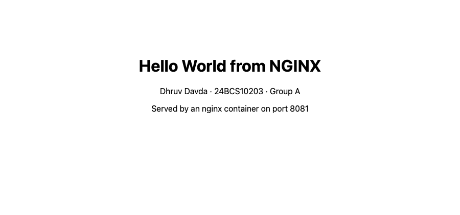
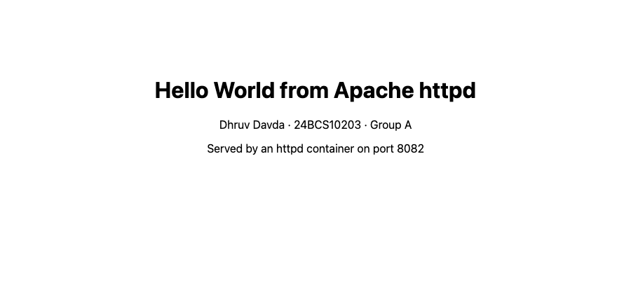
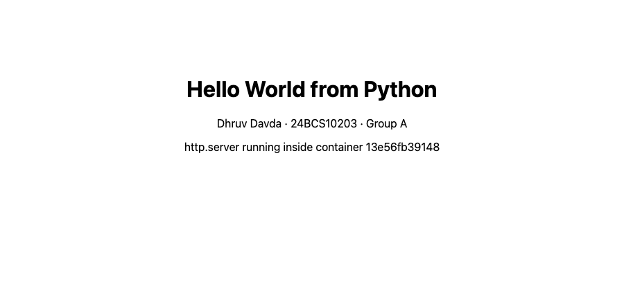
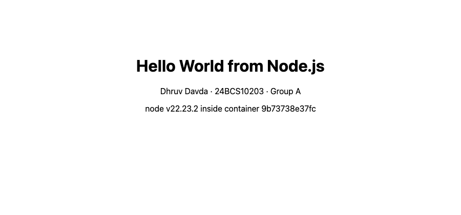
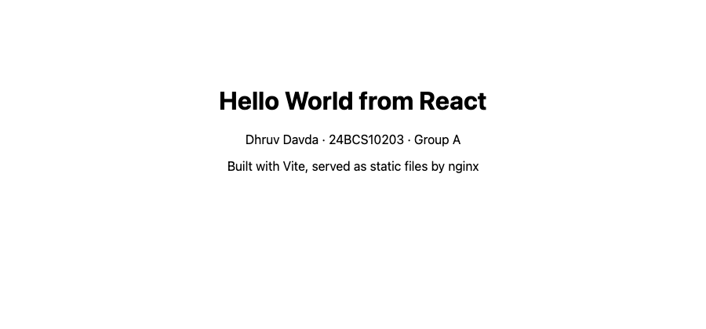

# Topic 05 – Docker Fundamentals

**Name:** Dhruv Davda
**Roll No:** 24BCS10203
**Email:** Dhruv.24bcs10203@sst.scaler.com
**Group:** A

## Task

Build and run "Hello World" web applications with Docker, then prove in a browser that each one is
actually serving the page.

I built **six** applications so that I could compare the different styles of Dockerfile they need:

| # | App | Directory | Base image | Container port | Host port |
|---|---|---|---|---|---|
| 1 | NGINX static site | [`nginx-app/`](./nginx-app) | `nginx:1.27-alpine` | 80 | 8081 |
| 2 | Apache httpd static site | [`apache-app/`](./apache-app) | `httpd:2.4-alpine` | 80 | 8082 |
| 3 | Python `http.server` | [`python-app/`](./python-app) | `python:3.12-alpine` | 8000 | 8083 |
| 4 | Node.js `http` module | [`nodejs-app/`](./nodejs-app) | `node:22-alpine` | 3000 | 8084 |
| 5 | Java `HttpServer` | [`java-app/`](./java-app) | `eclipse-temurin:21` (multi-stage) | 8080 | 8085 |
| 6 | React built with Vite | [`react-app/`](./react-app) | `node:22` → `nginx` (multi-stage) | 80 | 8086 |

Ports 80 and 443 on my host are already taken by the kind cluster from Topic 08, which is why every
app is published on the 808x range instead.

---

## Step 1: Build the images

```console
$ docker build -t dhruv/nginx-hello:1.0 ./nginx-app
$ docker build -t dhruv/apache-hello:1.0 ./apache-app
$ docker build -t dhruv/python-hello:1.0 ./python-app
$ docker build -t dhruv/nodejs-hello:1.0 ./nodejs-app
$ docker build -t dhruv/java-hello:1.0 ./java-app
$ docker build -t dhruv/react-hello:1.0 ./react-app
```

All six built successfully:

```console
$ docker images --filter "reference=dhruv/*" --format "table {{.Repository}}\t{{.Tag}}\t{{.Size}}"
REPOSITORY           TAG       SIZE
dhruv/react-hello    1.0       76.1MB
dhruv/java-hello     1.0       286MB
dhruv/nodejs-hello   1.0       228MB
dhruv/python-hello   1.0       87.8MB
dhruv/apache-hello   1.0       105MB
dhruv/nginx-hello    1.0       75.9MB
```

### The two kinds of Dockerfile in this set

The static sites need no runtime of their own — the base image is already a web server, so the
Dockerfile is two useful lines:

```dockerfile
FROM nginx:1.27-alpine
COPY index.html /usr/share/nginx/html/index.html
EXPOSE 80
# No CMD needed: the base image already starts nginx in the foreground.
```

The React app is the opposite extreme. It needs Node to build but **not** to run, so it uses two
stages and ships only the compiled bundle:

```dockerfile
# Stage 1 - build the static bundle with the full Node toolchain.
FROM node:22-alpine AS build
WORKDIR /app

# Copy the manifest first. Docker caches this layer, so "npm install" is only
# re-run when the dependencies actually change, not on every source edit.
COPY package.json ./
RUN npm install
COPY . .
RUN npm run build

# Stage 2 - ship only the compiled bundle. No node, no npm, no source.
FROM nginx:1.27-alpine
COPY --from=build /app/dist /usr/share/nginx/html
EXPOSE 80
```

That is why `dhruv/react-hello` is **76.1 MB** — essentially the same as the plain nginx image —
even though building it required the ~200 MB Node toolchain and a `node_modules` tree.

---

## Step 2: Run the containers

```console
$ docker run -d --name nginx-hello  -p 8081:80   dhruv/nginx-hello:1.0
107572c7696b900f236783f134ca8aa2efa1cac44dd1837022993ccdce0434c0
$ docker run -d --name apache-hello -p 8082:80   dhruv/apache-hello:1.0
4367f3f34dfdd88e0a46d3eed9ed4280144da4cece3fbfd6f7cf68f066ac32d9
$ docker run -d --name python-hello -p 8083:8000 dhruv/python-hello:1.0
13e56fb391481074bc0ecdd4de2e192e3aa7daafb0592997392198e4320bcf86
$ docker run -d --name nodejs-hello -p 8084:3000 dhruv/nodejs-hello:1.0
9b73738e37fc7e4a99c409afc3812b06d8fe19dfe1cc795c47b7ed10e848779c
$ docker run -d --name java-hello   -p 8085:8080 dhruv/java-hello:1.0
538c9de18ae5eb0e5eaffb5dea51d3a60bea57701031ee90c34e0677cb3226b8
$ docker run -d --name react-hello  -p 8086:80   dhruv/react-hello:1.0
ace800ed3d9446b16a89dad706926168ea8f31dc23a13aed11fedbf06ee98864
```

`-d` detaches, `--name` gives a stable name to use instead of the hash, and `-p host:container`
publishes the port. The long hex string printed back is the full container ID.

---

## Step 3: Verify the containers are running

```console
$ docker ps --filter "name=-hello" --format "table {{.Names}}\t{{.Image}}\t{{.Status}}\t{{.Ports}}"
NAMES          IMAGE                    STATUS         PORTS
react-hello    dhruv/react-hello:1.0    Up 8 seconds   0.0.0.0:8086->80/tcp, [::]:8086->80/tcp
java-hello     dhruv/java-hello:1.0     Up 8 seconds   0.0.0.0:8085->8080/tcp, [::]:8085->8080/tcp
nodejs-hello   dhruv/nodejs-hello:1.0   Up 8 seconds   0.0.0.0:8084->3000/tcp, [::]:8084->3000/tcp
python-hello   dhruv/python-hello:1.0   Up 9 seconds   0.0.0.0:8083->8000/tcp, [::]:8083->8000/tcp
apache-hello   dhruv/apache-hello:1.0   Up 9 seconds   0.0.0.0:8082->80/tcp, [::]:8082->80/tcp
nginx-hello    dhruv/nginx-hello:1.0    Up 9 seconds   0.0.0.0:8081->80/tcp, [::]:8081->80/tcp
```

The `PORTS` column is worth reading carefully: `0.0.0.0:8086->80/tcp` means *host* port 8086 forwards
to *container* port 80. The container itself has no idea it is reachable on 8086.

---

## Step 4: Verify that Hello World is displayed

```console
$ for p in 8081 8082 8083 8084 8085 8086; do
>   printf "port %s -> " "$p"; curl -s -o /dev/null -w "%{http_code} (%{time_total}s)\n" http://localhost:$p
> done
port 8081 -> 200 (0.001222s)
port 8082 -> 200 (0.001216s)
port 8083 -> 200 (0.001283s)
port 8084 -> 200 (0.002130s)
port 8085 -> 200 (0.001558s)
port 8086 -> 200 (0.001111s)
```

And the actual content of each page:

```console
$ curl -s http://localhost:8081 | grep -E '<h1>|24BCS'
<h1>Hello World from NGINX</h1>
<p>Dhruv Davda &middot; 24BCS10203 &middot; Group A</p>

$ curl -s http://localhost:8082 | grep -E '<h1>|24BCS'
<h1>Hello World from Apache httpd</h1>
<p>Dhruv Davda &middot; 24BCS10203 &middot; Group A</p>

$ curl -s http://localhost:8083 | grep -E '<h1>|24BCS'
<h1>Hello World from Python</h1>
<p>Dhruv Davda &middot; 24BCS10203 &middot; Group A</p>

$ curl -s http://localhost:8084 | grep -E '<h1>|24BCS'
<h1>Hello World from Node.js</h1>
<p>Dhruv Davda &middot; 24BCS10203 &middot; Group A</p>

$ curl -s http://localhost:8085 | grep -E '<h1>|24BCS'
<h1>Hello World from Java</h1>
<p>Dhruv Davda &middot; 24BCS10203 &middot; Group A</p>

$ curl -s http://localhost:8086 | grep -E '<h1>|24BCS'
```

### The React app returned nothing, and the reason is interesting

Five apps printed their heading. The sixth returned **HTTP 200 with no `<h1>` in it at all**. That
is not a broken container — it is client-side rendering:

```console
$ curl -s http://localhost:8086
<!DOCTYPE html>
<html lang="en">
  <head>
    <meta charset="utf-8" />
    <title>Hello World - React</title>
    <script type="module" crossorigin src="/assets/index-YosMVIX6.js"></script>
  </head>
  <body>
    <div id="root"></div>
  </body>
</html>
```

The page nginx serves is an empty shell. The heading only exists after the browser downloads and
executes the bundle, which is where the text actually lives:

```console
$ BUNDLE=$(curl -s http://localhost:8086 | grep -o 'assets/[^"]*\.js' | head -1)
$ echo $BUNDLE
assets/index-YosMVIX6.js

$ curl -s http://localhost:8086/$BUNDLE | grep -o 'Hello World from React'
Hello World from React
```

So I verified this one in a real headless browser instead, which renders the JavaScript:

```text
Visible text content:
Hello World from React
Dhruv Davda · 24BCS10203 · Group A
Built with Vite, served as static files by nginx
```

**Lesson: `curl` tests the server, a browser tests the application.** For a server-rendered app the
two agree; for a single-page app they do not, and a `curl`-based health check that greps for text
would report a false failure.

### Screenshots

| App | Screenshot |
|---|---|
| NGINX, port 8081 |  |
| Apache, port 8082 |  |
| Python, port 8083 |  |
| Node.js, port 8084 |  |
| Java, port 8085 |  |
| React, port 8086 |  |

The Java and Node pages print the container's own hostname, which is the container ID — the Java
screenshot reads `JDK 21.0.12 inside container 538c9de18ae5`, matching the ID that
`docker run` returned above.

### Logs

```console
$ docker logs python-hello
listening on 0.0.0.0:8000
192.168.65.1 - "GET / HTTP/1.1" 200 -
192.168.65.1 - "GET / HTTP/1.1" 200 -
192.168.65.1 - "GET / HTTP/1.1" 200 -

$ docker logs nodejs-hello
listening on 0.0.0.0:3000
GET /
GET /
GET /
```

The client address in the Python log is `192.168.65.1`, **not** my laptop's `172.20.1.251`. That is
the Docker Desktop VM's gateway: on macOS containers do not run on the host kernel, so traffic
arrives from the VM's internal network. On native Linux this would show the real client IP.

```console
$ docker exec nodejs-hello whoami    # confirm it is not running as root
node
```

---

## Step 5: Clean up

```console
$ docker stop nginx-hello apache-hello python-hello nodejs-hello java-hello react-hello
nginx-hello
apache-hello
python-hello
nodejs-hello
java-hello
react-hello

$ docker rm nginx-hello apache-hello python-hello nodejs-hello java-hello react-hello
nginx-hello
apache-hello
python-hello
nodejs-hello
java-hello
react-hello

$ docker ps -a --filter "name=-hello"
CONTAINER ID   IMAGE     COMMAND   CREATED   STATUS    PORTS     NAMES
```

The images are deliberately kept — `docker rm` removes containers, `docker rmi` would remove images.

---

## What I understood

- **An image is a template, a container is a running instance of it.** The same
  `dhruv/nginx-hello:1.0` image could back ten containers on ten different ports at once; nothing
  about the port is baked into the image.
- **`EXPOSE` documents, `-p` publishes.** `EXPOSE 80` in the Dockerfile does not open anything — I
  proved this by mapping `-p 8081:80`, where the host port is nothing like the exposed one. `EXPOSE`
  is metadata for humans and for `-P`.
- **The process must stay in the foreground.** The nginx and httpd images need no `CMD` because
  their entrypoint already runs the server in the foreground. If I had written something like
  `CMD ["nginx"]` with a daemon flag, PID 1 would exit immediately and the container would die —
  a container lives exactly as long as its PID 1.
- **Layer order controls cache reuse.** In the React Dockerfile, copying `package.json` and running
  `npm install` *before* copying the source means editing `main.jsx` reuses the cached dependency
  layer. Copying everything first would reinstall every dependency on every source change.
- **Multi-stage builds shrink images dramatically.** `docker history` shows what the Java image
  actually ships from my code:
  ```console
  $ docker history dhruv/java-hello:1.0 --format "table {{.CreatedBy}}\t{{.Size}}" | head -5
  CREATED BY                                      SIZE
  CMD ["java" "Main"]                             0B
  EXPOSE [8080/tcp]                               0B
  ENV PORT=8080                                   0B
  COPY /out . # buildkit                          12.3kB
  ```
  **12.3 kB** of compiled classes on top of the JRE. The 286 MB is all base image — and the `javac`
  compiler, the source file and the whole JDK never made it into the final image at all.
- **Alpine variants are much smaller** (nginx 75.9 MB vs the Debian-based image at over 190 MB), but
  they use musl instead of glibc, which can break native binaries. Fine for these apps, worth
  checking for anything with compiled dependencies.
- **`.dockerignore` is not optional.** Without it, `COPY . .` in the React build would upload the
  host's `node_modules` into the build context — slow, and potentially the wrong architecture's
  binaries. My `.dockerignore` excludes `node_modules` and `dist`.
- **Run as a non-root user where the image supports it.** `node:alpine` ships an unprivileged `node`
  user, so `USER node` was one line and `docker exec ... whoami` confirms the server is not root. If
  the container is ever compromised, the attacker is not root inside it.
- **`PYTHONUNBUFFERED=1` matters in containers.** Python buffers stdout when it is not a terminal,
  so without it `docker logs` stays empty and the app looks hung when it is actually fine.
- **Handle `SIGTERM`.** `docker stop` sends SIGTERM and waits 10 seconds before SIGKILL. The Node app
  traps it and closes the server, so all six containers stopped instantly rather than each taking
  the full grace period.
