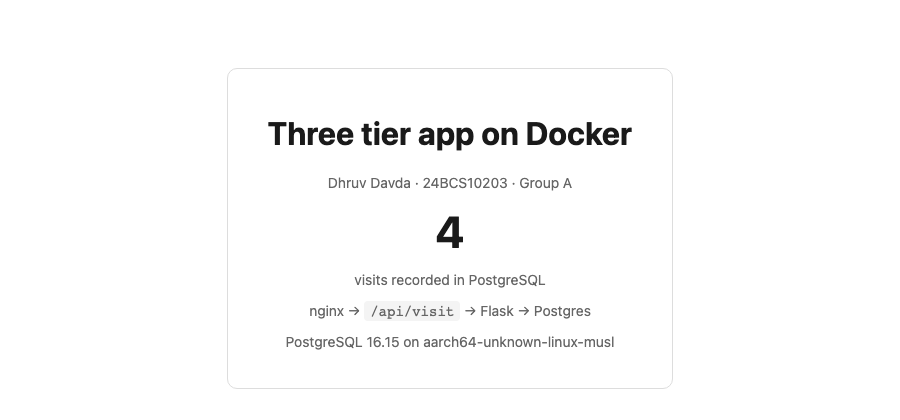

# Topic 06 – Dockerfiles and Images

**Name:** Dhruv Davda
**Roll No:** 24BCS10203
**Email:** Dhruv.24bcs10203@sst.scaler.com
**Group:** A

---

## Task 1: Run the multi-stage Dockerfile from the class repository

### 1. Clone the repository

```console
$ git clone https://github.com/Nency-Ravaliya/devops-heros.git
$ cd devops-heros/session6-7-docker/multi-stage-dockerfile
$ ls
Dockerfile  package.json  server.js
```

The Dockerfile provided in the session:

```dockerfile
# -------------------------
# Stage 1: Build
# -------------------------
FROM node:24-alpine AS builder
WORKDIR /app
COPY package*.json ./
RUN npm install
COPY . .

# -------------------------
# Stage 2: Production
# -------------------------
FROM node:24-alpine AS production
WORKDIR /app
COPY --from=builder /app/package*.json ./
RUN npm install --omit=dev
COPY --from=builder /app/server.js ./
EXPOSE 3000
CMD ["npm", "start"]
```

### 2. Build the image

```console
$ docker build -t dhruv/multistage-node:1.0 .
...
#12 [production 5/5] COPY --from=builder /app/server.js ./
#12 DONE 0.0s

#13 exporting to image
#13 exporting manifest sha256:a1434268d8c8b77e78ac324a5bc2f39d5fd1448c38c144a485096f4ae21a0ad6 done
#13 naming to docker.io/dhruv/multistage-node:1.0 done
#13 DONE 0.3s
```

### 3. Run a container on port 8080

```console
$ docker run -d --name multistage-app -p 8080:3000 dhruv/multistage-node:1.0
ae1ceb7c661c27f34d100861e782d63009086b4f39dea2e8d2cd31354f8a515e
```

The app listens on 3000 inside the container; `-p 8080:3000` is what puts it on port 8080 of my host.

### 4. Verify with `docker ps`

```console
$ docker ps --filter name=multistage-app --format "table {{.Names}}\t{{.Image}}\t{{.Status}}\t{{.Ports}}"
NAMES            IMAGE                       STATUS         PORTS
multistage-app   dhruv/multistage-node:1.0   Up 2 seconds   0.0.0.0:8080->3000/tcp, [::]:8080->3000/tcp
```

### 5. Access the application

```console
$ curl -s http://localhost:8080
<h1>Hello World from Docker Multi-Stage Build!</h1>

$ curl -s -o /dev/null -w "status=%{http_code}\n" http://localhost:8080
status=200

$ docker logs multistage-app

> docker-hello-world@1.0.0 start
> node server.js

Server running on port 3000
```


### 6. Inspect the final image

```console
$ docker images dhruv/multistage-node:1.0 --format "{{.Repository}}:{{.Tag}}  {{.Size}}"
dhruv/multistage-node:1.0  243MB

$ docker image inspect dhruv/multistage-node:1.0 \
    --format '{{.Config.Cmd}} / {{.Config.WorkingDir}} / {{.Architecture}} / layers={{len .RootFS.Layers}}'
[npm start] / /app / arm64 / layers=8

$ docker exec multistage-app ls /app
node_modules
package-lock.json
package.json
server.js

$ docker history dhruv/multistage-node:1.0 --format "{{.Size}}\t{{.CreatedBy}}" | head -6
0B	CMD ["npm" "start"]
0B	EXPOSE [3000/tcp]
12.3kB	COPY /app/server.js ./ # buildkit
9.45MB	RUN /bin/sh -c npm install --omit=dev # buil…
45.1kB	COPY /app/package*.json ./ # buildkit
8.19kB	WORKDIR /app
```

Only the `production` stage appears in `docker history`. The `builder` stage ran, then was discarded
— it is not in the image and not in the layer list.

---

## Task 2: Documentation – what the second stage actually saved

I did not want to just assert that multi-stage builds are smaller, so I wrote the single-stage
equivalent in [`single-stage-comparison/`](./single-stage-comparison) and measured both:

```dockerfile
# Single-stage equivalent, built only so I can measure what the second stage saves.
FROM node:24-alpine
WORKDIR /app
COPY package*.json ./
RUN npm install
COPY . .
EXPOSE 3000
CMD ["npm", "start"]
```

```console
$ docker build -t dhruv/singlestage-node:1.0 ./single-stage-comparison
$ docker images --format "table {{.Repository}}\t{{.Tag}}\t{{.Size}}" | grep -E 'stage-node|REPO'
REPOSITORY                TAG    SIZE
dhruv/singlestage-node    1.0    249MB
dhruv/multistage-node     1.0    243MB
```

**243 MB versus 249 MB — a saving of about 6 MB, or 2.4%.** That is far less than I expected, so I
investigated why:

```console
$ cat package.json
{
  "name": "docker-hello-world",
  ...
  "dependencies": {
    "express": "^5.1.0"
  }
}

$ docker run --rm dhruv/singlestage-node:1.0 sh -c 'du -sh /app/node_modules; ls /app/node_modules | wc -l'
4.3M	/app/node_modules
65

$ docker run --rm dhruv/multistage-node:1.0 sh -c 'du -sh /app/node_modules; ls /app/node_modules | wc -l'
4.3M	/app/node_modules
65
```

**There are no `devDependencies` in this project at all.** `npm install --omit=dev` in stage 2 is
therefore a no-op — both images contain the identical 4.3 MB / 65-package `node_modules` tree. And
because both stages use the *same* `node:24-alpine` base, the runtime image carries the whole Node
toolchain either way. The 6 MB difference is layer overhead plus one file the single-stage image
picked up accidentally:

```console
$ docker run --rm dhruv/singlestage-node:1.0 sh -c 'ls -a /app'
.
..
Dockerfile          <-- COPY . . pulled the Dockerfile in, because there is no .dockerignore
node_modules
package-lock.json
package.json
server.js
```

The multi-stage version copies `server.js` explicitly, so it cannot pick up stray files. The
single-stage one used `COPY . .` with no `.dockerignore` and shipped its own Dockerfile.

### When multi-stage actually pays off

Compare this with the React app I built in Topic 05, where the build tooling and the runtime are
genuinely different programs:

| Image | Build tool needed | Runtime needed | Final size |
|---|---|---|---|
| Topic 06 Node app (this one) | node + npm | **node** | 243 MB (vs 249 MB single-stage) |
| Topic 05 React app | node + npm + vite | **nginx only** | **76.1 MB** |
| Topic 05 Java app | JDK with `javac` | **JRE only** | 286 MB, of which my code is 12.3 kB |

**Conclusion: multi-stage builds save space in proportion to how much of the build toolchain the
runtime does not need.** For a compiled or bundled application — React to static files, Java source
to classes, Go to a single binary — the saving is enormous. For an interpreted Node service that
needs `node` at runtime anyway, the second stage buys you hygiene (no source, no stray files, no dev
dependencies *if there are any*) rather than megabytes.

Both are legitimate reasons to do it. But the size claim only holds when the bases differ, and this
Dockerfile is a good example of a multi-stage build that is mostly about cleanliness.

### Other things I noted about image layers

- **Every `RUN`, `COPY` and `ADD` creates a layer**; `ENV`, `EXPOSE`, `CMD` and `WORKDIR` are
  metadata and cost 0 B, which `docker history` shows directly.
- **Deleting a file in a later layer does not shrink the image.** The earlier layer still contains
  it. This is why secrets must never be `COPY`ed and then `rm`ed — they stay recoverable in the
  layer history. The correct fix is a build stage that never ships, or BuildKit secret mounts.
- **Cache invalidation cascades.** Changing one line in `package.json` invalidates that `COPY` and
  every layer after it, including `npm install`. Ordering from least-frequently-changed to
  most-frequently-changed is the whole trick.
- `--format` on `docker history` / `docker images` is much easier to read than the default table,
  and `docker image inspect --format` is how to pull one field out in a script.

---

## Task 3: Deploy at least 3 different types of applications with Docker

Topic 05 already covers six single-container applications (static nginx, static Apache, Python,
Node.js, Java, React). For this task I wanted the three types to be genuinely *different kinds* of
component and to actually talk to each other, so I built a three-tier stack in
[`three-tier-app/`](./three-tier-app):

| Tier | Type | Technology | Published to host? |
|---|---|---|---|
| `web` | Static site + reverse proxy | nginx | **Yes**, port 8090 |
| `api` | Stateless JSON API | Python / Flask | No, internal only |
| `db` | Stateful database | PostgreSQL 16 | No, internal only |

The app is a visit counter: the browser calls `/api/visit`, nginx proxies it to Flask, Flask inserts
a row into Postgres and returns the running total.

### The compose file

```yaml
services:
  db:
    image: postgres:16-alpine
    environment:
      POSTGRES_USER: dhruv
      POSTGRES_PASSWORD: devops_assignment
      POSTGRES_DB: visits
    volumes:
      # Named volume, so the row count survives "docker compose down".
      - db_data:/var/lib/postgresql/data
    healthcheck:
      test: ["CMD-SHELL", "pg_isready -U dhruv -d visits"]
      interval: 3s
      timeout: 3s
      retries: 10
    # No ports: the database is not reachable from the host at all.

  api:
    build: ./api
    environment:
      DATABASE_URL: postgresql://dhruv:devops_assignment@db:5432/visits
    depends_on:
      db:
        condition: service_healthy

  web:
    build: ./web
    ports:
      - "8090:80"
    depends_on:
      - api

volumes:
  db_data:
```

The nginx config is what joins tier 1 to tier 2:

```nginx
location /api/ {
    proxy_pass http://api:5000/api/;   # "api" is the compose service name
    proxy_set_header Host $host;
    proxy_set_header X-Real-IP $remote_addr;
}
```

### Bringing it up

```console
$ docker compose up -d --build
 Image three-tier-app-web Built
 Image three-tier-app-api Built
 Network three-tier-app_default Created
 Volume three-tier-app_db_data Created
 Container three-tier-app-db-1 Started
 Container three-tier-app-db-1 Waiting
 Container three-tier-app-db-1 Healthy
 Container three-tier-app-api-1 Started
 Container three-tier-app-web-1 Started

$ docker compose ps
NAME                   IMAGE                COMMAND                  SERVICE   STATUS                    PORTS
three-tier-app-api-1   three-tier-app-api   "python app.py"          api       Up 8 seconds              5000/tcp
three-tier-app-db-1    postgres:16-alpine   "docker-entrypoint.s…"   db        Up 11 seconds (healthy)   5432/tcp
three-tier-app-web-1   three-tier-app-web   "/docker-entrypoint.…"   web       Up 8 seconds              0.0.0.0:8090->80/tcp, [::]:8090->80/tcp
```

Note the `PORTS` column: only `web` has a host mapping. `api` and `db` show a bare container port.

### Verifying all three tiers

```console
$ curl -s http://localhost:8090/api/health
{"database":"PostgreSQL 16.15 on aarch64-unknown-linux-musl","status":"ok"}

$ for i in 1 2 3; do curl -s http://localhost:8090/api/visit; echo; done
{"group":"A","owner":"Dhruv Davda","roll":"24BCS10203","visits":1}
{"group":"A","owner":"Dhruv Davda","roll":"24BCS10203","visits":2}
{"group":"A","owner":"Dhruv Davda","roll":"24BCS10203","visits":3}
```

That request passed through all three tiers. Confirming the rows really exist by querying Postgres
directly:

```console
$ docker compose exec db psql -U dhruv -d visits -c 'SELECT count(*) FROM visits;'
 count
-------
     3
(1 row)
```

In the browser, which also exercises the `fetch` calls:



```text
Three tier app on Docker
Dhruv Davda · 24BCS10203 · Group A
4
visits recorded in PostgreSQL
nginx → /api/visit → Flask → Postgres
PostgreSQL 16.15 on aarch64-unknown-linux-musl
```

### The database is genuinely not exposed

```console
$ nc -zv -w 3 localhost 5432
nc: connectx to localhost port 5432 (tcp) failed: Connection refused

$ docker compose exec api sh -c 'getent hosts db'
172.20.0.2      db
```

From the host, port 5432 is refused — I never published it. From inside the `api` container the name
`db` resolves to a container IP via Docker's embedded DNS. This is the single most useful security
property of compose networking: **only publish the tier that has to be public.**

```console
$ docker compose logs api --tail 4
api-1  | 172.20.0.4 - - [17/Sep/2026 15:21:06] "GET /api/health HTTP/1.0" 200 -
api-1  | 172.20.0.4 - - [17/Sep/2026 15:21:06] "GET /api/visit HTTP/1.0" 200 -
```

The client IP in the API log is `172.20.0.4` — the nginx container, not my browser. Every API request
arrives from the proxy.

### Data survives a full teardown

```console
$ docker compose down
 Container three-tier-app-db-1 Removed
 Network three-tier-app_default Removed

$ docker volume ls | grep db_data
local     three-tier-app_db_data

$ docker compose up -d
$ curl -s http://localhost:8090/api/visit
{"group":"A","owner":"Dhruv Davda","roll":"24BCS10203","visits":5}
```

The containers were destroyed and recreated, and the count **continued from 4 to 5** instead of
resetting to 1. `docker compose down` removes containers and networks but keeps named volumes;
`docker compose down -v` is what deletes the data.

### What I understood from the three-tier build

- **`depends_on` alone is not enough.** It waits for the container to *start*, not for the service
  inside to be *ready*. Postgres accepts TCP connections seconds before it can serve queries, so I
  needed both `condition: service_healthy` with a `pg_isready` healthcheck **and** a retry loop in
  the application:
  ```python
  def connect_with_retry(attempts: int = 15, delay: float = 2.0):
      """Postgres accepts TCP before it is ready to serve queries."""
  ```
  Depending on startup order is a race; retrying is a design. A real deployment restarts containers
  in any order, so the retry is the part that actually matters.
- **Service names are the API.** `postgresql://dhruv:...@db:5432/visits` and `proxy_pass
  http://api:5000` contain no IP addresses. Docker's embedded DNS resolves the service name, so the
  containers can be recreated with new IPs and nothing breaks.
- **Configuration comes from the environment, not the image.** The API reads `DATABASE_URL` from its
  environment, so the same image runs against any database. Baking the DSN into the image would mean
  rebuilding to change environments.
- **Stateless versus stateful is the key architectural split.** `web` and `api` hold nothing and can
  be killed freely; `db` owns the only state and is the only service with a volume. That distinction
  is exactly what returns in Kubernetes as Deployment versus StatefulSet (Topic 10).
- The password here is a plain value in the compose file, which is fine for a classroom exercise but
  is precisely what Kubernetes Secrets exist to fix — which is Topic 11.

### Clean up

```console
$ docker compose down -v          # -v also deletes the named volume
$ docker rm -f multistage-app
```
