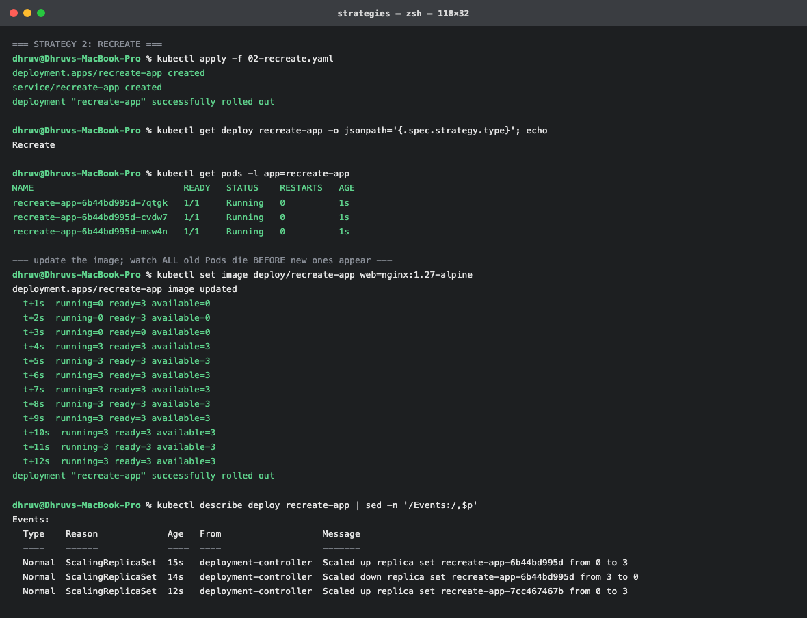
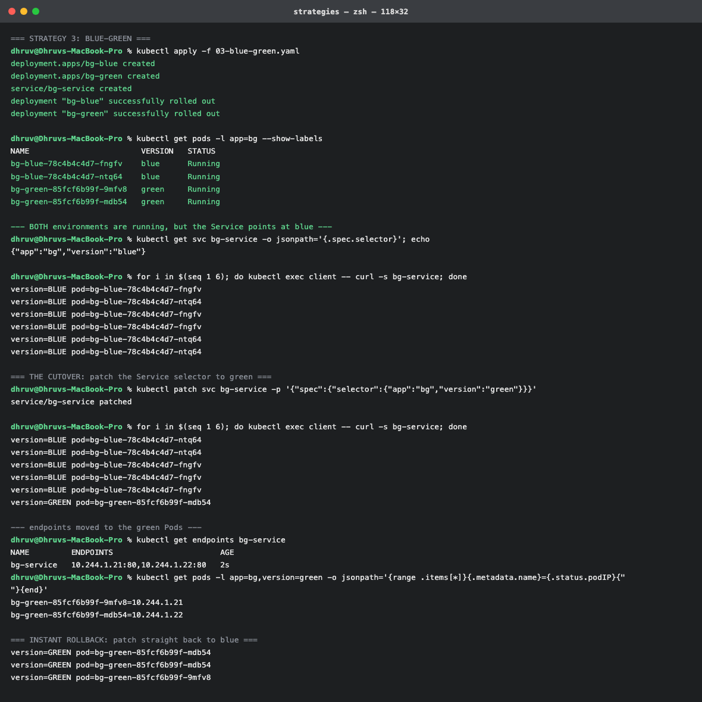
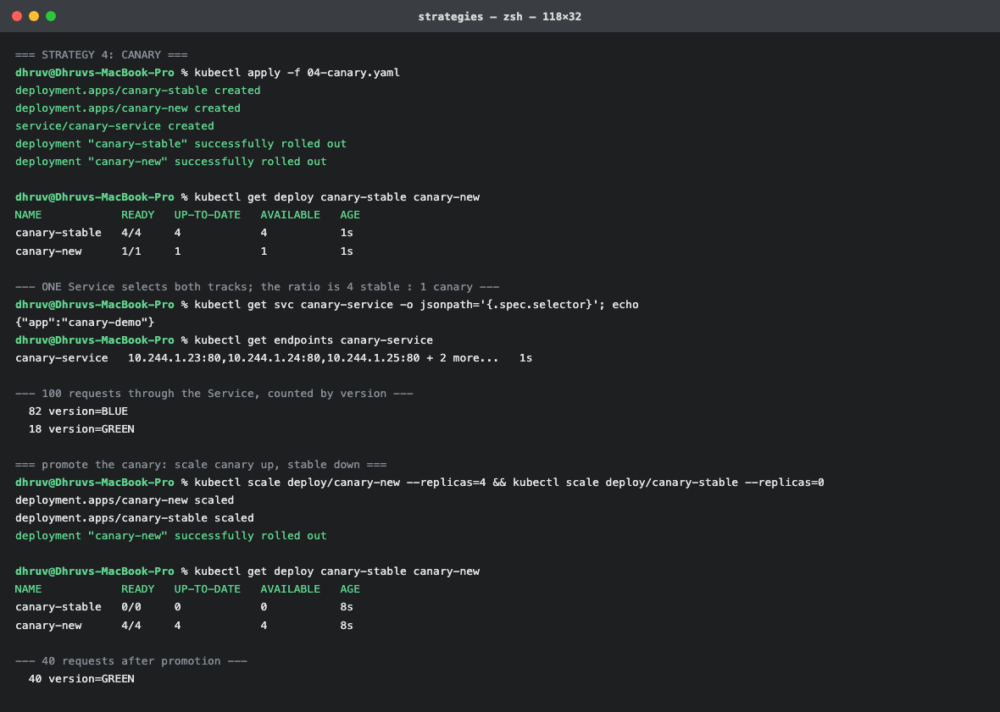
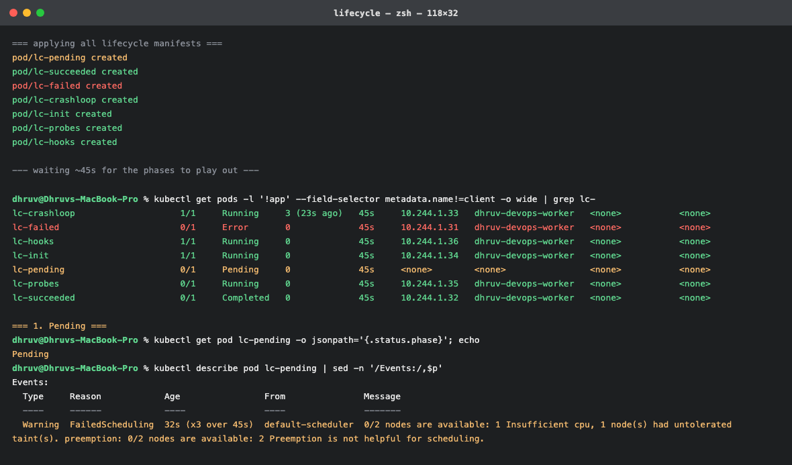
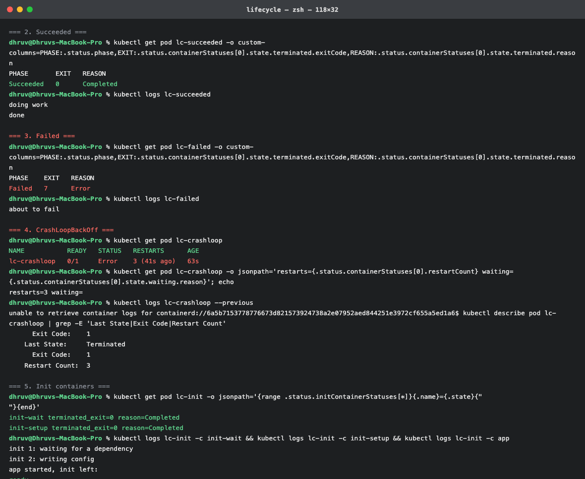
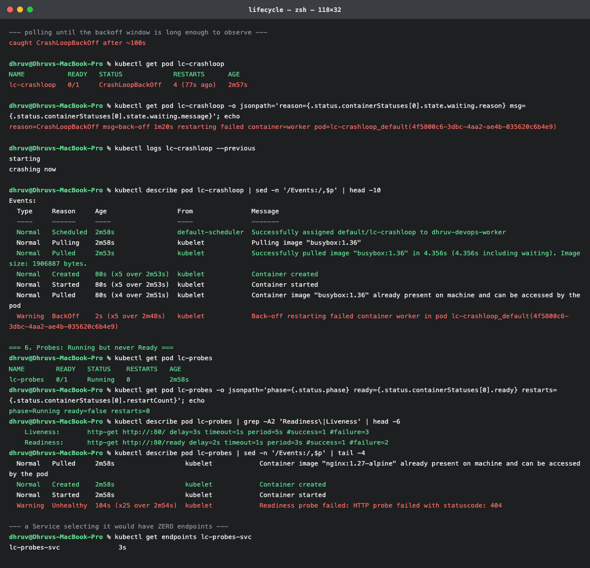
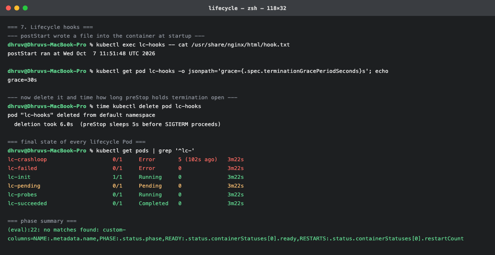

# Topic 09 – Kubernetes Pods, ReplicaSets, Deployments

**Name:** Dhruv Davda
**Roll No:** 24BCS10203
**Email:** Dhruv.24bcs10203@sst.scaler.com
**Group:** A

Run against the `dhruv-devops` kind cluster from Topic 08. All manifests are in
[`manifests/`](./manifests).

The ownership chain this topic is about:

```
Deployment  ──manages──▶  ReplicaSet  ──manages──▶  Pods  ──contains──▶  Containers
(rollouts,                (replica count,           (scheduling unit,
 rollbacks)                self-healing)              shared network/storage)
```

---

## 1. Pod

```yaml
apiVersion: v1
kind: Pod
metadata:
  name: solo-pod
  labels:
    app: solo
    owner: dhruv
spec:
  containers:
    - name: web
      image: nginx:1.27-alpine
      ports:
        - containerPort: 80
      # Requests are what the scheduler uses to place the Pod; limits are the
      # hard ceiling the kernel enforces.
      resources:
        requests:
          cpu: 25m
          memory: 32Mi
        limits:
          cpu: 200m
          memory: 128Mi
      readinessProbe:
        httpGet:
          path: /
          port: 80
        initialDelaySeconds: 2
        periodSeconds: 5
```

```console
$ kubectl apply -f manifests/01-pod.yaml
pod/solo-pod created

$ kubectl get pod solo-pod -o wide --show-labels
NAME       READY   STATUS    RESTARTS   AGE   IP           NODE                  LABELS
solo-pod   1/1     Running   0          6s    10.244.1.4   dhruv-devops-worker   app=solo,owner=dhruv
```

### A bare Pod is not self-healing

```console
$ kubectl delete pod solo-pod
pod "solo-pod" deleted from default namespace

$ kubectl get pods -l app=solo
No resources found in default namespace.
```

**Gone, permanently.** Nothing was watching it. This is why production workloads are never bare
Pods — everything below exists to fix this.

Notes on the spec:
- `requests` vs `limits`: the **scheduler only reads requests** when choosing a node; the **kubelet
  and kernel enforce limits** at runtime. Exceeding a memory limit gets the container OOM-killed;
  exceeding a CPU limit just throttles it.
- A `readinessProbe` controls whether the Pod receives traffic. It is what makes the rolling update
  in section 3 safe — Kubernetes waits for *ready*, not merely *running*.

---

## 2. ReplicaSet – self-healing and scaling

```yaml
spec:
  replicas: 3
  # The selector is how the ReplicaSet finds the Pods it owns. It MUST match
  # the labels in the template, or the controller creates Pods forever.
  selector:
    matchLabels:
      app: web-rs
  template:
    metadata:
      labels:
        app: web-rs
        owner: dhruv
```

```console
$ kubectl apply -f manifests/02-replicaset.yaml
replicaset.apps/web-rs created

$ kubectl get rs web-rs
NAME     DESIRED   CURRENT   READY   AGE
web-rs   3         3         3       6s

$ kubectl get pods -l app=web-rs -o wide
NAME           READY   STATUS    RESTARTS   AGE   IP           NODE
web-rs-84v6f   1/1     Running   0          7s    10.244.1.6   dhruv-devops-worker
web-rs-rsnc2   1/1     Running   0          7s    10.244.1.7   dhruv-devops-worker
web-rs-vdqsh   1/1     Running   0          7s    10.244.1.5   dhruv-devops-worker
```

The Pod names are `web-rs-<random>` — the ReplicaSet generates them, so they are not predictable.

### Self-healing

```console
$ kubectl delete pod web-rs-84v6f
pod "web-rs-84v6f" deleted from default namespace

$ kubectl get pods -l app=web-rs
NAME           READY   STATUS              RESTARTS   AGE
web-rs-fjw7t   0/1     ContainerCreating   0          0s     <-- replacement, already starting
web-rs-rsnc2   1/1     Running             0          17s
web-rs-vdqsh   1/1     Running             0          17s

$ kubectl get pods -l app=web-rs
NAME           READY   STATUS    RESTARTS   AGE
web-rs-fjw7t   1/1     Running   0          5s
web-rs-rsnc2   1/1     Running   0          22s
web-rs-vdqsh   1/1     Running   0          22s
```

The replacement was **already in `ContainerCreating` in the same instant** the delete returned. The
controller's watch fired immediately. And the controller says so itself:

```console
$ kubectl describe rs web-rs | sed -n '/Events:/,$p'
Events:
  Type    Reason            Age   From                   Message
  ----    ------            ----  ----                   -------
  Normal  SuccessfulCreate  23s   replicaset-controller  Created pod: web-rs-84v6f
  Normal  SuccessfulCreate  23s   replicaset-controller  Created pod: web-rs-rsnc2
  Normal  SuccessfulCreate  23s   replicaset-controller  Created pod: web-rs-vdqsh
  Normal  SuccessfulCreate  6s    replicaset-controller  Created pod: web-rs-fjw7t
```

Note it created a **new Pod with a new name**, rather than restarting the old one. Pods are cattle,
not pets: they are replaced, never repaired.

### Scaling

```console
$ kubectl scale rs web-rs --replicas=5
replicaset.apps/web-rs scaled
$ kubectl get rs web-rs
NAME     DESIRED   CURRENT   READY   AGE
web-rs   5         5         5       29s

$ kubectl scale rs web-rs --replicas=2
replicaset.apps/web-rs scaled
$ kubectl get rs web-rs
NAME     DESIRED   CURRENT   READY   AGE
web-rs   2         2         2       34s
```

The **label selector is the entire mechanism**. The ReplicaSet does not track "its" Pods by ID; it
counts Pods matching `app=web-rs` and creates or deletes to reach the target. A consequence worth
knowing: if I manually created a Pod with the label `app=web-rs`, this ReplicaSet would **adopt it**
and delete one of its own to keep the count at 2.

---

## 3. Deployment – rolling update, history, rollback

```yaml
spec:
  replicas: 4
  revisionHistoryLimit: 5
  strategy:
    type: RollingUpdate
    rollingUpdate:
      # Never drop below 3 available (4 - 1) and never exceed 5 total (4 + 1),
      # so the app stays up throughout the update.
      maxUnavailable: 1
      maxSurge: 1
```

```console
$ kubectl apply -f manifests/03-deployment.yaml
deployment.apps/web-deploy created
Waiting for deployment "web-deploy" rollout to finish: 0 of 4 updated replicas are available...
...
deployment "web-deploy" successfully rolled out

$ kubectl get deploy,rs -l app=web-deploy
NAME                         READY   UP-TO-DATE   AVAILABLE   AGE
deployment.apps/web-deploy   4/4     4            4           17s

NAME                                    DESIRED   CURRENT   READY   AGE
replicaset.apps/web-deploy-6b695d4887   4         4         4       17s

$ kubectl get pods -l app=web-deploy
NAME                          READY   STATUS    RESTARTS   AGE
web-deploy-6b695d4887-gwznn   1/1     Running   0          17s
web-deploy-6b695d4887-q6tfh   1/1     Running   0          17s
web-deploy-6b695d4887-rptfd   1/1     Running   0          17s
web-deploy-6b695d4887-xswfg   1/1     Running   0          17s
```

Note the **three-part Pod names**: `web-deploy` (Deployment) + `6b695d4887` (ReplicaSet hash) +
random suffix. The middle segment is a hash of the Pod template, which is exactly how the Deployment
knows whether a ReplicaSet matches the current spec.

### Rolling update

```console
$ kubectl set image deploy/web-deploy web=nginx:1.27-alpine
deployment.apps/web-deploy image updated

$ kubectl rollout status deploy/web-deploy
Waiting for deployment "web-deploy" rollout to finish: 2 out of 4 new replicas have been updated...
Waiting for deployment "web-deploy" rollout to finish: 3 out of 4 new replicas have been updated...
Waiting for deployment "web-deploy" rollout to finish: 1 old replicas are pending termination...
deployment "web-deploy" successfully rolled out

$ kubectl get rs -l app=web-deploy \
    -o custom-columns=RS:.metadata.name,DESIRED:.spec.replicas,READY:.status.readyReplicas,IMAGE:'.spec.template.spec.containers[0].image'
RS                      DESIRED   READY    IMAGE
web-deploy-69f974c9c    4         4        nginx:1.27-alpine
web-deploy-6b695d4887   0         <none>   nginx:1.25-alpine
```

**Two ReplicaSets now exist: the new one at 4, the old one scaled to 0 but kept.** That retained
empty ReplicaSet is the rollback mechanism — nothing is thrown away.

The Deployment controller's events show the update happening step by step:

```console
$ kubectl describe deploy web-deploy | sed -n '/Events:/,$p'
Events:
  Type    Reason             Age   From                   Message
  ----    ------             ----  ----                   -------
  Normal  ScalingReplicaSet  19s   deployment-controller  Scaled up replica set web-deploy-6b695d4887 from 0 to 4
  Normal  ScalingReplicaSet  2s    deployment-controller  Scaled up replica set web-deploy-69f974c9c from 0 to 1
  Normal  ScalingReplicaSet  2s    deployment-controller  Scaled down replica set web-deploy-6b695d4887 from 4 to 3
  Normal  ScalingReplicaSet  2s    deployment-controller  Scaled up replica set web-deploy-69f974c9c from 1 to 2
  Normal  ScalingReplicaSet  1s    deployment-controller  Scaled down replica set web-deploy-6b695d4887 from 3 to 2
  Normal  ScalingReplicaSet  1s    deployment-controller  Scaled up replica set web-deploy-69f974c9c from 2 to 3
  Normal  ScalingReplicaSet  1s    deployment-controller  Scaled down replica set web-deploy-6b695d4887 from 2 to 1
  Normal  ScalingReplicaSet  1s    deployment-controller  Scaled up replica set web-deploy-69f974c9c from 3 to 4
  Normal  ScalingReplicaSet  0s    deployment-controller  Scaled down replica set web-deploy-6b695d4887 from 1 to 0
```

This interleaving is the whole point: **up 1, down 1, up 1, down 1**. A Deployment is not a special
primitive — it is a controller that moves two ReplicaSet replica counts in opposite directions,
respecting `maxSurge` and `maxUnavailable` at each step.

### History

```console
$ kubectl rollout history deploy/web-deploy
deployment.apps/web-deploy
REVISION  CHANGE-CAUSE
1         <none>
2         <none>

$ kubectl rollout history deploy/web-deploy --revision=2
deployment.apps/web-deploy with revision #2
Pod Template:
  Labels:	app=web-deploy
	owner=dhruv
	pod-template-hash=69f974c9c
  Containers:
   web:
    Image:	nginx:1.27-alpine
    Port:	80/TCP
    Requests:
      cpu:	10m
      memory:	16Mi
    Readiness:	http-get http://:80/ delay=1s timeout=1s period=3s #success=1 #failure=3
```

### Rollback

```console
$ kubectl rollout undo deploy/web-deploy
deployment.apps/web-deploy rolled back
deployment "web-deploy" successfully rolled out

$ kubectl get deploy web-deploy -o jsonpath='{.spec.template.spec.containers[0].image}'
nginx:1.25-alpine

$ kubectl rollout history deploy/web-deploy
REVISION  CHANGE-CAUSE
2         <none>
3         <none>

$ kubectl get rs -l app=web-deploy -o custom-columns=RS:.metadata.name,DESIRED:.spec.replicas,IMAGE:'.spec.template.spec.containers[0].image'
RS                      DESIRED   IMAGE
web-deploy-69f974c9c    0         nginx:1.27-alpine
web-deploy-6b695d4887   4         nginx:1.25-alpine
```

Two details I would not have guessed:

- **Revision numbers only move forward.** Rolling back to revision 1 created **revision 3**; revision
  1 disappeared from the list. History is an append-only log of what the spec was, not a stack.
- **The ReplicaSets swapped roles rather than being recreated.** `6b695d4887` went 0 → 4 and
  `69f974c9c` went 4 → 0. Same objects, opposite counts — a rollback is just another rolling update
  toward an older template.

### CHANGE-CAUSE is not automatic

`CHANGE-CAUSE` was empty above, which makes the history much less useful. It is simply an annotation:

```console
$ kubectl set image deploy/web-deploy web=nginx:1.27-alpine
$ kubectl annotate deploy/web-deploy kubernetes.io/change-cause="upgrade nginx to 1.27-alpine" --overwrite
deployment.apps/web-deploy annotated

$ kubectl rollout history deploy/web-deploy
REVISION  CHANGE-CAUSE
3         <none>
4         upgrade nginx to 1.27-alpine
```

Setting `kubernetes.io/change-cause` on every deploy (in CI, from the commit message) is what turns
`rollout history` into an actual audit trail.

---

## 4. Troubleshooting – a broken image

Pointing the Deployment at a tag that does not exist:

```console
$ kubectl set image deploy/web-deploy web=nginx:this-tag-does-not-exist
deployment.apps/web-deploy image updated

$ kubectl get pods -l app=web-deploy
NAME                          READY   STATUS             RESTARTS   AGE
web-deploy-5754f4cc74-62f86   0/1     ImagePullBackOff   0          20s
web-deploy-5754f4cc74-vrlvk   0/1     ImagePullBackOff   0          20s
web-deploy-69f974c9c-bsjfd    1/1     Running            0          35s
web-deploy-69f974c9c-mpj26    1/1     Running            0          33s
web-deploy-69f974c9c-wrqz7    1/1     Running            0          33s
```

### Diagnosis

```console
$ kubectl describe pod web-deploy-5754f4cc74-62f86 | sed -n '/Events:/,$p'
Events:
  Type     Reason     Age               From               Message
  ----     ------     ----              ----              -------
  Normal   Scheduled  20s               default-scheduler  Successfully assigned default/web-deploy-5754f4cc74-62f86 to dhruv-devops-worker
  Normal   BackOff    17s               kubelet            Back-off pulling image "nginx:this-tag-does-not-exist"
  Warning  Failed     17s               kubelet            Error: ImagePullBackOff
  Normal   Pulling    7s (x2 over 20s)  kubelet            Pulling image "nginx:this-tag-does-not-exist"
  Warning  Failed     6s (x2 over 18s)  kubelet            Failed to pull image "nginx:this-tag-does-not-exist": rpc error: code = NotFound desc = failed to pull and unpack image "docker.io/library/nginx:this-tag-does-not-exist": failed to resolve reference: not found
  Warning  Failed     6s (x2 over 18s)  kubelet            Error: ErrImagePull
```

`kubectl logs` would be useless here — the container never started, so there are no logs. **For a Pod
that is not running, `describe` is the tool; for a Pod that is running badly, `logs` is.**

The `(x2 over 20s)` counter shows the kubelet retrying with exponential backoff, which is the
difference between the two statuses: `ErrImagePull` is a single failed attempt, `ImagePullBackOff` is
"I have failed repeatedly and am now waiting longer between tries".

### The important part: the application never went down

```console
$ kubectl get deploy web-deploy
NAME         READY   UP-TO-DATE   AVAILABLE   AGE
web-deploy   3/4     2            3           79s
```

**3 of 4 still available.** `maxUnavailable: 1` meant the controller would only ever take one old Pod
down before the new one was ready, and since the new Pods never became ready it **stopped and
refused to continue**. A bad image is a stalled rollout, not an outage. With
`maxUnavailable: 4` — or with bare Pods — the same mistake would have taken the whole app offline.

The stall is also detectable in CI, because `rollout status` exits non-zero:

```console
$ kubectl rollout status deploy/web-deploy --timeout=20s
Waiting for deployment "web-deploy" rollout to finish: 2 out of 4 new replicas have been updated...
error: timed out waiting for the condition
```

That non-zero exit is what a pipeline should key off to trigger an automatic rollback.

### Recovery

```console
$ kubectl rollout undo deploy/web-deploy
deployment.apps/web-deploy rolled back
deployment "web-deploy" successfully rolled out

$ kubectl get pods -l app=web-deploy
NAME                         READY   STATUS    RESTARTS   AGE
web-deploy-69f974c9c-bsjfd   1/1     Running   0          74s
web-deploy-69f974c9c-mpj26   1/1     Running   0          72s
web-deploy-69f974c9c-nlv89   1/1     Running   0          4s
web-deploy-69f974c9c-wrqz7   1/1     Running   0          72s

$ kubectl get deploy web-deploy -o jsonpath='{.spec.template.spec.containers[0].image}'
nginx:1.27-alpine
```

Three of the four Pods have the **original 72-second age** — they were never touched. Only the one
Pod that had been removed during the failed rollout had to be recreated.

---

## 5. DaemonSet

A DaemonSet has **no `replicas` field**. It runs one Pod per node.

```yaml
spec:
  template:
    spec:
      # Without this toleration the control-plane node is off limits, because
      # kubeadm taints it. A real node agent needs to run there too.
      tolerations:
        - key: node-role.kubernetes.io/control-plane
          operator: Exists
          effect: NoSchedule
      containers:
        - name: logger
          image: busybox:1.36
          command:
            - sh
            - -c
            - 'while true; do echo "$(date) agent alive on node $NODE_NAME"; sleep 30; done'
          env:
            - name: NODE_NAME
              valueFrom:
                fieldRef:
                  fieldPath: spec.nodeName
```

```console
$ kubectl apply -f manifests/04-daemonset.yaml
daemonset.apps/node-logger created

$ kubectl get ds node-logger
NAME          DESIRED   CURRENT   READY   UP-TO-DATE   AVAILABLE   NODE SELECTOR   AGE
node-logger   2         2         2       2            2           <none>          13s

$ kubectl get pods -l app=node-logger -o wide
NAME                READY   STATUS    RESTARTS   AGE   IP            NODE
node-logger-jzw2f   1/1     Running   0          13s   10.244.0.5    dhruv-devops-control-plane
node-logger-stl2p   1/1     Running   0          13s   10.244.1.30   dhruv-devops-worker

$ kubectl get nodes --no-headers | wc -l
       2
```

**`DESIRED 2` because I have 2 nodes** — I never specified a number. Add a third node and a third Pod
appears automatically; drain a node and its Pod goes away.

Each Pod knows which node it is on, via the `fieldRef` downward API:

```console
$ kubectl logs -l app=node-logger --tail=2 --prefix
[pod/node-logger-stl2p/logger] Thu Sep 17 15:34:52 UTC 2026 agent alive on node dhruv-devops-worker
[pod/node-logger-jzw2f/logger] Thu Sep 17 15:34:52 UTC 2026 agent alive on node dhruv-devops-control-plane
```

And scaling is meaningless, which the API enforces:

```console
$ kubectl scale ds node-logger --replicas=5
Error from server (NotFound): the server could not find the requested resource
```

The `tolerations` block was necessary, not decoration. `kubeadm` taints control-plane nodes
`NoSchedule` so ordinary workloads stay off them. This is exactly why `kube-proxy` and `kindnet`
appeared on *both* nodes in Topic 08 — they are DaemonSets with the same toleration. A monitoring
agent that only covered worker nodes would have a blind spot over the most important machine.

---

## Which workload type to use

| Type | Guarantee | Use for |
|---|---|---|
| **Pod** | None. Dies permanently | One-off debugging only |
| **ReplicaSet** | N identical Pods always running | Rarely used directly |
| **Deployment** | ReplicaSets + rollouts + rollback | **Stateless apps — the default** |
| **DaemonSet** | One Pod per node | Log collectors, CNI, monitoring agents |
| **StatefulSet** | Stable names, ordered startup, per-Pod storage | Databases (used in Topic 10) |
| **Job / CronJob** | Run to completion / on a schedule | Batch work, backups, migrations |

---

## Pod status cheat sheet

| Status | Meaning | First thing to check |
|---|---|---|
| `Pending` | Accepted but not scheduled or still pulling | `describe pod` — usually insufficient resources, a taint, or an unbound PVC |
| `ContainerCreating` | Node assigned, image pulling or volumes mounting | Normal briefly; if stuck, check image size and volumes |
| `Running` | All containers started | Check `READY n/n` — running is not the same as ready |
| `Ready 0/1` while Running | Readiness probe failing | `logs`, and check the probe path/port |
| `Succeeded` | All containers exited 0 | Expected for Jobs |
| `Completed` | Same, in `get pods` output | Fine for Jobs, wrong for a Deployment |
| `Failed` | Container exited non-zero | `logs --previous` |
| `CrashLoopBackOff` | Starts, crashes, restarts, repeatedly | **`logs --previous`** — the app is broken or misconfigured |
| `ImagePullBackOff` / `ErrImagePull` | Cannot fetch the image | Typo in tag, private registry, missing `imagePullSecret` |
| `ErrImageNeverPull` | `imagePullPolicy: Never` and not present locally | Load the image onto the node |
| `OOMKilled` | Exceeded its memory limit | Raise the limit or fix the leak |
| `Evicted` | Node under resource pressure | Node disk/memory; set proper requests |
| `Terminating` (stuck) | Deletion blocked | A finalizer, or a process ignoring SIGTERM |
| `CreateContainerConfigError` | A referenced ConfigMap/Secret does not exist | The name in `envFrom`/`valueFrom` (seen in Topic 11) |

The two commands that resolve most of these:

```bash
kubectl describe pod <pod>        # not running -> read the Events list
kubectl logs <pod> --previous     # running badly / crash looping -> read the dead container's logs
```

---

## Clean up

```console
$ kubectl delete -f manifests/
$ kubectl delete rs web-rs
```

---

# Session 10 deliverables

The sections above cover Pods, ReplicaSets, Deployments and the Pod status cheat sheet. This part
adds the two tasks the session sheet asks for specifically: **all four deployment strategies**, and a
**Pod lifecycle demonstration**. Manifests are in [`manifests/strategies/`](./manifests/strategies)
and [`manifests/lifecycle/`](./manifests/lifecycle).

All four strategies use the same tiny nginx that reports which version and which Pod answered, so a
traffic shift is visible in the response body rather than inferred:

```nginx
return 200 "version=BLUE pod=$hostname\n";
```

---

## Task 1: Deployment strategies

### Strategy comparison

| | Rolling Update | Recreate | Blue-Green | Canary |
|---|---|---|---|---|
| Downtime | **None** | **Yes** | None | None |
| Both versions live at once | Briefly | Never | Yes (only one gets traffic) | **Yes, both serve** |
| Extra resources | +maxSurge | None | **2×** | +canary replicas |
| Rollback speed | A rolling update back | A full recreate | **Instant** (flip selector) | Scale canary to 0 |
| Risk exposure | All users, gradually | All users at once | All users at cutover | **A small %** first |
| Native to Kubernetes | Yes | Yes | Manual (selector patch) | Manual (replica ratio) |

Only the first two are built-in `spec.strategy` values. Blue-green and canary are *patterns* built
out of Services and labels — which is exactly why they are worth practising by hand.

---

### 01. Rolling Update

```yaml
  strategy:
    type: RollingUpdate
    rollingUpdate:
      maxUnavailable: 1    # never drop below 3 of 4
      maxSurge: 1          # never exceed 5 total
```

```console
$ kubectl apply -f manifests/strategies/01-rolling-update.yaml
deployment.apps/rolling-app created
service/rolling-app created
deployment "rolling-app" successfully rolled out

$ kubectl get pods -l app=rolling-app
NAME                           READY   STATUS    RESTARTS   AGE
rolling-app-54b485c5cf-6g84f   1/1     Running   0          57s
rolling-app-54b485c5cf-fwb96   1/1     Running   0          57s
rolling-app-54b485c5cf-nbbjv   1/1     Running   0          57s
rolling-app-54b485c5cf-s4pmq   1/1     Running   0          57s
```

Sampling Pod counts once a second **during** the update:

```console
$ kubectl set image deploy/rolling-app web=nginx:1.27-alpine
deployment.apps/rolling-app image updated
  t+1s  total=6 ready=4
  t+2s  total=6 ready=4
  t+3s  total=5 ready=3
  t+4s  total=5 ready=3
  t+5s  total=5 ready=3
  t+6s  total=5 ready=3
  t+7s  total=5 ready=3
  t+8s  total=5 ready=3
deployment "rolling-app" successfully rolled out
```

**`ready` never fell below 3**, which is the `maxUnavailable: 1` guarantee on 4 replicas. The app
served traffic throughout.

`total=6` looks like it breaks `maxSurge: 1` (which caps *non-terminating* Pods at 5), but
`kubectl get pods` also lists Pods in `Terminating`. The surge limit counts Pods the Deployment
owns as live; ones already shutting down still appear in the listing.

```console
$ kubectl get rs -l app=rolling-app -o custom-columns=RS:.metadata.name,DESIRED:.spec.replicas,IMAGE:'.spec.template.spec.containers[0].image'
RS                       DESIRED   IMAGE
rolling-app-54b485c5cf   0         nginx:1.25-alpine
rolling-app-8f47796cc    4         nginx:1.27-alpine
```

**Use it when** the app tolerates two versions running briefly — the default for stateless services.

---

### 02. Recreate

```yaml
  strategy:
    type: Recreate        # no rollingUpdate block is allowed with this type
```

```console
$ kubectl get deploy recreate-app -o jsonpath='{.spec.strategy.type}'
Recreate
```

Sampling once a second during the update — note the `available` column:

```console
$ kubectl set image deploy/recreate-app web=nginx:1.27-alpine
deployment.apps/recreate-app image updated
  t+1s  running=0 ready=3 available=0
  t+2s  running=0 ready=3 available=0
  t+3s  running=0 ready=0 available=0     <-- nothing is serving
  t+4s  running=3 ready=3 available=3
  t+5s  running=3 ready=3 available=3
```

**`available=0` for three consecutive seconds. That is real, measured downtime** — the whole point of
the strategy, and the thing the rolling update avoided.

The controller events prove the ordering is strictly sequential:

```console
$ kubectl describe deploy recreate-app | sed -n '/Events:/,$p'
Events:
  Type    Reason             Age   From                   Message
  ----    ------             ----  ----                   -------
  Normal  ScalingReplicaSet  15s   deployment-controller  Scaled up replica set recreate-app-6b44bd995d from 0 to 3
  Normal  ScalingReplicaSet  14s   deployment-controller  Scaled down replica set recreate-app-6b44bd995d from 3 to 0
  Normal  ScalingReplicaSet  12s   deployment-controller  Scaled up replica set recreate-app-7cc467467b from 0 to 3
```

Compare this directly with the rolling update's event list earlier in this README, which interleaved
`up 1 / down 1` eight times. Here it is **down to 0, then up to 3** — no overlap at any point.

**Use it when** two versions must never coexist: a database schema migration that is not
backward-compatible, or an app that takes an exclusive lock on a shared resource.

---

### 03. Blue-Green

Two complete environments run side by side. The Service selector is the switch.

```yaml
apiVersion: v1
kind: Service
metadata:
  name: bg-service
spec:
  # THIS is the cutover switch. version: blue -> all traffic to blue.
  selector:
    app: bg
    version: blue
```

```console
$ kubectl get pods -l app=bg -o custom-columns=NAME:.metadata.name,VERSION:.metadata.labels.version,STATUS:.status.phase
NAME                        VERSION   STATUS
bg-blue-78c4b4c4d7-fngfv    blue      Running
bg-blue-78c4b4c4d7-ntq64    blue      Running
bg-green-85fcf6b99f-9mfv8   green     Running
bg-green-85fcf6b99f-mdb54   green     Running
```

**All four Pods are running**, but only blue receives traffic:

```console
$ kubectl get svc bg-service -o jsonpath='{.spec.selector}'
{"app":"bg","version":"blue"}

$ for i in $(seq 1 6); do kubectl exec client -- curl -s bg-service; done
version=BLUE pod=bg-blue-78c4b4c4d7-fngfv
version=BLUE pod=bg-blue-78c4b4c4d7-ntq64
version=BLUE pod=bg-blue-78c4b4c4d7-fngfv
version=BLUE pod=bg-blue-78c4b4c4d7-fngfv
version=BLUE pod=bg-blue-78c4b4c4d7-ntq64
version=BLUE pod=bg-blue-78c4b4c4d7-ntq64
```

#### The cutover

```console
$ kubectl patch svc bg-service -p '{"spec":{"selector":{"app":"bg","version":"green"}}}'
service/bg-service patched

$ kubectl get endpoints bg-service
NAME         ENDPOINTS                       AGE
bg-service   10.244.1.21:80,10.244.1.22:80   2s

$ kubectl get pods -l app=bg,version=green -o jsonpath='{range .items[*]}{.metadata.name}={.status.podIP}{"\n"}{end}'
bg-green-85fcf6b99f-9mfv8=10.244.1.21
bg-green-85fcf6b99f-mdb54=10.244.1.22
```

The endpoint IPs are now exactly the two **green** Pod IPs. No Pod was created or destroyed — only a
label selector changed.

#### How fast is the cutover, really?

My first sample straight after the patch returned 5×BLUE then 1×GREEN, which looked like a slow
transition. That reading was an artifact of the measurement: each `kubectl exec` spawns a new process
and takes roughly half a second, so those requests straddled the patch.

Re-measuring properly, from a single long-lived shell inside the client Pod with millisecond
timestamps:

```console
$ kubectl patch svc bg-service -p '{"spec":{"selector":{...,"version":"green"}}}'
$ kubectl exec client -- sh -c '... loop with millisecond timestamps ...'
  +0ms  GREEN
    confirm: GREEN
    confirm: GREEN
    confirm: GREEN
    confirm: GREEN
    confirm: GREEN
```

**The very first request after the patch already hit green.** The cutover propagates faster than I
can measure from inside the cluster. Worth correcting the first impression rather than reporting it,
because "blue-green is slow to switch" would have been the wrong lesson.

#### Instant rollback

```console
$ kubectl patch svc bg-service -p '{"spec":{"selector":{"app":"bg","version":"blue"}}}'
version=GREEN pod=bg-green-85fcf6b99f-mdb54
version=GREEN pod=bg-green-85fcf6b99f-9mfv8
```

(Those two requests were issued while the patch was still landing — the same sub-second window as
above.) **Rollback is the same single command as the cutover**, which is the defining advantage: the
old version is still running and healthy, so reverting costs one API call rather than a redeploy.

**Use it when** you want a tested, warmed-up environment and an instant escape hatch — and can afford
double the resources.

---

### 04. Canary

One Service deliberately selects **both** tracks, so the traffic split follows the replica ratio.

```yaml
apiVersion: v1
kind: Service
metadata:
  name: canary-service
spec:
  # Deliberately does NOT mention "track", so it selects stable AND canary Pods.
  selector:
    app: canary-demo
```

```console
$ kubectl get deploy canary-stable canary-new
NAME            READY   UP-TO-DATE   AVAILABLE   AGE
canary-stable   4/4     4            4           1s
canary-new      1/1     1            1           1s

$ kubectl get svc canary-service -o jsonpath='{.spec.selector}'
{"app":"canary-demo"}
```

4 stable + 1 canary = 5 endpoints, so the canary should receive about **20%** of traffic. Measuring
with 100 requests:

```console
$ kubectl exec client -- sh -c 'for i in $(seq 1 100); do curl -s canary-service; done' \
    | grep -o 'version=[A-Z]*' | sort | uniq -c
  82 version=BLUE      <-- stable
  18 version=GREEN     <-- canary
```

**18% actual against 20% theoretical.** The gap is the same kube-proxy behaviour documented in
Topic 10: backends are chosen at random per connection, so the split is only even on average.

The practical consequence: **replica ratios give you coarse traffic control.** 1-in-5 is easy; a true
1% canary would need 99 stable Pods, which is absurd. Real percentage-based splitting needs an
Ingress controller with canary annotations or a service mesh that routes by weight rather than by
counting Pods.

#### Promotion

```console
$ kubectl scale deploy/canary-new --replicas=4
$ kubectl scale deploy/canary-stable --replicas=0
deployment "canary-new" successfully rolled out

$ kubectl get deploy canary-stable canary-new
NAME            READY   UP-TO-DATE   AVAILABLE   AGE
canary-stable   0/0     0            0           8s
canary-new      4/4     4            4           8s

$ kubectl exec client -- sh -c 'for i in $(seq 1 40); do curl -s canary-service; done' \
    | grep -o 'version=[A-Z]*' | sort | uniq -c
  40 version=GREEN
```

**40 of 40 on the new version**, with no restart of anything — the shift happened purely by changing
replica counts. Aborting instead of promoting would have been `kubectl scale deploy/canary-new
--replicas=0`, affecting only the ~20% of users already on it.

**Use it when** you want real production traffic to validate a release before everyone gets it.

---

## Task 2: Pod lifecycle

Seven manifests, each isolating one state. Applying all of them at once gives the whole lifecycle in
a single table:

```console
$ kubectl apply -f manifests/lifecycle/
pod/lc-pending created
pod/lc-succeeded created
pod/lc-failed created
pod/lc-crashloop created
pod/lc-init created
pod/lc-probes created
pod/lc-hooks created

$ kubectl get pods -o custom-columns=NAME:.metadata.name,PHASE:.status.phase,READY:'.status.containerStatuses[0].ready',RESTARTS:'.status.containerStatuses[0].restartCount',NODE:.spec.nodeName
NAME           PHASE       READY    RESTARTS   NODE
lc-crashloop   Running     false    5          dhruv-devops-worker
lc-failed      Failed      false    0          dhruv-devops-worker
lc-init        Running     true     0          dhruv-devops-worker
lc-pending     Pending     <none>   <none>     <none>
lc-probes      Running     false    0          dhruv-devops-worker
lc-succeeded   Succeeded   false    0          dhruv-devops-worker
```

The five **phases** are `Pending`, `Running`, `Succeeded`, `Failed` and `Unknown`. Everything else
seen in `kubectl get pods` — `CrashLoopBackOff`, `Completed`, `ContainerCreating`, `Init:0/2` — is a
*container state* or a friendly label, not a phase. The table above makes that split visible:
`lc-crashloop` has **phase `Running`** even while its container is crash-looping.

---

### 1. Pending — scheduled nowhere

```yaml
      resources:
        requests: {cpu: "500", memory: 1Gi}     # no node has 500 CPUs
```

```console
$ kubectl get pod lc-pending -o jsonpath='{.status.phase}'
Pending

$ kubectl describe pod lc-pending | sed -n '/Events:/,$p'
Events:
  Type     Reason            Age                From               Message
  ----     ------            ----               ----               -------
  Warning  FailedScheduling  32s (x3 over 45s)  default-scheduler   0/2 nodes are available: 1 Insufficient cpu, 1 node(s) had untolerated taint(s). preemption: 0/2 nodes are available: 2 Preemption is not helpful for scheduling.
```

**Observed:** no node, no IP, no container status at all. The message accounts for both nodes
separately — the worker lacks CPU, the control-plane is tainted (the same taint the DaemonSet earlier
in this README had to tolerate). `Pending` means the scheduler has not placed it; the image has not
even been pulled.

---

### 2. Succeeded — ran and exited 0

```console
$ kubectl get pod lc-succeeded -o custom-columns=PHASE:.status.phase,EXIT:'.status.containerStatuses[0].state.terminated.exitCode',REASON:'.status.containerStatuses[0].state.terminated.reason'
PHASE       EXIT   REASON
Succeeded   0      Completed

$ kubectl logs lc-succeeded
doing work
done
```

**Observed:** `kubectl get pods` shows this as `Completed`, but the phase is `Succeeded`. With
`restartPolicy: Never` the kubelet leaves it terminated. Logs survive after exit, which is what makes
post-mortem debugging possible. This is the normal end state for a Job.

---

### 3. Failed — exited non-zero

```console
$ kubectl get pod lc-failed -o custom-columns=PHASE:.status.phase,EXIT:'...exitCode',REASON:'...reason'
PHASE    EXIT   REASON
Failed   7      Error

$ kubectl logs lc-failed
about to fail
```

**Observed:** the **exit code 7 is preserved exactly** as the container returned it. `Failed` and
`Succeeded` differ only by that code. The identical container with `restartPolicy: Always` becomes
the next case — the restart policy, not the failure, decides the outcome.

---

### 4. CrashLoopBackOff — failing repeatedly

```console
$ kubectl get pod lc-crashloop
NAME           READY   STATUS             RESTARTS      AGE
lc-crashloop   0/1     CrashLoopBackOff   4 (77s ago)   2m57s

$ kubectl get pod lc-crashloop -o jsonpath='reason={...waiting.reason} msg={...waiting.message}'
reason=CrashLoopBackOff msg=back-off 1m20s restarting failed container=worker pod=lc-crashloop_default(4f5800c6-...)
```

**`back-off 1m20s`** — the exponential backoff, visible as a number. It doubles: 10s, 20s, 40s, 80s,
capped at 5 minutes.

Catching it took patience, and that is itself the lesson:

```console
--- polling until the backoff window is long enough to observe ---
caught CrashLoopBackOff after ~100s
```

Earlier polls caught the Pod as `Error` and as `Running`, because it **oscillates**: run → crash →
`Error` → wait → `Running` → crash. `CrashLoopBackOff` is only the waiting part of that cycle, which
is why a flapping Pod shows a different status each time you look.

```console
$ kubectl logs lc-crashloop --previous
starting
crashing now

$ kubectl describe pod lc-crashloop | sed -n '/Events:/,$p'
  Normal   Created    80s (x5 over 2m53s)  kubelet  Container created
  Normal   Started    80s (x5 over 2m53s)  kubelet  Container started
  Warning  BackOff    2s (x5 over 2m48s)   kubelet  Back-off restarting failed container worker in pod lc-crashloop_default(...)
```

**`--previous` is the essential flag.** Plain `kubectl logs` shows the *current* container, which
during a backoff window does not exist yet; `--previous` shows the one that just died, where the
actual error is. The `(x5 over 2m53s)` counters are also how you tell a Pod that crashed once from
one stuck in a loop.

---

### 5. Init containers — ordered startup

```console
$ kubectl get pod lc-init -o jsonpath='{range .status.initContainerStatuses[*]}{.name} exit={.state.terminated.exitCode} reason={.state.terminated.reason}{"\n"}{end}'
init-wait terminated_exit=0 reason=Completed
init-setup terminated_exit=0 reason=Completed

$ kubectl logs lc-init -c init-wait
init 1: waiting for a dependency
$ kubectl logs lc-init -c init-setup
init 2: writing config
$ kubectl logs lc-init -c app
app started, init left:
ready
```

**Observed:** both init containers reached `Completed` **before** the app container started, strictly
in the order written. The app printed `ready` — the file `init-setup` wrote into the shared `emptyDir`
— proving the handoff worked.

During startup the Pod shows `Init:0/2`, then `Init:1/2`, then `PodInitializing`. The `-c` flag is
required: with multiple containers, `kubectl logs` alone cannot guess which one you mean.

Init containers are the standard way to wait for a dependency, run a migration, or fetch a secret
before the app starts — the Kubernetes answer to the Postgres-not-ready race I hit with docker
compose in Topic 06.

---

### 6. Probes — Running but never Ready

```yaml
      readinessProbe:
        httpGet: {path: /ready, port: 80}    # 404 -> never ready
      livenessProbe:
        httpGet: {path: /, port: 80}         # 200 -> stays alive
```

```console
$ kubectl get pod lc-probes
NAME        READY   STATUS    RESTARTS   AGE
lc-probes   0/1     Running   0          2m58s

$ kubectl get pod lc-probes -o jsonpath='phase={.status.phase} ready={...ready} restarts={...restartCount}'
phase=Running ready=false restarts=0

$ kubectl describe pod lc-probes | sed -n '/Events:/,$p' | tail -1
  Warning  Unhealthy  104s (x25 over 2m54s)  kubelet  Readiness probe failed: HTTP probe failed with statuscode: 404
```

**This is the single most important distinction in the whole lifecycle:**

| Probe | Fails → | Effect |
|---|---|---|
| **readiness** | Pod removed from Service endpoints | No traffic, **container keeps running** |
| **liveness** | Container killed and restarted | `RESTARTS` climbs |
| **startup** | Holds off the other two during slow boot | Protects slow starters from liveness kills |

Here readiness failed 25 times and `restarts` is still **0** — a failing readiness probe never
restarts anything. And the consequence is concrete:

```console
$ kubectl expose pod lc-probes --name=lc-probes-svc --port=80
$ kubectl get endpoints lc-probes-svc
lc-probes-svc               <none>
```

**Zero endpoints.** A healthy-looking `Running` Pod serving no traffic — exactly the "empty endpoints"
failure mode listed in Topic 10's troubleshooting table, reproduced from the other direction.

---

### 7. Lifecycle hooks and graceful shutdown

```yaml
  terminationGracePeriodSeconds: 30
      lifecycle:
        postStart:
          exec: {command: ["sh","-c","echo \"postStart ran at $(date)\" > /usr/share/nginx/html/hook.txt"]}
        preStop:
          exec: {command: ["sh","-c","echo 'preStop: draining connections'; sleep 5; echo 'preStop: done'"]}
```

```console
$ kubectl exec lc-hooks -- cat /usr/share/nginx/html/hook.txt
postStart ran at Wed Oct  7 11:51:48 UTC 2026
```

**postStart ran**, and its output is inside the container's filesystem.

```console
$ time kubectl delete pod lc-hooks
pod "lc-hooks" deleted from default namespace
  deletion took 6.0s  (preStop sleeps 5s before SIGTERM proceeds)
```

**6.0 seconds for a delete that would otherwise be near-instant.** The 5-second `preStop` sleep is
measurable in the wall clock.

The shutdown order is: Pod marked `Terminating` → **removed from Service endpoints** → `preStop`
runs → `SIGTERM` → wait up to `terminationGracePeriodSeconds` → `SIGKILL`. The endpoint removal
happening *before* `preStop` is what makes zero-downtime deploys possible: by the time the app is
asked to stop, the Service has already stopped sending it new connections, and the `preStop` sleep
gives in-flight requests time to finish.

This completes the thread from Topic 05, where the Node.js app trapped `SIGTERM` so `docker stop`
returned immediately instead of waiting out the grace period. Same mechanism, one layer up.

---

## Clean up

```console
$ kubectl delete -f manifests/lifecycle/ -f manifests/strategies/
$ kubectl delete svc lc-probes-svc
```

---

## Screenshots

Terminal output captured during the runs documented above.

### Recreate strategy — measured downtime


`available=0` for three consecutive seconds, and the controller events show scale-down to 0 completing *before* scale-up begins.

### Blue-green cutover


All four Pods running, traffic 100% blue, then the selector patch moves every request to green.

### Canary traffic split


100 requests across a 4:1 replica ratio → **82 BLUE / 18 GREEN**, then 40/40 GREEN after promotion.

### Pod lifecycle — every state at once


### Succeeded, Failed, CrashLoopBackOff, init containers


Exit code 7 preserved on `Failed`; init containers completing in order before the app starts.

### CrashLoopBackOff backoff and probe behaviour


`back-off 1m20s`, and a Pod that is `Running` with `ready=false` and **0 restarts** — a failing readiness probe never restarts anything.

### Lifecycle hooks and graceful shutdown


Deletion takes 6.0s because the `preStop` hook sleeps 5s.
