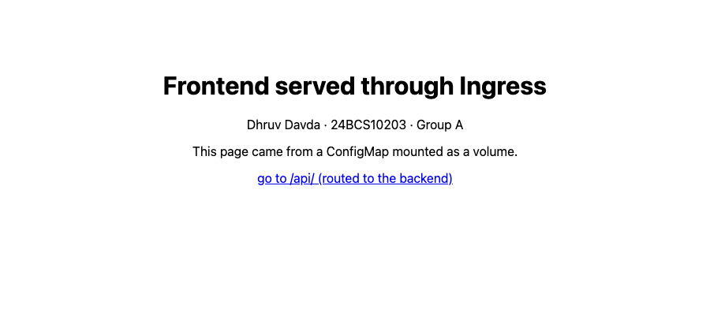

# Topic 11 – Kubernetes Ingress, ConfigMaps and Secrets

**Name:** Dhruv Davda
**Roll No:** 24BCS10203
**Email:** Dhruv.24bcs10203@sst.scaler.com
**Group:** A

Run against the `dhruv-devops` kind cluster. Manifests in [`manifests/`](./manifests).

> **Note on the committed Secret:** the values in `manifests/secret.yaml` are throwaway strings
> invented for this assignment. A real Secret manifest must never be committed to git — see the
> discussion at the end of section 2.

What this topic builds:

```
                    http://localhost/
                            │
                  ┌─────────▼──────────┐
                  │  nginx Ingress     │   one entry point, port 80
                  │  controller        │
                  └────┬──────────┬────┘
                /      │          │      /api(/|$)(.*)
             ┌─────────▼──┐   ┌───▼────────────┐
             │ frontend   │   │ backend        │
             │ Service    │   │ Service :8000  │
             │ 2 Pods     │   │ 2 Pods         │
             └─────┬──────┘   └───┬────────┬───┘
                   │              │        │
            ConfigMap volume   ConfigMap   Secret
            (index.html)       (env vars)  (env + files)
```

---

## 0. Install the Ingress controller

An Ingress object is only data. **Nothing happens until a controller is running to act on it.**

```console
$ kubectl apply -f https://raw.githubusercontent.com/kubernetes/ingress-nginx/main/deploy/static/provider/kind/deploy.yaml
namespace/ingress-nginx created
...
deployment.apps/ingress-nginx-controller created
ingressclass.networking.k8s.io/nginx created
validatingwebhookconfiguration.admissionregistration.k8s.io/ingress-nginx-admission created

$ kubectl wait --namespace ingress-nginx --for=condition=ready pod \
    --selector=app.kubernetes.io/component=controller --timeout=300s
pod/ingress-nginx-controller-596f5b6bcf-wwvcv condition met

$ kubectl get ingressclass
NAME    CONTROLLER             PARAMETERS   AGE
nginx   k8s.io/ingress-nginx   <none>       27s
```

### It did not work at first, and fixing it was the most instructive part

```console
$ curl -s -o /dev/null -w "status=%{http_code}\n" http://localhost
status=000
```

Nothing on port 80. The controller Pod was `Running` and Ready, so I traced where the traffic was
supposed to enter:

```console
$ kubectl get pods -n ingress-nginx -o wide
NAME                                        READY   STATUS    RESTARTS   AGE   IP            NODE
ingress-nginx-controller-596f5b6bcf-wwvcv   1/1     Running   0          39s   10.244.1.44   dhruv-devops-worker

$ kubectl get pod -n ingress-nginx -l app.kubernetes.io/component=controller \
    -o jsonpath='{.items[0].spec.containers[0].ports}'
[{"containerPort":80,"hostPort":80,"name":"http","protocol":"TCP"}, {"containerPort":443,"hostPort":443,...}]

$ kubectl get deploy -n ingress-nginx ingress-nginx-controller -o jsonpath='{.spec.template.spec.nodeSelector}'
{"kubernetes.io/os":"linux"}

$ docker port dhruv-devops-control-plane
80/tcp -> 0.0.0.0:80
443/tcp -> 0.0.0.0:443
6443/tcp -> 127.0.0.1:54929
```

There it is. The controller uses **`hostPort: 80`** — it binds port 80 *on the node it runs on*. But:

- my kind config puts the host port mappings on the **control-plane** node (that is what
  `extraPortMappings` in `08_Kubernetes_Fundamentals/kind-cluster.yaml` does), and
- the controller's `nodeSelector` was only `kubernetes.io/os: linux`, so the scheduler was free to
  place it — and it chose the **worker**.

The Pod was listening on port 80 of a node whose port 80 is not published to macOS. Exactly the same
class of problem as the host-networking result in Topic 07: the server was fine, the path from my
laptop to it did not exist.

The fix is to pin the controller to the node that has the port mappings, using the
`ingress-ready=true` label my kind config sets — plus a toleration, since the control-plane node is
tainted (as established in Topic 09's DaemonSet section):

```console
$ kubectl patch deploy -n ingress-nginx ingress-nginx-controller --type merge -p '{
    "spec": {"template": {"spec": {
      "nodeSelector": {"kubernetes.io/os": "linux", "ingress-ready": "true"},
      "tolerations": [
        {"key": "node-role.kubernetes.io/control-plane", "operator": "Equal", "effect": "NoSchedule"}
      ]
    }}}
  }'
deployment.apps/ingress-nginx-controller patched
deployment "ingress-nginx-controller" successfully rolled out

$ kubectl get pods -n ingress-nginx -o wide
NAME                                        READY   STATUS    RESTARTS   AGE   IP           NODE
ingress-nginx-controller-66ddbf9f64-6ttzm   1/1     Running   0          25s   10.244.0.6   dhruv-devops-control-plane
```

```console
$ curl -s -o /dev/null -w "status=%{http_code}\n" http://localhost
status=404

$ curl -s http://localhost | head -3
<html>
<head><title>404 Not Found</title></head>
<body>
```

**A 404 is success here.** The controller is reachable from my Mac and answering; it simply has no
Ingress rules yet, so it has nothing to route to. Going from `000` to `404` is the whole
verification.

Also worth noting, consistent with Topic 10: the controller's own Service is a LoadBalancer stuck at
`<pending>`, because kind has no cloud provider. It is irrelevant here — `hostPort` is how kind gets
traffic in, bypassing the Service entirely.

```console
$ kubectl get svc -n ingress-nginx
NAME                       TYPE           CLUSTER-IP    EXTERNAL-IP   PORT(S)                      AGE
ingress-nginx-controller   LoadBalancer   10.96.53.93   <pending>     80:32228/TCP,443:32071/TCP   26s
```

---

## 1. ConfigMap

One object, two very different consumption styles:

```yaml
apiVersion: v1
kind: ConfigMap
metadata:
  name: app-config
data:
  APP_OWNER: "Dhruv Davda"
  APP_ROLL: "24BCS10203"
  APP_GROUP: "A"
  APP_ENV: "development"
  LOG_LEVEL: "debug"

  # A multi-line value behaves as a file when mounted.
  index.html: |
    <!DOCTYPE html>
    ...
```

```console
$ kubectl apply -f manifests/configmap.yaml
configmap/app-config created

$ kubectl get configmap app-config
NAME         DATA   AGE
app-config   6      0s

$ kubectl describe configmap app-config | head -20
Name:         app-config
Namespace:    default

Data
====
APP_ENV:
----
development

APP_GROUP:
----
A

APP_OWNER:
----
Dhruv Davda

APP_ROLL:
----
24BCS10203
```

`DATA 6` counts the keys. **Note that `describe` prints every value in plain text** — contrast this
with the Secret in the next section.

---

## 2. Secret

```yaml
apiVersion: v1
kind: Secret
metadata:
  name: app-secret
type: Opaque
stringData:          # stringData accepts plain text; the API server encodes it
  DB_USERNAME: "dhruv_admin"
  DB_PASSWORD: "S3cur3-Assignment-Pass"
  API_TOKEN: "tok_24bcs10203_demo_only"
```

`stringData` is much nicer than `data` — with `data` I would have to base64-encode each value myself.

```console
$ kubectl apply -f manifests/secret.yaml
secret/app-secret created

$ kubectl get secret app-secret
NAME         TYPE     DATA   AGE
app-secret   Opaque   3      0s

$ kubectl describe secret app-secret
Name:         app-secret
Namespace:    default

Type:  Opaque

Data
====
API_TOKEN:    24 bytes
DB_PASSWORD:  22 bytes
DB_USERNAME:  11 bytes
```

**`describe` shows only byte counts, not values.** That is the visible difference from a ConfigMap,
and it is where the false sense of security comes from — because the values are one command away:

```console
$ kubectl get secret app-secret -o jsonpath='{.data.DB_PASSWORD}'
UzNjdXIzLUFzc2lnbm1lbnQtUGFzcw==

$ kubectl get secret app-secret -o jsonpath='{.data.DB_PASSWORD}' | base64 -d
S3cur3-Assignment-Pass
```

### What a Secret actually gives you, and what it does not

**Base64 is encoding, not encryption.** Anyone who can `get secrets` in the namespace can read every
value. What a Secret does provide over a ConfigMap:

- Values are kept out of `describe` output and most log/UI surfaces, so they do not leak by accident.
- Secrets can be encrypted at rest in etcd (`EncryptionConfiguration`), ConfigMaps typically are not.
- RBAC is usually written to restrict `secrets` far more tightly than `configmaps`.
- The kubelet stores mounted Secrets in **tmpfs**, so they never touch the node's disk.

What it does not provide: protection from anyone with read access, and protection from **git**. This
is why the manifest in this repo contains invented values. In a real project the options are
`kubectl create secret` from the command line, a Sealed Secrets / SOPS encrypted file, or an external
store like Vault or AWS Secrets Manager via the Secrets Store CSI driver.

---

## 3. Deploy the applications and inject the configuration

The frontend takes its page from a **ConfigMap volume**, selecting a single key:

```yaml
      volumes:
        - name: page
          configMap:
            name: app-config
            items:
              # Mount only this one key, not every key in the ConfigMap.
              - key: index.html
                path: index.html
```

Without `items`, all six keys — including `APP_OWNER` and `LOG_LEVEL` — would appear as files in the
web root and be served to the public. Selecting one key matters.

The backend takes config as **environment variables** and the Secret **both ways**:

```yaml
          # envFrom pulls in EVERY key as an environment variable.
          envFrom:
            - configMapRef:
                name: app-config
            - secretRef:
                name: app-secret
          env:
            # A single explicit key, as an alternative to envFrom.
            - name: EXPLICIT_TOKEN
              valueFrom:
                secretKeyRef:
                  name: app-secret
                  key: API_TOKEN
          volumeMounts:
            - name: secret-files
              mountPath: /etc/app-secret
              readOnly: true
```

```console
$ kubectl apply -f manifests/frontend.yaml -f manifests/backend.yaml
deployment.apps/frontend created
service/frontend created
configmap/backend-code created
deployment.apps/backend created
service/backend created

$ kubectl get pods -l owner=dhruv
NAME                        READY   STATUS    RESTARTS   AGE
backend-6c59775977-2v797    1/1     Running   0          9s
backend-6c59775977-5cxmq    1/1     Running   0          9s
frontend-7d67c699f5-7rcgq   1/1     Running   0          9s
frontend-7d67c699f5-ggzk9   1/1     Running   0          9s

$ kubectl get svc frontend backend
NAME       TYPE        CLUSTER-IP      EXTERNAL-IP   PORT(S)    AGE
frontend   ClusterIP   10.96.115.203   <none>        80/TCP     9s
backend    ClusterIP   10.96.122.103   <none>        8000/TCP   9s
```

### Proof the configuration arrived

```console
$ kubectl exec backend-6c59775977-2v797 -- env | grep -E 'APP_|LOG_LEVEL' | sort
APP_ENV=development
APP_GROUP=A
APP_OWNER=Dhruv Davda
APP_ROLL=24BCS10203
LOG_LEVEL=debug

$ kubectl exec backend-6c59775977-2v797 -- env | grep -E 'DB_|API_TOKEN|EXPLICIT' | sort
API_TOKEN=tok_24bcs10203_demo_only
DB_PASSWORD=S3cur3-Assignment-Pass
DB_USERNAME=dhruv_admin
EXPLICIT_TOKEN=tok_24bcs10203_demo_only
```

Note that `index.html` did **not** become an environment variable even though `envFrom` pulls in
every key — a key with a `.` in it is not a valid env var name, so Kubernetes skipped it.

**A caution this makes obvious:** secrets injected as environment variables are readable with
`kubectl exec ... env`, appear in `/proc/<pid>/environ`, and are often dumped by crash reporters and
logging libraries. Mounted files are the safer option:

```console
$ kubectl exec backend-6c59775977-2v797 -- ls -la /etc/app-secret
total 4
drwxrwxrwt    3 root     root           140 Sep 17 15:44 .
drwxr-xr-x    2 root     root           100 Sep 17 15:44 ..2026_09_17_15_44_58.2597496554
lrwxrwxrwx    1 root     root            32 Sep 17 15:44 ..data -> ..2026_09_17_15_44_58.2597496554
lrwxrwxrwx    1 root     root            16 Sep 17 15:44 API_TOKEN -> ..data/API_TOKEN
lrwxrwxrwx    1 root     root            18 Sep 17 15:44 DB_PASSWORD -> ..data/DB_PASSWORD
lrwxrwxrwx    1 root     root            18 Sep 17 15:44 DB_USERNAME -> ..data/DB_USERNAME

$ kubectl exec backend-6c59775977-2v797 -- cat /etc/app-secret/DB_USERNAME
dhruv_admin
```

That symlink layout is not clutter, it is the **atomic update mechanism**: each key is a symlink to
`..data`, which is itself a symlink to a timestamped directory. To publish a change the kubelet
writes a whole new directory and swings the `..data` symlink in one operation, so an application
never reads a half-updated set of values.

### Live updates: volumes refresh, environment variables do not

```console
$ kubectl patch configmap app-config -p '{"data":{"LOG_LEVEL":"warn"}}'
configmap/app-config patched

$ kubectl get configmap app-config -o jsonpath='{.data.LOG_LEVEL}'     # the object changed
warn

$ kubectl exec backend-6c59775977-2v797 -- printenv LOG_LEVEL          # the running Pod did not
debug
```

**Environment variables are frozen at container start.** The ConfigMap says `warn`, the running
container still says `debug`, and it will say `debug` forever.

A mounted volume behaves completely differently:

```console
$ kubectl patch configmap app-config --type merge \
    -p '{"data":{"index.html":"<h1>Updated via ConfigMap volume</h1>\n<p>Dhruv Davda 24BCS10203</p>\n"}}'
configmap/app-config patched

waiting for the kubelet to sync the projected volume...
synced after ~35s

$ curl -s http://localhost/
<h1>Updated via ConfigMap volume</h1>
<p>Dhruv Davda 24BCS10203</p>
```

**The page changed with no restart and no rebuild** — about 35 seconds later, which is the kubelet's
sync period, not instant. (When I restored the original ConfigMap afterwards, the two frontend
replicas converged a few seconds apart, because each kubelet syncs on its own schedule. Worth
knowing: during a config change, replicas are briefly inconsistent.)

To pick up new environment variables the Pods must be replaced:

```console
$ kubectl rollout restart deploy/backend
deployment.apps/backend restarted
deployment "backend" successfully rolled out

$ kubectl exec backend-6bcd64c49f-2qfwp -- printenv LOG_LEVEL
warn
```

| Injection style | Updates without restart? | Best for |
|---|---|---|
| `env` / `envFrom` | **No** — frozen at start | Simple settings, values the app reads once |
| Volume mount | **Yes**, after the kubelet sync delay | Config files, certificates, anything hot-reloadable |

`kubectl rollout restart` is the clean way to apply env changes — it is a normal rolling update, so
it respects `maxUnavailable` and keeps the app serving (Topic 09).

---

## 4. Ingress

```yaml
apiVersion: networking.k8s.io/v1
kind: Ingress
metadata:
  name: app-ingress
  annotations:
    # Rewrite /api/foo to /foo before it reaches the backend, so the backend
    # does not need to know it is mounted under a prefix.
    nginx.ingress.kubernetes.io/rewrite-target: /$2
spec:
  ingressClassName: nginx
  rules:
    - http:
        paths:
          # The (/|$)(.*) capture group is what $2 in rewrite-target refers to.
          - path: /api(/|$)(.*)
            pathType: ImplementationSpecific
            backend:
              service:
                name: backend
                port:
                  number: 8000
          - path: /
            pathType: Prefix
            backend:
              service:
                name: frontend
                port:
                  number: 80
```

```console
$ kubectl apply -f manifests/ingress.yaml
ingress.networking.k8s.io/app-ingress created

$ kubectl get ingress app-ingress
NAME          CLASS   HOSTS   ADDRESS   PORTS   AGE
app-ingress   nginx   *                 80      8s

$ kubectl describe ingress app-ingress | sed -n '/Rules/,$p'
Rules:
  Host        Path  Backends
  ----        ----  --------
  *
              /api(/|$)(.*)   backend:8000 (10.244.1.47:8000,10.244.1.48:8000)
              /               frontend:80 (10.244.1.45:80,10.244.1.46:80)
Annotations:  nginx.ingress.kubernetes.io/rewrite-target: /$2
Events:
  Type    Reason  Age   From                      Message
  ----    ------  ----  ----                      -------
  Normal  Sync    8s    nginx-ingress-controller  Scheduled for sync
```

The `Backends` column resolves each rule to **actual Pod IPs**, which is the quickest way to confirm
an Ingress is wired to real endpoints rather than an empty Service (the Topic 10 failure mode).

### Both routes, on one port

```console
$ curl -s http://localhost/ | grep -E '<h1>|24BCS'
  <h1>Frontend served through Ingress</h1>
  <p>Dhruv Davda &middot; 24BCS10203 &middot; Group A</p>
```

```console
$ curl -s http://localhost/api/
{
  "owner": "Dhruv Davda",
  "roll": "24BCS10203",
  "group": "A",
  "env": "development",
  "log_level": "debug",
  "db_username": "dhruv_admin",
  "db_password_length": 22,
  "db_password_masked": "S3********************",
  "api_token_present": true,
  "secret_files": [
    "..2026_09_17_15_44_58.1087132136",
    "..data",
    "API_TOKEN",
    "DB_PASSWORD",
    "DB_USERNAME"
  ],
  "pod": "backend-6c59775977-5cxmq",
  "path": "/"
}
```

Two things to read carefully in that response:

- **`"path": "/"`, not `"/api/"`.** The rewrite worked. The backend received `/`, so it can be written
  without any knowledge of the prefix it is published under — and could be remounted at `/v2/` by
  changing only the Ingress.
- The secret values are present but reported as a length and a mask, proving injection worked without
  printing credentials into a screenshot.

### Screenshots

| Route | Screenshot |
|---|---|
| `http://localhost/` → frontend |  |
| `http://localhost/api/` → backend |  |

The API screenshot was taken after the `rollout restart`, so it shows `"log_level": "warn"` — the
updated value, which is the result of the experiment in section 3.

### Why Ingress rather than more Services

Topic 10 ended with the problem: NodePort forces clients to remember `:30080`, `:30081`, …, and a
LoadBalancer per service means paying for an external IP per service. Ingress replaces both:

| | NodePort | LoadBalancer | Ingress |
|---|---|---|---|
| Layer | L4 (TCP) | L4 (TCP) | **L7 (HTTP)** |
| External IPs needed | 0, but odd ports | **One per Service** | **One for everything** |
| Route by hostname / path | No | No | **Yes** |
| TLS termination | No | Cloud-dependent | **Yes, per host** |
| Cost on a cloud provider | Free | Per load balancer | One load balancer total |

`ingressClassName: nginx` matters: it is what tells *this* controller the object is its
responsibility. A cluster can run nginx and Traefik side by side, and without the class an Ingress
would either be ignored or picked up by both.

Things this demo does not cover but that a production Ingress would add: `host:` rules for
name-based virtual hosting, a `tls:` block referencing a certificate Secret (usually issued
automatically by cert-manager), and annotations for rate limiting, auth and body size.

---

## 5. Clean up

```console
$ kubectl delete -f manifests/
$ kubectl delete -f https://raw.githubusercontent.com/kubernetes/ingress-nginx/main/deploy/static/provider/kind/deploy.yaml
```

To remove the whole cluster from Topics 08–11:

```console
$ kind delete cluster --name dhruv-devops
```
