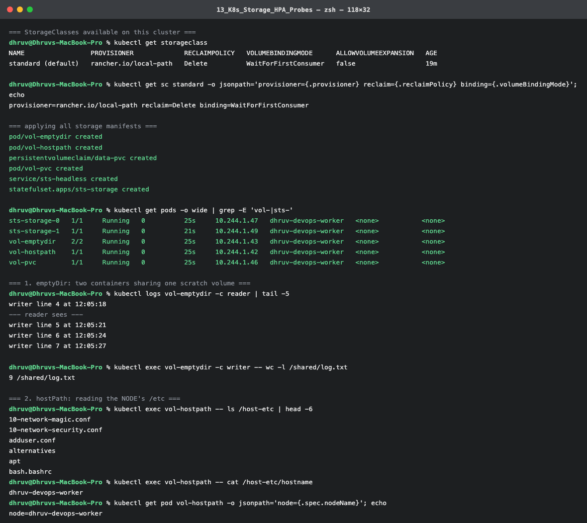
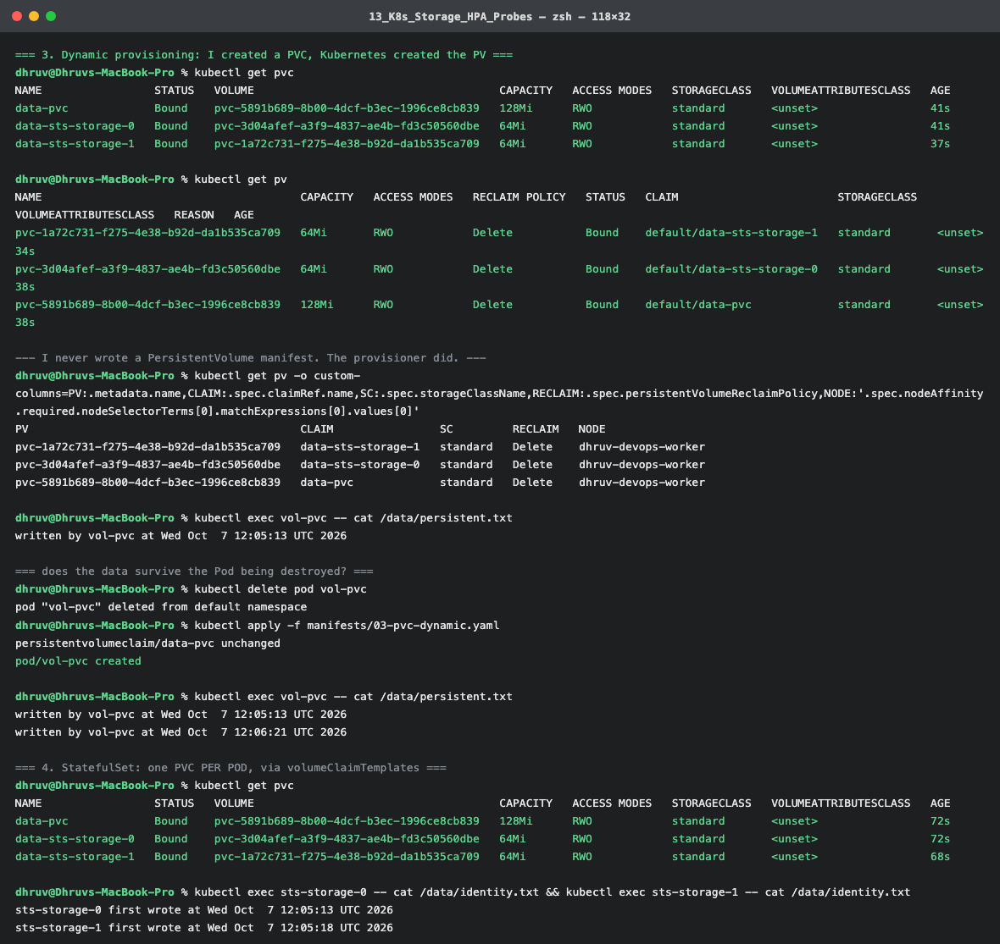
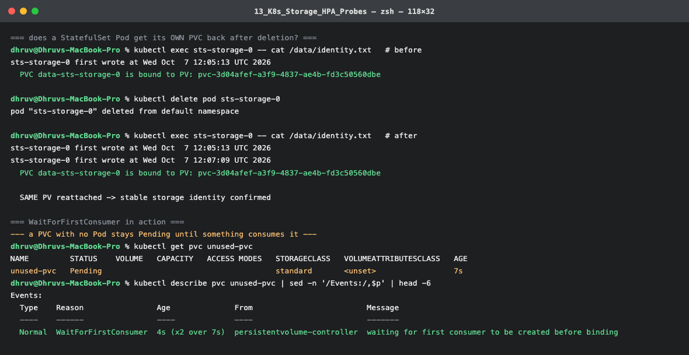
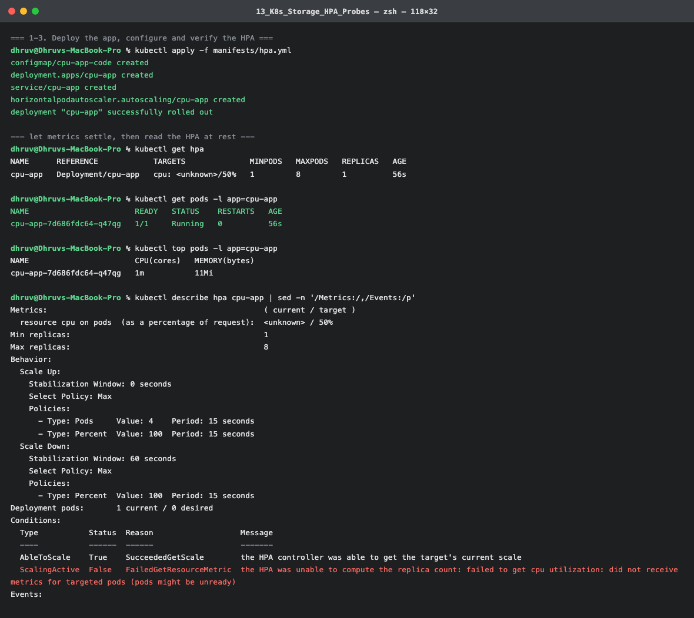
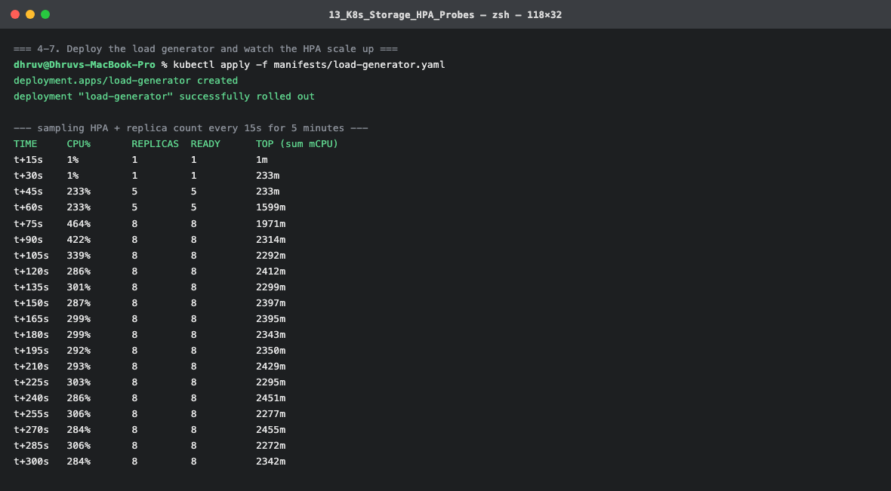
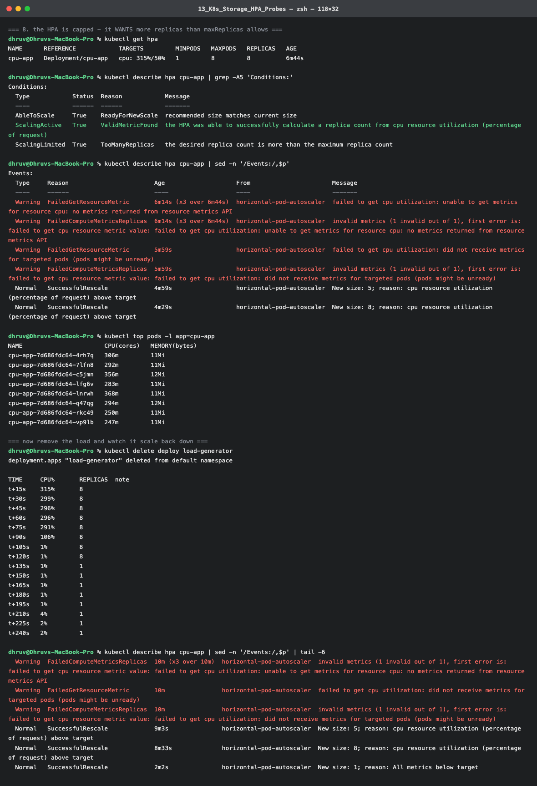
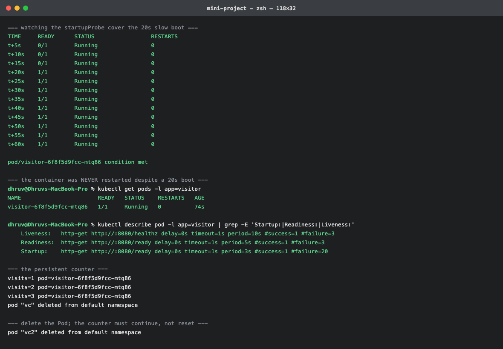

# Session 13 – Kubernetes Storage, HPA & Probes

**Name:** Dhruv Davda · **Roll No:** 24BCS10203 · **Email:** Dhruv.24bcs10203@sst.scaler.com · **Group:** A

Run against my `dhruv-devops` kind cluster (Kubernetes v1.37.0, 2 nodes).

| Task | Where |
|---|---|
| Task 1 — Kubernetes Volumes | [`01-kubernetes-volumes/README.md`](./01-kubernetes-volumes/README.md) |
| Task 2 — HPA hands-on | below |
| Task 3 — Mini project | [`mini-project/`](./mini-project), documented below |

## Prerequisite: metrics-server

An HPA reads CPU from the **metrics API**, which kind does not ship. Installing it is step zero —
without it the HPA reports `<unknown>` forever:

```console
$ kubectl apply -f https://github.com/kubernetes-sigs/metrics-server/releases/latest/download/components.yaml
$ kubectl patch deployment metrics-server -n kube-system --type=json \
    -p='[{"op":"add","path":"/spec/template/spec/containers/0/args/-","value":"--kubelet-insecure-tls"}]'
deployment.apps/metrics-server patched

$ kubectl top nodes
NAME                         CPU(cores)   CPU(%)   MEMORY(bytes)   MEMORY(%)
dhruv-devops-control-plane   131m         1%       588Mi           3%
dhruv-devops-worker          41m          0%       156Mi           0%
```

`--kubelet-insecure-tls` is needed because kind's kubelets use self-signed certificates that
metrics-server will not trust by default. On a managed cluster this is unnecessary.

---

## Task 2: HPA hands-on

### The manifest

Full file: [`manifests/hpa.yml`](./manifests/hpa.yml). The app hashes SHA-256 in a loop on every
request, so load is easy to generate and easy to see.

```yaml
          # HPA CANNOT WORK without resources.requests - the percentage target
          # is a percentage OF THE REQUEST.
          resources:
            requests: {cpu: 100m, memory: 64Mi}
            limits:   {cpu: 500m, memory: 256Mi}
```

```yaml
apiVersion: autoscaling/v2
kind: HorizontalPodAutoscaler
metadata: {name: cpu-app}
spec:
  scaleTargetRef: {apiVersion: apps/v1, kind: Deployment, name: cpu-app}
  minReplicas: 1
  maxReplicas: 8
  metrics:
    - type: Resource
      resource:
        name: cpu
        target:
          type: Utilization
          averageUtilization: 50
  behavior:
    scaleUp:   {stabilizationWindowSeconds: 0}
    scaleDown: {stabilizationWindowSeconds: 60}    # shortened from the 300s default
```

**`averageUtilization: 50` means 50% of the *request*, not of the node.** With `requests.cpu: 100m`
the target is 50m per Pod. This is the single most misunderstood part of HPA, and a Deployment with
no `requests` simply cannot be autoscaled on CPU.

### 1–3. Deploy, configure and verify

```console
$ kubectl apply -f manifests/hpa.yml
configmap/cpu-app-code created
deployment.apps/cpu-app created
service/cpu-app created
horizontalpodautoscaler.autoscaling/cpu-app created

$ kubectl get hpa
NAME      REFERENCE            TARGETS              MINPODS   MAXPODS   REPLICAS   AGE
cpu-app   Deployment/cpu-app   cpu: <unknown>/50%   1         8         1          56s
```

**`<unknown>` at first**, even though `kubectl top pods` already worked:

```console
$ kubectl describe hpa cpu-app | grep -A3 Conditions:
  ScalingActive   False   FailedGetResourceMetric   the HPA was unable to compute the replica count:
                                                    failed to get cpu utilization: did not receive metrics
                                                    for targeted pods (pods might be unready)
```

This is a startup race, not a misconfiguration — metrics-server scrapes on an interval and the HPA
polls on its own. It resolved on its own:

```console
--- polling until the HPA has a CPU reading ---
HPA got a reading after ~10s: 1%

$ kubectl get hpa
NAME      REFERENCE            TARGETS       MINPODS   MAXPODS   REPLICAS   AGE
cpu-app   Deployment/cpu-app   cpu: 1%/50%   1         8         1          68s

$ kubectl describe hpa cpu-app | grep -A5 Conditions:
  AbleToScale     True    ReadyForNewScale    recommended size matches current size
  ScalingActive   True    ValidMetricFound    the HPA was able to successfully calculate a replica count
  ScalingLimited  False   DesiredWithinRange  the desired count is within the acceptable range
```

Those three conditions are the HPA health check: *can I scale*, *do I have metrics*, *am I capped*.

### 4–7. Load generator, CPU and Pod scaling

```console
$ kubectl apply -f manifests/load-generator.yaml     # 6 parallel wget loops
deployment.apps/load-generator created
```

Sampling every 15 seconds:

```console
TIME     CPU%       REPLICAS  READY      TOP (sum mCPU)
t+15s    1%         1         1          1m
t+30s    1%         1         1          233m
t+45s    233%       5         5          233m        <-- first scale-up
t+60s    233%       5         5          1599m
t+75s    464%       8         8          1971m       <-- hit maxReplicas
t+90s    422%       8         8          2314m
t+105s   339%       8         8          2292m
t+120s   286%       8         8          2412m
t+135s   301%       8         8          2299m
...
t+300s   284%       8         8          2342m
```

Reading the trace:

- **t+30s** — CPU is being consumed (233m) but the HPA still reports 1%. The metrics pipeline lags
  the real load by roughly one scrape interval. **An HPA is always reacting to the recent past.**
- **t+45s** — 233% against a 50% target. The HPA computes
  `ceil(1 × 233/50) = 5` and scales **1 → 5 in one step**, not one Pod at a time.
- **t+75s** — still above target, so it goes to **8**, the configured ceiling.
- **t+90s onward** — a plateau around 290%, *far* above the 50% target.

That plateau is the interesting part, and the HPA says exactly why:

```console
$ kubectl get hpa
NAME      REFERENCE            TARGETS         MINPODS   MAXPODS   REPLICAS   AGE
cpu-app   Deployment/cpu-app   cpu: 315%/50%   1         8         8          6m44s

$ kubectl describe hpa cpu-app | grep -A5 Conditions:
  ScalingLimited  True    TooManyReplicas   the desired replica count is more than the maximum replica count
```

**`ScalingLimited: True / TooManyReplicas`.** The HPA wants more than 8 Pods and is not allowed. The
load generator is an infinite loop, so it simply consumes whatever capacity exists — more Pods would
not reduce per-Pod CPU. **A sustained gap between current and target with `ScalingLimited: True` means
raise `maxReplicas`, not debug the HPA.**

Per-Pod CPU confirms the work really was distributed:

```console
$ kubectl top pods -l app=cpu-app
NAME                       CPU(cores)   MEMORY(bytes)
cpu-app-7d686fdc64-4rh7q   306m         11Mi
cpu-app-7d686fdc64-7lfn8   292m         11Mi
cpu-app-7d686fdc64-c5jmn   356m         12Mi
cpu-app-7d686fdc64-lfg6v   283m         11Mi
cpu-app-7d686fdc64-lnrwh   368m         11Mi
cpu-app-7d686fdc64-q47qg   294m         12Mi
cpu-app-7d686fdc64-rkc49   250m         11Mi
cpu-app-7d686fdc64-vp9lb   247m         11Mi
```

Eight Pods at ~250–370m each. Each is near its **500m limit**, not its 100m request — the request is
for scheduling and HPA maths, the limit is the actual ceiling.

### 8. Scale-down

```console
$ kubectl delete deploy load-generator
deployment.apps "load-generator" deleted from default namespace

TIME     CPU%       REPLICAS
t+15s    315%       8
t+45s    296%       8
t+75s    291%       8
t+90s    106%       8          <-- load draining
t+105s   1%         8
t+120s   1%         8          <-- metric at 1%, still 8 Pods
t+135s   1%         1          <-- stabilization window expired
t+240s   2%         1
```

**CPU hit 1% at t+105s but the scale-down only happened at t+135s** — the 60-second
`scaleDown.stabilizationWindowSeconds` I configured. The HPA deliberately waits, so a brief dip does
not destroy capacity that is about to be needed again. The default is **300s**; I shortened it to make
the demo observable.

Note the asymmetry: **8 → 1 in a single step.** Scale-up is also aggressive but is additionally
governed by `scaleUp` policies (4 Pods or 100% per 15s, whichever is larger). The design bias is
"scale up fast, scale down slowly" — being over-provisioned costs money, being under-provisioned
costs availability.

```console
$ kubectl describe hpa cpu-app | sed -n '/Events:/,$p'
  Normal   SuccessfulRescale   9m3s   horizontal-pod-autoscaler  New size: 5; reason: cpu resource utilization (percentage of request) above target
  Normal   SuccessfulRescale   8m33s  horizontal-pod-autoscaler  New size: 8; reason: cpu resource utilization (percentage of request) above target
  Normal   SuccessfulRescale   2m2s   horizontal-pod-autoscaler  New size: 1; reason: All metrics below target
```

### HPA command reference

| Command | Purpose |
|---|---|
| `kubectl get hpa` | Current vs target, and replica count |
| `kubectl get hpa -w` | Watch scaling live |
| `kubectl describe hpa <n>` | **Conditions and Events — where the real diagnosis is** |
| `kubectl top pods` | Actual per-Pod usage |
| `kubectl top nodes` | Whether the cluster itself has headroom |
| `kubectl get hpa -o yaml` | `status.currentMetrics`, for scripting |

### What I understood

- **`requests` are mandatory.** Utilization is a percentage of the request; with no request there is
  nothing to take a percentage of.
- **metrics-server is a prerequisite**, and `<unknown>` for the first ~30s is normal, not a fault.
- **The HPA computes a ratio, not a step:** `desired = ceil(current × currentMetric / targetMetric)`,
  which is why it jumped 1 → 5 directly.
- **Scaling is asymmetric by design** — fast up, slow down, governed by stabilization windows.
- **`ScalingLimited` is the condition to read** when utilization sits above target and nothing
  happens.
- An HPA scales **Pods**, not nodes. Once `maxReplicas` is reached or the cluster runs out of room,
  the next tool is the Cluster Autoscaler.

---

## Task 3: Mini project — a resilient visit counter

[`mini-project/visitor-app.yaml`](./mini-project/visitor-app.yaml) combines all three parts of this
session into one workload:

| Concern | Mechanism |
|---|---|
| State survives restarts | PVC on the `standard` StorageClass |
| Slow boot is not killed | `startupProbe` (20 × 3s = 60s budget) |
| No traffic before it is usable | `readinessProbe` on `/ready` |
| A wedged container is recovered | `livenessProbe` on `/healthz` |
| Handles load | CPU `requests` + HPA-ready |
| Safe updates with RWO storage | `strategy: Recreate` |

The app deliberately sleeps 20 seconds at startup before opening its data file, simulating a cache
warm-up.

### All three probes together

```console
$ kubectl describe pod -l app=visitor | grep -E 'Startup:|Readiness:|Liveness:'
    Liveness:   http-get http://:8080/healthz delay=0s timeout=1s period=10s #success=1 #failure=3
    Readiness:  http-get http://:8080/ready   delay=0s timeout=1s period=5s  #success=1 #failure=3
    Startup:    http-get http://:8080/ready   delay=0s timeout=1s period=3s  #success=1 #failure=20
```

Watching the boot:

```console
TIME     READY      STATUS                 RESTARTS
t+5s     0/1        Running                0
t+10s    0/1        Running                0
t+15s    0/1        Running                0
t+20s    1/1        Running                0     <-- warmup finished, now Ready
t+60s    1/1        Running                0

$ kubectl get pods -l app=visitor
NAME                       READY   STATUS    RESTARTS   AGE
visitor-6f8f5d9fcc-mtq86   1/1     Running   0          74s
```

**`RESTARTS 0` through a 20-second boot.** That is the `startupProbe` earning its place: while it is
running, the liveness probe is suspended. Without it, a liveness probe with
`periodSeconds: 10, failureThreshold: 3` would have killed the container at ~30s — and then killed
the replacement, forever. This is the classic cause of a `CrashLoopBackOff` that only affects slow-
starting applications.

The alternative — a large `initialDelaySeconds` on the liveness probe — is strictly worse: it has to
be set for the *worst case* boot, which means a genuinely hung container also goes undetected for
that long. A `startupProbe` adapts.

### State survives Pod replacement

```console
$ wget -qO- http://visitor/   (×3)
visits=1 pod=visitor-6f8f5d9fcc-mtq86
visits=2 pod=visitor-6f8f5d9fcc-mtq86
visits=3 pod=visitor-6f8f5d9fcc-mtq86

$ kubectl delete pod -l app=visitor

$ wget -qO- http://visitor/   (×2)
visits=6 pod=visitor-6f8f5d9fcc-rgfvf      <-- different Pod
visits=7 pod=visitor-6f8f5d9fcc-rgfvf

$ kubectl exec visitor-6f8f5d9fcc-rgfvf -- cat /data/visits.txt
7
```

**Different Pod name, continuing count.** The Pod was destroyed; the PersistentVolume was not.

### Why `strategy: Recreate` here

The PVC is `ReadWriteOnce`. A RollingUpdate would briefly run old and new Pods together, both wanting
the same volume — which either blocks the rollout or risks two writers on one file. `Recreate` trades
a few seconds of downtime for correctness. That is the Session 10 strategy comparison applied to a
real constraint: **the storage decided the deployment strategy.**

A production version would instead make the app stateless and move the counter to a database, or use
a StatefulSet so each replica gets its own volume.

### Clean up

```console
$ kubectl delete -f mini-project/ -f manifests/
$ kubectl delete pvc --all
```

---

## Screenshots

Terminal output captured during the runs documented above.

### StorageClass, emptyDir and hostPath


`WaitForFirstConsumer` binding mode, two containers sharing one `emptyDir`, and a Pod reading the node's own `/etc/hostname`.

### Dynamic provisioning and persistence


PVCs bound to auto-created PVs, and the data file surviving Pod deletion with both timestamps intact.

### StatefulSet PVC reattachment


Same PV UUID before and after deleting `sts-storage-0`, plus `WaitForFirstConsumer` holding an unused PVC at `Pending`.

### HPA configured and reporting


The `<unknown>` startup window, then `cpu: 1%/50%` with all three conditions healthy.

### HPA scaling up under load


1 → 5 replicas at 233% CPU, then to the ceiling of 8.

### Capped, then scaling back down


`ScalingLimited: True / TooManyReplicas`, then 8 → 1 once the 60s stabilization window expires.

### Mini project — all three probes


`RESTARTS 0` through a 20-second boot: the `startupProbe` suspending liveness is what prevents the crash loop.
