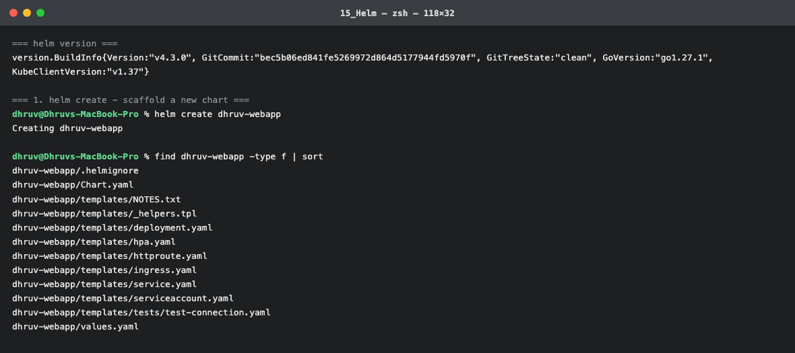
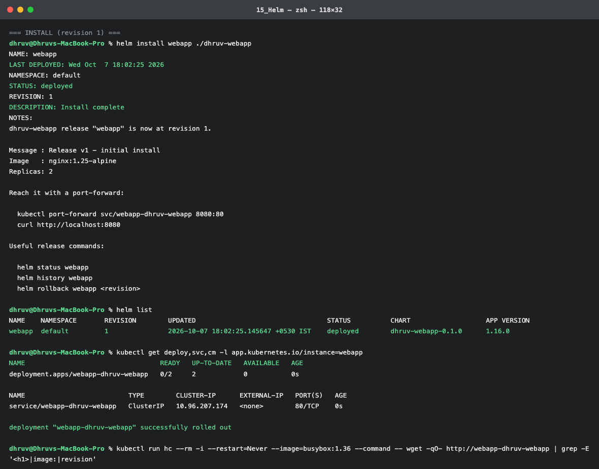
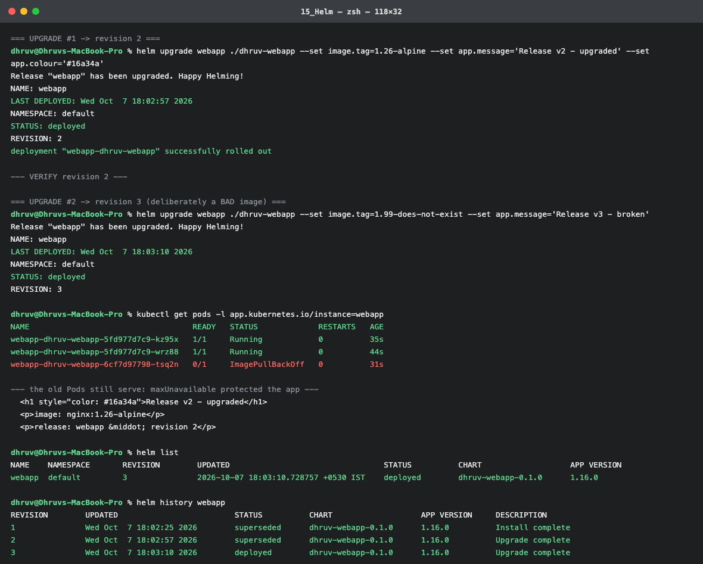
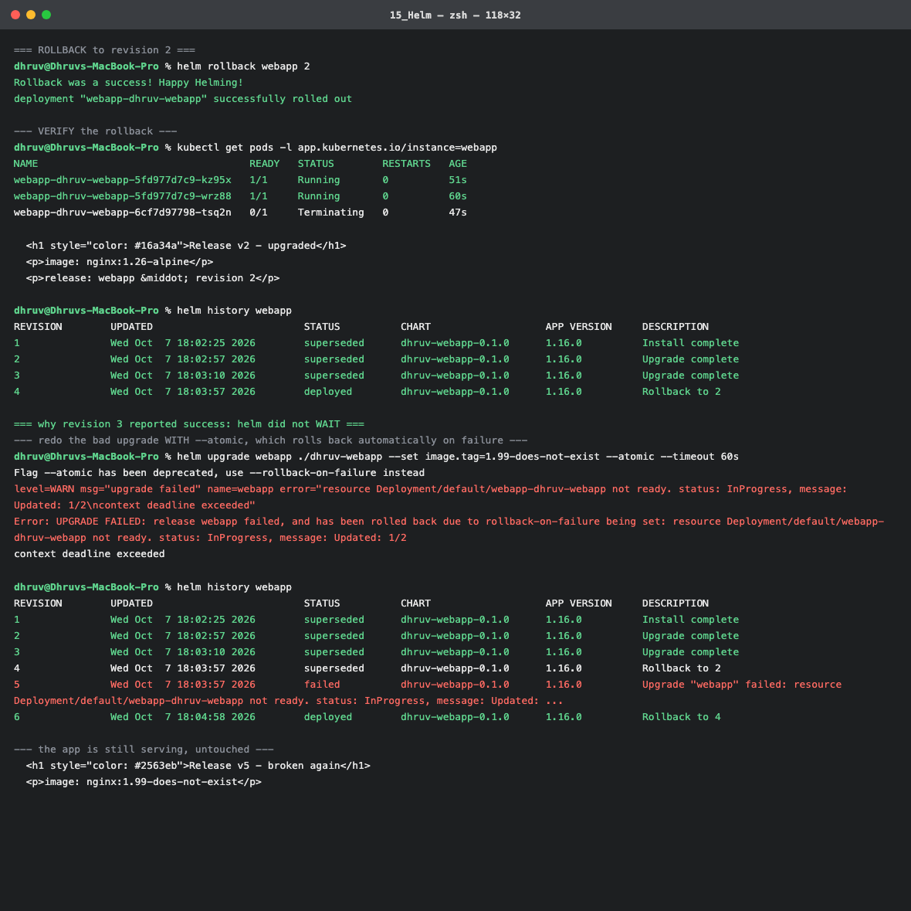
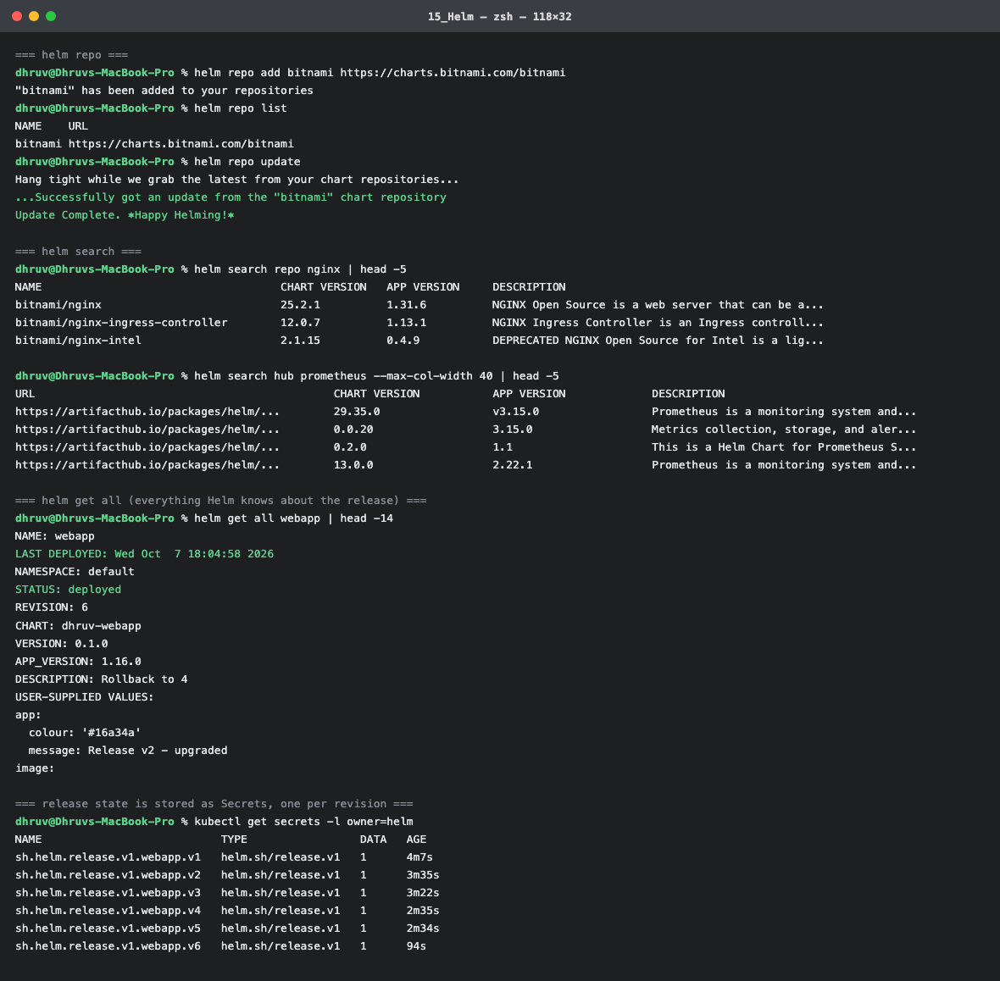

# Session 15 – Helm

**Name:** Dhruv Davda · **Roll No:** 24BCS10203 · **Email:** Dhruv.24bcs10203@sst.scaler.com · **Group:** A

Run against my `dhruv-devops` kind cluster with **Helm v4.3.0**. The chart is in
[`dhruv-webapp/`](./dhruv-webapp).

```console
$ helm version
version.BuildInfo{Version:"v4.3.0", GitCommit:"bec5b06...", GoVersion:"go1.27.1", KubeClientVersion:"v1.37"}
```

---

## Task 1: Helm commands

### `helm create`

```console
$ helm create dhruv-webapp
Creating dhruv-webapp

$ find dhruv-webapp -type f | sort
dhruv-webapp/.helmignore
dhruv-webapp/Chart.yaml
dhruv-webapp/templates/NOTES.txt
dhruv-webapp/templates/_helpers.tpl
dhruv-webapp/templates/deployment.yaml
dhruv-webapp/templates/hpa.yaml
dhruv-webapp/templates/httproute.yaml
dhruv-webapp/templates/ingress.yaml
dhruv-webapp/templates/service.yaml
dhruv-webapp/templates/serviceaccount.yaml
dhruv-webapp/templates/tests/test-connection.yaml
dhruv-webapp/values.yaml
```

| File | Role |
|---|---|
| `Chart.yaml` | Chart metadata — name, `version`, `appVersion` |
| `values.yaml` | **Default** values; everything configurable lives here |
| `templates/*.yaml` | Go-templated manifests |
| `templates/_helpers.tpl` | Reusable template functions (naming, labels) |
| `templates/NOTES.txt` | Printed after install/upgrade |
| `.helmignore` | What not to package |

I replaced the generated `deployment.yaml`, added a `configmap.yaml` that renders the values into a
visible page, and deleted the `hpa`, `ingress` and `httproute` templates I did not need.

**That deletion broke the chart**, which is a useful lesson in itself:

```console
$ helm lint .
[ERROR] templates/: dhruv-webapp/templates/NOTES.txt:2:14
  executing "dhruv-webapp/templates/NOTES.txt" at <.Values.httpRoute.enabled>:
    nil pointer evaluating interface {}.enabled
Error: 1 chart(s) linted, 1 chart(s) failed
```

`NOTES.txt` still referenced a value I had removed. **`helm lint` catches template errors before they
reach a cluster** — and a nil-pointer on a missing value is the most common Helm authoring bug.

After rewriting `NOTES.txt`:

```console
$ helm lint .
==> Linting .
[INFO] Chart.yaml: icon is recommended
1 chart(s) linted, 0 chart(s) failed
```

### `helm template` — render without a cluster

```console
$ helm template test-render . | grep -E '^kind:|  name:|image:'
kind: ServiceAccount
  name: test-render-dhruv-webapp
kind: ConfigMap
  name: test-render-dhruv-webapp-page
      <p>image: nginx:1.25-alpine</p>
kind: Service
  name: test-render-dhruv-webapp
kind: Deployment
  name: test-render-dhruv-webapp
          image: "nginx:1.25-alpine"
```

Pure local rendering — no API server contact. The best way to see what a chart will actually produce,
and essential in CI.

### `helm install`

```console
$ helm install webapp ./dhruv-webapp
NAME: webapp
LAST DEPLOYED: Wed Oct  7 18:02:25 2026
NAMESPACE: default
STATUS: deployed
REVISION: 1
DESCRIPTION: Install complete
NOTES:
dhruv-webapp release "webapp" is now at revision 1.

Message : Release v1 - initial install
Image   : nginx:1.25-alpine
Replicas: 2
```

`NOTES.txt` is rendered with the release's values — a genuinely useful place to put the commands a
user needs next.

### `helm list` and `helm status`

```console
$ helm list
NAME    NAMESPACE  REVISION  UPDATED                    STATUS    CHART               APP VERSION
webapp  default    1         2026-10-07 18:02:25 +0530  deployed  dhruv-webapp-0.1.0  1.16.0

$ helm status webapp | head -6
NAME: webapp
LAST DEPLOYED: Wed Oct  7 18:02:25 2026
NAMESPACE: default
STATUS: deployed
REVISION: 1
DESCRIPTION: Install complete
```

Verifying it actually serves:

```console
$ kubectl exec hclient -- wget -qO- http://webapp-dhruv-webapp
  <p>Dhruv Davda &middot; 24BCS10203 &middot; Group A</p>
  <p>image: nginx:1.25-alpine</p>
  <p>release: webapp &middot; revision 1</p>
```

### `helm get`

```console
$ helm get values webapp
USER-SUPPLIED VALUES:
null

$ helm get manifest webapp | grep -E '^kind:|^  name:'
kind: ServiceAccount
  name: webapp-dhruv-webapp
kind: ConfigMap
  name: webapp-dhruv-webapp-page
kind: Service
  name: webapp-dhruv-webapp
kind: Deployment
  name: webapp-dhruv-webapp
```

`USER-SUPPLIED VALUES: null` because I overrode nothing on install — `helm get values` shows only
**overrides**, not the full merged set (`helm get values -a` shows everything). The distinction
matters when debugging "why is this value not what I expect".

### Where Helm stores its state

```console
$ kubectl get secrets -l owner=helm
NAME                           TYPE                 DATA   AGE
sh.helm.release.v1.webapp.v1   helm.sh/release.v1   1      4m7s
sh.helm.release.v1.webapp.v2   helm.sh/release.v1   1      3m35s
sh.helm.release.v1.webapp.v3   helm.sh/release.v1   1      3m22s
sh.helm.release.v1.webapp.v4   helm.sh/release.v1   1      2m35s
sh.helm.release.v1.webapp.v5   helm.sh/release.v1   1      2m34s
sh.helm.release.v1.webapp.v6   helm.sh/release.v1   1      94s
```

**One Secret per revision, in the release's namespace.** There is no Helm server component (Tiller
was removed in Helm 3) — the cluster itself is the database. That is why `helm list` from another
machine with the same kubeconfig sees the same releases, and why deleting those Secrets destroys
release history.

### `helm repo` and `helm search`

```console
$ helm repo add bitnami https://charts.bitnami.com/bitnami
"bitnami" has been added to your repositories

$ helm repo list
NAME     URL
bitnami  https://charts.bitnami.com/bitnami

$ helm repo update
...Successfully got an update from the "bitnami" chart repository
Update Complete. ⎈Happy Helming!⎈

$ helm search repo nginx | head -4
NAME                              CHART VERSION  APP VERSION  DESCRIPTION
bitnami/nginx                     25.2.1         1.31.6       NGINX Open Source is a web server that can be a...
bitnami/nginx-ingress-controller  12.0.7         1.13.1       NGINX Ingress Controller is an Ingress controll...

$ helm search hub prometheus --max-col-width 40 | head -3
URL                                      CHART VERSION  APP VERSION  DESCRIPTION
https://artifacthub.io/packages/helm/...  29.35.0        v3.15.0      Prometheus is a monitoring system and...
```

**`search repo` looks in repositories you have added; `search hub` searches Artifact Hub globally.**
Note the two different versions in the output: `CHART VERSION` is the packaging version,
`APP VERSION` is the software inside. They move independently — a chart fix bumps the first only.

---

## Task 2: The complete rollback workflow

```
Install (r1) → Upgrade (r2) → Verify → Upgrade (r3, broken) → Verify → Rollback → Verify
```

### Upgrade → revision 2

```console
$ helm upgrade webapp ./dhruv-webapp --set image.tag=1.26-alpine \
    --set app.message='Release v2 - upgraded' --set app.colour='#16a34a'
Release "webapp" has been upgraded. Happy Helming!
REVISION: 2
deployment "webapp-dhruv-webapp" successfully rolled out
```

### Upgrade → revision 3, with a deliberately broken image

```console
$ helm upgrade webapp ./dhruv-webapp --set image.tag=1.99-does-not-exist \
    --set app.message='Release v3 - broken'
Release "webapp" has been upgraded. Happy Helming!
NAME: webapp
STATUS: deployed
REVISION: 3
```

**Helm reported `STATUS: deployed` and "Happy Helming!" for a release that cannot start.** Reality:

```console
$ kubectl get pods -l app.kubernetes.io/instance=webapp
NAME                                   READY   STATUS             RESTARTS   AGE
webapp-dhruv-webapp-5fd977d7c9-kz95x   1/1     Running            0          35s
webapp-dhruv-webapp-5fd977d7c9-wrz88   1/1     Running            0          44s
webapp-dhruv-webapp-6cf7d97798-tsq2n   0/1     ImagePullBackOff   0          31s

$ helm history webapp
REVISION  UPDATED                   STATUS      CHART               DESCRIPTION
1         Wed Oct  7 18:02:25 2026  superseded  dhruv-webapp-0.1.0  Install complete
2         Wed Oct  7 18:02:57 2026  superseded  dhruv-webapp-0.1.0  Upgrade complete
3         Wed Oct  7 18:03:10 2026  deployed    dhruv-webapp-0.1.0  Upgrade complete
```

**This is the most important thing I learned this session.** By default `helm upgrade` only submits
objects to the API server; it does **not** wait for Pods to become healthy. "Upgrade complete" means
"the manifests were accepted", not "the application works".

The app itself stayed up, because the Deployment's rolling update refused to proceed past
`maxUnavailable` — the same protection demonstrated in Session 10:

```console
$ kubectl exec hclient -- wget -qO- http://webapp-dhruv-webapp
  <h1 style="color: #16a34a">Release v2 - upgraded</h1>
  <p>image: nginx:1.26-alpine</p>
  <p>release: webapp &middot; revision 2</p>
```

Helm says revision 3; the users are getting revision 2. **Helm's revision number and the running
software can disagree.**

### Rollback

```console
$ helm rollback webapp 2
Rollback was a success! Happy Helming!
deployment "webapp-dhruv-webapp" successfully rolled out

$ helm history webapp
REVISION  UPDATED                   STATUS      CHART               DESCRIPTION
1         Wed Oct  7 18:02:25 2026  superseded  dhruv-webapp-0.1.0  Install complete
2         Wed Oct  7 18:02:57 2026  superseded  dhruv-webapp-0.1.0  Upgrade complete
3         Wed Oct  7 18:03:10 2026  superseded  dhruv-webapp-0.1.0  Upgrade complete
4         Wed Oct  7 18:03:57 2026  deployed    dhruv-webapp-0.1.0  Rollback to 2
```

**A rollback is a new revision (4), not a deletion of revision 3.** History is append-only — exactly
like `kubectl rollout undo` in Session 10, where rolling back to revision 1 created revision 3.

### Doing it properly: `--rollback-on-failure`

```console
$ helm upgrade webapp ./dhruv-webapp --set image.tag=1.99-does-not-exist --atomic --timeout 60s
Flag --atomic has been deprecated, use --rollback-on-failure instead
level=WARN msg="upgrade failed" name=webapp error="resource Deployment/default/webapp-dhruv-webapp not ready.
  status: InProgress, message: Updated: 1/2\ncontext deadline exceeded"
Error: UPGRADE FAILED: release webapp failed, and has been rolled back due to rollback-on-failure
  being set: resource Deployment/default/webapp-dhruv-webapp not ready...
```

Two things to note:

1. **`--atomic` is deprecated in Helm 4** in favour of `--rollback-on-failure`.
2. The upgrade now **failed loudly and reverted itself**:

```console
$ helm history webapp
REVISION  UPDATED                   STATUS      DESCRIPTION
4         Wed Oct  7 18:03:57 2026  superseded  Rollback to 2
5         Wed Oct  7 18:03:57 2026  failed      Upgrade "webapp" failed: resource Deployment/... not ready
6         Wed Oct  7 18:04:58 2026  deployed    Rollback to 4
```

Revision 5 is recorded as **`failed`** and revision 6 is the automatic rollback. Compare with
revision 3, which was recorded as a success. **`--rollback-on-failure` (or at minimum `--wait`)
should be the default in any pipeline**, and a non-zero exit is what CI needs to fail a deploy.

### A subtlety the rollback exposed

Immediately after the rollback, the page still showed the *failed* release's text:

```console
--- the app is still serving, untouched ---
  <h1 style="color: #2563eb">Release v5 - broken again</h1>
  <p>image: nginx:1.99-does-not-exist</p>
```

That looked like a broken rollback, so I checked the actual objects:

```console
$ kubectl get cm webapp-dhruv-webapp-page -o jsonpath='{.data.index\.html}' | grep -E '<h1|image:'
  <h1 style="color: #16a34a">Release v2 - upgraded</h1>
  <p>image: nginx:1.26-alpine</p>

$ kubectl get pods -l app.kubernetes.io/instance=webapp -o jsonpath='{range .items[*]}{.metadata.name} {.spec.containers[0].image}{"\n"}{end}'
webapp-dhruv-webapp-5fd977d7c9-kz95x nginx:1.26-alpine
webapp-dhruv-webapp-5fd977d7c9-wrz88 nginx:1.26-alpine
```

**Every object was already correct.** The stale content was the Pod's *mounted* copy:

```console
--- waiting for the kubelet to resync the ConfigMap volume into the Pods ---
  t+10s: Release v5 - broken again
  t+20s: Release v5 - broken again
  t+30s: Release v5 - broken again
  t+40s: Release v5 - broken again
  t+50s: Release v2 - upgraded
  -> page reverted to v2
```

**The rollback was instant at the API level; the mounted file took ~50 seconds to catch up** — the
same kubelet ConfigMap sync delay I measured at ~35s in Topic 11. A `helm rollback` that returns
"success" does not mean every Pod has observed the change yet.

(The `checksum/config` annotation in my Deployment template normally forces a Pod restart when the
ConfigMap changes, which avoids this. Here the rollback restored the *same* checksum as revision 4,
so no restart was triggered — correct behaviour, with a visible lag.)

### `helm uninstall`

```bash
helm uninstall webapp              # removes resources and release history
helm uninstall webapp --keep-history   # keeps history so it can be rolled back
```

---

## Task 3: Mini project — the chart as a parameterised app

[`dhruv-webapp/`](./dhruv-webapp) is the deliverable. What makes it an actual chart rather than YAML
with extra steps:

**1. Values drive everything visible.**

```yaml
app:
  owner: "Dhruv Davda"
  roll: "24BCS10203"
  message: "Release v1 - initial install"
  colour: "#2563eb"
```

rendered through:

```yaml
      <h1 style="color: {{ .Values.app.colour }}">{{ .Values.app.message }}</h1>
      <p>{{ .Values.app.owner }} &middot; {{ .Values.app.roll }} &middot; Group {{ .Values.app.group }}</p>
      <p>release: {{ .Release.Name }} &middot; revision {{ .Release.Revision }}</p>
```

`.Release.Revision` is injected by Helm, so the page states which revision produced it — which is what
made the rollback verifiable from outside the cluster.

**2. A config change forces a rollout.**

```yaml
      annotations:
        # Changing the page forces a rollout, because the annotation changes.
        checksum/config: {{ include (print $.Template.BasePath "/configmap.yaml") . | sha256sum }}
```

Without this, editing a ConfigMap leaves the Deployment untouched and Pods keep the old config until
the kubelet resync — the exact lag measured above. This idiom is the standard fix.

**3. Consistent naming and labels** via `_helpers.tpl`, so every object gets
`app.kubernetes.io/instance: webapp` and can be selected as a unit.

### Install the same chart three ways

```bash
helm install dev  ./dhruv-webapp --set replicaCount=1 --set app.message="dev"
helm install prod ./dhruv-webapp -f prod-values.yaml --namespace prod --create-namespace
helm install qa   ./dhruv-webapp --set-string image.tag=1.27-alpine
```

One chart, three releases, no copy-pasted YAML. That is the entire argument for Helm.

---

## Command reference

| Command | Purpose |
|---|---|
| `helm create <n>` | Scaffold a chart |
| `helm lint <dir>` | **Validate before installing** |
| `helm template <rel> <dir>` | Render locally, no cluster |
| `helm install <rel> <dir>` | Create a release |
| `helm install --dry-run --debug` | Render + validate against the API, change nothing |
| `helm list` / `-A` | Releases in this namespace / all |
| `helm status <rel>` | Current revision and resources |
| `helm get values\|manifest\|all <rel>` | What was supplied / rendered / everything |
| `helm upgrade <rel> <dir>` | New revision |
| `helm upgrade --install` | Install if absent, upgrade if present (**idempotent, use in CI**) |
| `helm upgrade --wait --rollback-on-failure` | **Wait for health; revert automatically** |
| `helm history <rel>` | Every revision and its status |
| `helm rollback <rel> <rev>` | Revert (creates a new revision) |
| `helm uninstall <rel>` | Remove |
| `helm repo add\|list\|update` | Manage repositories |
| `helm search repo\|hub <term>` | Search added repos / Artifact Hub |

## What I understood

- **Helm is a templating engine plus a release database.** The templates produce manifests; the
  release state lives in Secrets in the cluster, one per revision.
- **`helm lint` and `helm template` catch most authoring errors offline** — my NOTES.txt nil-pointer
  never reached the cluster.
- **A default `helm upgrade` does not verify health.** It reported "deployed" for a release whose Pod
  was in `ImagePullBackOff`. `--wait` plus `--rollback-on-failure` is what makes the exit code mean
  something.
- **Rollback appends a revision** rather than deleting one, so history is a complete audit log.
- **Helm's success and the user's experience can diverge in both directions** — revision 3 was
  "deployed" while users saw revision 2, and the rollback was complete while Pods still served stale
  mounted content for ~50s.
- **`CHART VERSION` and `APP VERSION` are independent**, which matters when pinning dependencies.

---

## Screenshots

Terminal output captured during the runs documented above.

### `helm create` and the chart that fails lint


The generated chart layout, before I replaced the templates.

### `helm install`


`REVISION: 1`, with `NOTES.txt` rendered using the release's own values.

### Upgrades — including one that lies


Revision 3 reports **`STATUS: deployed`** while its Pod sits in `ImagePullBackOff` and users are still served revision 2.

### Rollback and `--rollback-on-failure`


The rollback appends revision 4; the atomic retry records revision 5 as **`failed`** and auto-reverts to 6.

### Repos, search, and where release state lives


One Secret per revision, in the release namespace — the cluster is Helm's database.
