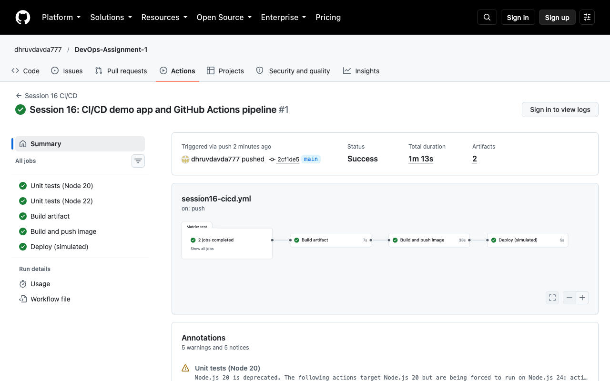

# Session 16 – CI/CD & GitHub Actions

**Name:** Dhruv Davda · **Roll No:** 24BCS10203 · **Email:** Dhruv.24bcs10203@sst.scaler.com · **Group:** A

**This pipeline is real and it ran.** Workflow:
[`.github/workflows/session16-cicd.yml`](../.github/workflows/session16-cicd.yml) ·
Run: [#37623670800](https://github.com/dhruvdavda777/DevOps-Assignment-1/actions/runs/37623670800)



```
Status: Success · Total duration 1m 13s · Artifacts 2

✓ Unit tests (Node 20)   11s
✓ Unit tests (Node 22)   11s
✓ Build artifact          7s
✓ Build and push image   38s
✓ Deploy (simulated)      5s
```

---

## CI vs CD

| | Continuous Integration | Continuous Delivery / Deployment |
|---|---|---|
| Question | "Does this change break anything?" | "Can this change reach users safely?" |
| Trigger | Every push / PR | A passing build on a release branch |
| Does | Build, test, lint, scan | Package, publish, deploy, verify |
| Fails → | The merge is blocked | The release is blocked or rolled back |
| In this pipeline | `test`, `build-artifact` | `docker`, `deploy` |

**Deliv*ery* means every green build is *releasable*; deploy*ment* means it is released automatically.
My `deploy` job uses an `environment:`, which is how you add a manual approval gate and turn
continuous deployment back into continuous delivery.

## The application

[`app/`](./app) — a Node.js HTTP API on the standard library only, so the test job needs no
`npm install`.

| Path | Role |
|---|---|
| `src/calc.js` | Pure functions: `add`, `percentage`, `grade` |
| `src/server.js` | HTTP server with `/`, `/healthz`, `/readyz`, `/add`, `/grade` |
| `test/calc.test.js` | 6 unit tests using Node's built-in runner |
| `Dockerfile` | Multi-stage; **the test stage must pass or the build fails** |

```console
$ curl -s http://localhost:8097/
{
  "app": "dhruv-cicd-demo",
  "owner": "Dhruv Davda",
  "roll": "24BCS10203",
  "group": "A",
  "version": "docker",
  "host": "90de4680b3ba",
  "endpoints": ["/healthz", "/readyz", "/add?a=1&b=2", "/grade?score=88"]
}

$ curl -s 'http://localhost:8097/grade?score=88'
{ "score": 88, "grade": "B" }

$ curl -s 'http://localhost:8097/add?a=24&b=10203'
{ "a": 24, "b": 10203, "sum": 10227 }
```

### A portability bug the local run caught first

My first test script was `node --test test/`, which failed on my machine:

```console
$ node --test test/
Error: Cannot find module '/Users/.../16_CICD_GitHub_Actions/app/test'
  code: 'MODULE_NOT_FOUND'
```

Local Node is **v26**; the Docker image is **node:22-alpine**. Newer Node resolves a bare directory
argument as a module path rather than a test directory. `node --test` with **no argument**
auto-discovers test files and works on both, so that is what the pipeline uses — and it is what the
Node 20 / Node 22 matrix exists to protect.

---

## Workflow anatomy

### Workflow, jobs, steps, runners

```yaml
name: Session 16 CI/CD          # the WORKFLOW
on:
  push:
    branches: [main]
    paths: ['16_CICD_GitHub_Actions/**', '.github/workflows/session16-cicd.yml']
  workflow_dispatch:            # manual trigger from the Actions tab
jobs:
  test:                         # a JOB
    runs-on: ubuntu-latest      # the RUNNER
    steps:                      # STEPS, sequential within the job
      - uses: actions/checkout@v4
      - run: node --test
```

| Concept | In this pipeline |
|---|---|
| **Workflow** | One YAML file, one pipeline |
| **Job** | 5 of them; separate VMs, **parallel unless `needs:` says otherwise** |
| **Step** | A `run` (shell) or a `uses` (reusable action) |
| **Runner** | `ubuntu-latest`, a fresh GitHub-hosted VM per job |

The `paths:` filter means pushes that touch only other sessions do not burn Actions minutes.

### Job dependencies shape the graph

```yaml
  build-artifact:
    needs: test
  docker:
    needs: [test, build-artifact]
  deploy:
    needs: docker
```

```
test (Node 20) ─┐
                ├─> build-artifact ─> docker ─> deploy
test (Node 22) ─┘
```

The two matrix jobs ran **concurrently** (both 11s, total elapsed 1m13s for everything).

### Matrix builds

```yaml
    strategy:
      fail-fast: false
      matrix:
        node: ['20', '22']
```

`fail-fast: false` keeps the other version running when one fails — otherwise you learn only that
*something* broke, not whether it is version-specific.

### Secrets

```yaml
      - name: Log in to GHCR
        uses: docker/login-action@v3
        with:
          registry: ghcr.io
          username: ${{ github.actor }}
          # GITHUB_TOKEN is injected by Actions - no secret to manage.
          password: ${{ secrets.GITHUB_TOKEN }}
```

```yaml
    permissions:
      contents: read
      packages: write        # required to push to GHCR
```

**`GITHUB_TOKEN` is generated per run and expires when the run ends** — nothing stored, nothing to
rotate. It starts with no permissions beyond what `permissions:` grants, which is least privilege
(Session 18's IAM notes) applied to CI. A long-lived PAT in repository secrets would be strictly
worse.

Secrets are masked in logs; they are **not** available to workflows triggered by a fork's pull
request, which is what stops an attacker opening a PR that prints them.

### Artifacts

```yaml
      - name: Upload the artifact
        uses: actions/upload-artifact@v4
        with:
          name: app-bundle-${{ github.sha }}
          path: ${{ env.APP_DIR }}/dist/*.tar.gz
          retention-days: 7
```

Each job runs on a **fresh VM**, so nothing is shared implicitly. Artifacts are the supported way to
pass files between jobs and to keep build output after the run (the screenshot shows **Artifacts: 2**
— the bundle plus the build log attachment).

### Caching

```yaml
          cache-from: type=gha
          cache-to: type=gha,mode=max
```

Docker layer caching through the Actions cache. The first build populates it; later builds reuse
unchanged layers.

---

## The CD half: a real image in a real registry

```console
$ docker pull ghcr.io/dhruvdavda777/dhruv-cicd-demo:latest
Error response from daemon: no matching manifest for linux/arm64/v8 in the manifest list entries:
  no match for platform in manifest: not found
```

**The pull failed — and the reason is worth knowing.** GitHub-hosted runners are **amd64**, so the
pipeline produced an amd64-only image, and my Mac is arm64:

```console
$ docker manifest inspect ghcr.io/dhruvdavda777/dhruv-cicd-demo:latest
  linux/amd64  (v1+json)
  unknown/unknown  (v1+json)
```

Pulling with an explicit platform works, and the CI-built image runs correctly under emulation:

```console
$ docker pull --platform linux/amd64 ghcr.io/dhruvdavda777/dhruv-cicd-demo:latest
Status: Downloaded newer image for ghcr.io/dhruvdavda777/dhruv-cicd-demo:latest

$ docker run -d --platform linux/amd64 -p 8098:3000 ghcr.io/dhruvdavda777/dhruv-cicd-demo:latest
$ curl -s http://localhost:8098/
{
  "app": "dhruv-cicd-demo",
  "owner": "Dhruv Davda",
  "roll": "24BCS10203",
  "group": "A",
  "version": "docker",
  "host": "a683ff8fe931",
```

**The fix for a real project** is a multi-arch build, which `setup-buildx-action` already enables:

```yaml
      - uses: docker/build-push-action@v6
        with:
          platforms: linux/amd64,linux/arm64      # <- the missing line
```

It roughly doubles build time, which is why it is not the default. I left the pipeline single-arch
and documented the trade-off rather than hiding it, since "works in CI, fails on a developer laptop"
is exactly the class of problem worth being able to explain.

### Deploy

```yaml
  deploy:
    needs: docker
    environment: production        # a protected environment can require approval
    steps:
      - name: Render the Kubernetes manifests
        run: |
          sed "s|IMAGE_PLACEHOLDER|${{ env.IMAGE_NAME }}:${GITHUB_SHA::7}|g" \
            ${{ env.APP_DIR }}/../k8s/deployment.yaml
```

The manifests are in [`k8s/deployment.yaml`](./k8s/deployment.yaml) with probes and resource limits
carried over from Sessions 13–14.

**This job renders rather than applies, and the run summary says so.** My cluster is a local kind
cluster with no publicly reachable API server, so a GitHub-hosted runner genuinely cannot reach it.
The honest options are a self-hosted runner, a tunnel, or a pull-based GitOps agent — which is what
Session 20 covers, and is the better answer anyway because it needs no inbound access at all.

**Immutable tags:** the image is tagged with the **commit SHA** as well as `latest`, and the deploy
substitutes the SHA tag. Deploying `latest` means you cannot tell what is running or roll back to a
known artifact.

---

## Pipeline execution evidence

```console
$ gh run view 37623670800
✓ main Session 16 CI/CD · 37623670800
Triggered via push about 1 minute ago

JOBS
✓ Unit tests (Node 20) in 11s (ID 112799922127)
✓ Unit tests (Node 22) in 11s (ID 112799922486)
✓ Build artifact in 7s (ID 112800014339)
✓ Build and push image in 38s (ID 112800070616)
✓ Deploy (simulated) in 5s (ID 112800349439)
```

### Warnings the run surfaced

```
! Node.js 20 is deprecated. The following actions target Node.js 20 but are being forced to run on Node.js 24:
  actions/checkout@v4, actions/setup-node@v4
- "The ubuntu-latest label will migrate to Ubuntu 26 beginning October 19, 2026."
```

Both are real and worth recording: pinned action versions age, and **`ubuntu-latest` is a moving
target**. A pipeline that pins `ubuntu-24.04` is reproducible; one that uses `latest` will change
underneath you on a date GitHub chooses.

---

## What I understood

- **A pipeline is a dependency graph, not a script.** Independent jobs run in parallel; `needs:`
  is the only thing that serialises them.
- **Jobs do not share a filesystem.** Anything that must cross a job boundary is an artifact or a
  cache — a surprise if you expect a single build directory.
- **`GITHUB_TOKEN` + `permissions:` beats stored credentials.** Scoped per run, expires with the run.
- **The Dockerfile's test stage is a second safety net**: even a manual `docker build` cannot produce
  an image whose tests fail.
- **Tag with the commit SHA.** `latest` is unrollbackable and untraceable.
- **CI runs on amd64.** If developers use Apple Silicon, either build multi-arch or expect
  "works in CI, not on my laptop".
- **Green CI is not a working deployment.** The same lesson as `helm upgrade` reporting success for a
  Pod in `ImagePullBackOff` — a pipeline only verifies what you explicitly make it verify.
