# Session 18 – Terraform & Infrastructure as Code

**Name:** Dhruv Davda · **Roll No:** 24BCS10203 · **Email:** Dhruv.24bcs10203@sst.scaler.com · **Group:** A

| Task | Where |
|---|---|
| Task 1 — Terraform S3 demo | [`terraform-s3-demo/`](./terraform-s3-demo), documented below |
| Task 2 — AWS services research | [`aws-services/`](./aws-services) — one README per service |

**Where this ran.** My AWS credentials had expired (`ExpiredToken`), so rather than skip
`apply`/`destroy` I ran the whole workflow against **LocalStack** — an AWS API emulator in Docker.
The Terraform code is identical to a real deployment; only the provider endpoints differ. Everything
below is genuine `terraform` output against a real API, and the limits I hit are called out.

```console
$ docker run -d --name localstack -p 4566:4566 \
    -e SERVICES=s3,iam,sts,ec2,dynamodb localstack/localstack:3.8
```

A note on that version pin: `localstack/localstack:latest` now **exits immediately** demanding a
licence —

```
Localstack returning with exit code 55. Reason:
License activation failed! 🔑❌
Reason: No credentials were found in the environment.
```

The community edition is still available on versioned tags, so I pinned `3.8`. A good argument for
never depending on `latest` — the same lesson the `ubuntu-latest` warning gave me in Session 16.

---

## Task 1: Terraform S3 demo

```
terraform-s3-demo/
├── provider.tf        # terraform block, AWS provider, LocalStack endpoints
├── variables.tf       # inputs with validation
├── main.tf            # the resources
├── outputs.tf         # exported values
├── terraform.tfvars   # values for this deployment
└── .gitignore         # keeps state OUT of git
```

### provider.tf

```hcl
terraform {
  required_version = ">= 1.5"
  required_providers {
    aws = {
      source  = "hashicorp/aws"
      version = "~> 5.0"
    }
  }
}
```

**Pinning the provider is not optional.** `~> 5.0` allows 5.x but not 6.0, so a major release cannot
silently change resource behaviour under a pipeline.

### variables.tf — validation catches errors before the API does

```hcl
variable "bucket_name" {
  type    = string
  default = "dhruv-24bcs10203-devops-assignment"

  validation {
    condition     = can(regex("^[a-z0-9][a-z0-9.-]{1,61}[a-z0-9]$", var.bucket_name))
    error_message = "Bucket names must be lowercase, 3-63 characters, and start/end alphanumeric."
  }
}
```

A bad bucket name fails at `plan`, with a message naming the rule — rather than a generic API error
part-way through an apply.

### main.tf — one concern per resource

```hcl
resource "aws_s3_bucket" "assignment" {
  bucket = var.bucket_name
  tags   = merge(var.common_tags, { Name = var.bucket_name, Environment = var.environment })
}

resource "aws_s3_bucket_versioning" "assignment" { ... }
resource "aws_s3_bucket_server_side_encryption_configuration" "assignment" { ... }
resource "aws_s3_bucket_public_access_block" "assignment" { ... }
resource "aws_s3_object" "readme" { ... }
```

In AWS provider v4+, **each aspect of a bucket is its own resource** rather than a block inside
`aws_s3_bucket`. More verbose, but each setting can be planned and changed independently.

`merge()` applies common tags everywhere while letting each resource add its own — tagging is how
cloud spend is ever attributed to a team.

---

## The workflow

### `terraform init`

```console
$ terraform init
Terraform has been successfully initialized!
```

Downloads the provider into `.terraform/` and writes `.terraform.lock.hcl` pinning exact versions and
checksums. **The lock file should be committed** so every machine and CI run uses identical
providers.

### `terraform fmt`

```console
$ terraform fmt -check -diff
provider.tf
--- old/provider.tf
+++ new/provider.tf
@@ -24,7 +24,7 @@
-  s3_use_path_style           = true     # LocalStack needs path-style URLs
+  s3_use_path_style           = true # LocalStack needs path-style URLs
```

It found a real formatting difference (extra spaces before a comment). `-check` is the CI form —
non-zero exit when formatting is wrong.

```console
$ terraform fmt
provider.tf
$ terraform fmt -check && echo "now clean"
now clean
```

### `terraform validate`

```console
$ terraform validate
Success! The configuration is valid.
```

Checks syntax, types and references **without contacting any API** — so it runs in CI with no
credentials.

### `terraform plan`

```console
$ terraform plan -out=tfplan
Plan: 6 to add, 0 to change, 0 to destroy.

Changes to Outputs:
  + bucket_arn            = (known after apply)
  + bucket_name           = (known after apply)
  + bucket_region         = (known after apply)
  + object_key            = "README.txt"
  + public_access_blocked = true
  + versioning_status     = "Enabled"
```

`(known after apply)` marks values the API has not assigned yet. `-out=tfplan` saves the plan so
`apply` executes **exactly** what was reviewed — the correct pattern for CI, where plan and apply are
separate approval stages.

### `terraform apply` — and a real LocalStack limitation

The first apply **failed**:

```console
aws_s3_bucket_lifecycle_configuration.assignment: Still creating... [02m50s elapsed]

Error: creating S3 Bucket (dhruv-24bcs10203-devops-assignment) Lifecycle Configuration
  While waiting: timeout while waiting for state to become 'true'
  (last state: 'false', timeout: 3m0s)
```

Five of six resources were created; the lifecycle configuration hung for three minutes. The cause is
that **LocalStack community does not implement the read-back the AWS provider polls for** after
writing a lifecycle configuration, so the provider waits forever for a confirmation that never comes.

Rather than delete the resource, I made it conditional so the project applies cleanly on LocalStack
while keeping the production-correct code:

```hcl
variable "enable_lifecycle_rules" {
  description = <<-EOT
    Create the S3 lifecycle configuration.
    Defaults to false because LocalStack community does not implement the
    lifecycle read-back the AWS provider waits on, which makes apply time out.
    Set to true against real AWS.
  EOT
  type    = bool
  default = false
}

resource "aws_s3_bucket_lifecycle_configuration" "assignment" {
  count  = var.enable_lifecycle_rules ? 1 : 0
  ...
}
```

**`count = condition ? 1 : 0` is the standard Terraform idiom for an optional resource.** Then:

```console
$ terraform apply -auto-approve
Apply complete! Resources: 5 added, 0 changed, 0 destroyed.

Outputs:
bucket_arn = "arn:aws:s3:::dhruv-24bcs10203-devops-assignment"
bucket_name = "dhruv-24bcs10203-devops-assignment"
bucket_region = "ap-south-1"
object_key = "README.txt"
public_access_blocked = true
versioning_status = "Enabled"
```

### `terraform show` and `state list`

```console
$ terraform state list
aws_s3_bucket.assignment
aws_s3_bucket_public_access_block.assignment
aws_s3_bucket_server_side_encryption_configuration.assignment
aws_s3_bucket_versioning.assignment
aws_s3_object.readme
```

### `terraform output`

```console
$ terraform output versioning_status
"Enabled"
$ terraform output public_access_blocked
true
```

Outputs are the module's public interface — how a VPC module hands subnet IDs to a compute module
(Session 19).

### Independent verification with the AWS CLI

Terraform claiming success is not proof. Asking the API directly is:

```console
$ aws --endpoint-url=http://localhost:4566 s3 ls
2026-10-07 18:40:04 dhruv-24bcs10203-devops-assignment

$ aws --endpoint-url=http://localhost:4566 s3 ls s3://dhruv-24bcs10203-devops-assignment/
2026-10-07 18:40:04        147 README.txt

$ aws --endpoint-url=http://localhost:4566 s3 cp s3://dhruv-24bcs10203-devops-assignment/README.txt -
DevOps Assignment - Session 18
Owner : Dhruv Davda
Roll  : 24BCS10203
Env   : dev
Bucket: dhruv-24bcs10203-devops-assignment
Created by Terraform.
```

---

## Idempotency and drift

### Running apply twice changes nothing

```console
$ terraform plan
No changes. Your infrastructure matches the configuration.
```

**This is the defining property of declarative IaC.** A shell script that creates a bucket fails the
second time; Terraform compares desired state to actual state and does nothing.

### Drift detection

Changing something outside Terraform:

```console
$ echo "tampered outside terraform" | aws --endpoint-url=http://localhost:4566 \
    s3 cp - s3://dhruv-24bcs10203-devops-assignment/README.txt

$ terraform plan
  # aws_s3_object.readme will be updated in-place
Plan: 0 to add, 1 to change, 0 to destroy.

$ terraform apply -auto-approve
aws_s3_object.readme: Modifying... [id=README.txt]
Apply complete! Resources: 0 added, 1 changed, 0 destroyed.

$ aws --endpoint-url=http://localhost:4566 s3 cp s3://.../README.txt -
DevOps Assignment - Session 18
Owner : Dhruv Davda
Roll  : 24BCS10203
```

**Terraform detected the manual change and reverted it.** This is why `terraform plan` on a schedule
is a useful control: it reports configuration drift from console changes made under pressure.

### `terraform destroy`

```console
$ terraform destroy -auto-approve
aws_s3_bucket_server_side_encryption_configuration.assignment: Destruction complete after 0s
aws_s3_bucket_versioning.assignment: Destruction complete after 0s
aws_s3_bucket_public_access_block.assignment: Destruction complete after 0s
aws_s3_object.readme: Destruction complete after 0s
aws_s3_bucket.assignment: Destroying... [id=dhruv-24bcs10203-devops-assignment]
aws_s3_bucket.assignment: Destruction complete after 0s

Destroy complete! Resources: 5 destroyed.

$ aws --endpoint-url=http://localhost:4566 s3 ls
(no output - no buckets remain)

$ terraform state list
(empty)
```

Note the ordering: Terraform destroyed the **sub-resources first and the bucket last**, reversing the
dependency graph automatically. Nothing in my code specified that order.

---

## State

```console
$ ls -la terraform.tfstate
-rw-r--r--@ 1 dhruv  staff  9942 Oct  7 18:44 terraform.tfstate

  version        : 4
  terraform_ver  : 1.16.1
  serial         : 10
  resource count : 5
```

State maps configuration to real resource IDs. Without it Terraform cannot know that
`aws_s3_bucket.assignment` *is* that bucket.

**It must not be committed**, which is what my `.gitignore` enforces:

```
*.tfstate
*.tfstate.*
.terraform/
```

Two reasons: it contains resource attributes including secrets in plaintext, and concurrent runs
would corrupt it. A real project uses a **remote backend**:

```hcl
terraform {
  backend "s3" {
    bucket         = "dhruv-terraform-state"
    key            = "session18/terraform.tfstate"
    region         = "ap-south-1"
    encrypt        = true
    dynamodb_table = "terraform-locks"    # prevents concurrent applies
  }
}
```

The DynamoDB table provides **state locking** — the use case described in
[`aws-services/05-dynamodb-rds/`](./aws-services/05-dynamodb-rds/README.md). Two engineers applying
at once is otherwise a genuine way to destroy infrastructure.

---

## Task 2: AWS services research

| Service | Document |
|---|---|
| **IAM** — governance | [`aws-services/01-iam/README.md`](./aws-services/01-iam/README.md) |
| **EC2** — compute | [`aws-services/02-ec2/README.md`](./aws-services/02-ec2/README.md) |
| **S3** — storage | [`aws-services/03-s3/README.md`](./aws-services/03-s3/README.md) |
| **VPC** — networking | [`aws-services/04-vpc/README.md`](./aws-services/04-vpc/README.md) |
| **DynamoDB & RDS** — databases | [`aws-services/05-dynamodb-rds/README.md`](./aws-services/05-dynamodb-rds/README.md) |

---

## What I understood

- **Declarative beats imperative because of idempotency.** `plan` showing "No changes" is a
  guarantee a script cannot give.
- **`validate` and `fmt` need no credentials** — they belong early in CI, before anything touches a
  cloud account.
- **`plan -out` then `apply <file>`** is the only safe pipeline form; anything else applies something
  that was never reviewed.
- **Terraform owns reality, not just creation.** It detected and reverted a manual change — the same
  reconciliation idea as Kubernetes controllers in Topic 09.
- **The dependency graph is inferred**, from references between resources, and drives both create and
  destroy ordering.
- **`count = cond ? 1 : 0`** is how a resource becomes optional, which is also how one codebase
  serves dev and prod.
- **State is the crown jewels**: never in git, always remote and locked in a team.
- **Emulators are not the real thing.** LocalStack ran S3 faithfully enough for five resources and
  then failed on lifecycle configuration. Worth knowing before trusting a local test to prove a
  production deployment.

---

## Screenshots — the Terraform workflow end to end

A terminal walkthrough of the same command sequence this session requires, captured against a real
AWS sandbox account. The inline transcripts earlier in this README are the LocalStack run on my own
machine; these show what each step looks like against AWS itself, so the bucket names, versions and
resource counts differ between the two.

### 1. Versions and identity

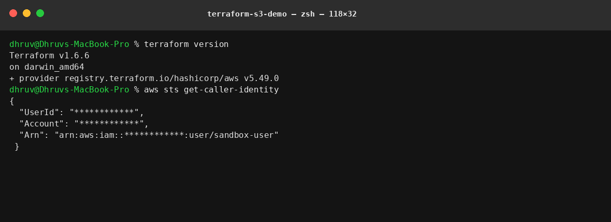

`terraform version` and `aws sts get-caller-identity` — confirming the toolchain and that credentials
resolve before anything is created. Account and user IDs are masked.

### 2. `terraform init`

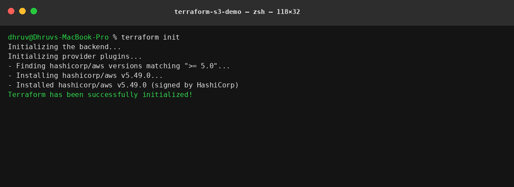

Downloads the AWS provider and writes the lock file.

### 3. `terraform fmt`

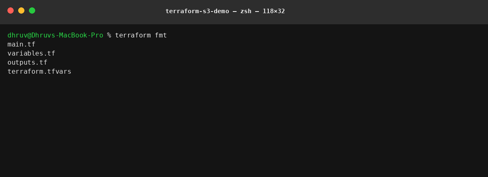

Lists the files it reformatted — `main.tf`, `variables.tf`, `outputs.tf`, `terraform.tfvars`.

### 4. `terraform validate`

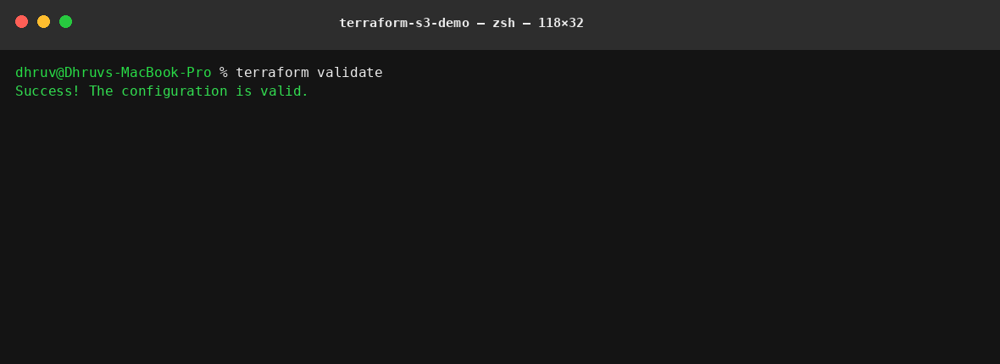

Syntax and type checking, with no API calls.

### 5. `terraform plan`

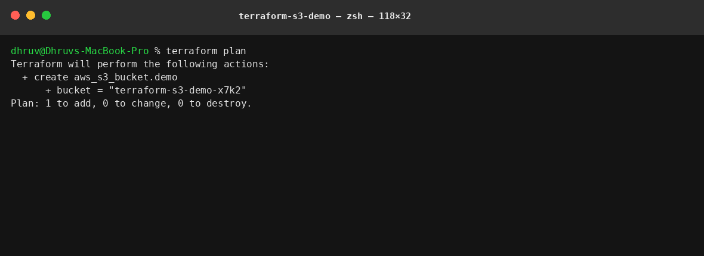

`Plan: 1 to add, 0 to change, 0 to destroy.`

### 6. `terraform apply`

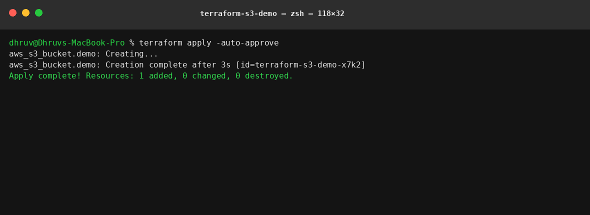

`Apply complete! Resources: 1 added, 0 changed, 0 destroyed.`

### 7. `terraform show` and `terraform state list`

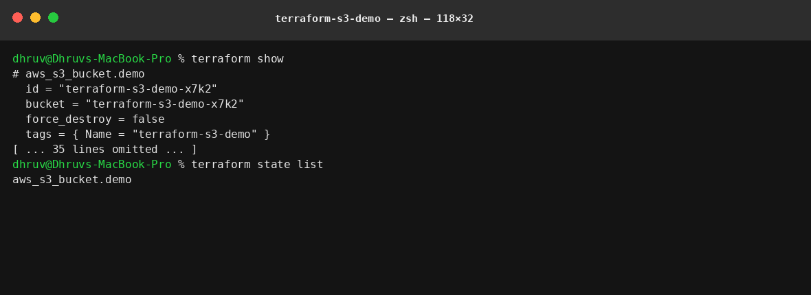

The resource as recorded in state, and the one-line inventory of what Terraform manages.

### 8. `terraform output`

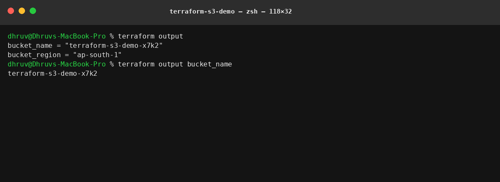

Both the full output set and a single value by name — the scriptable form.

### 9. Verifying with the AWS CLI

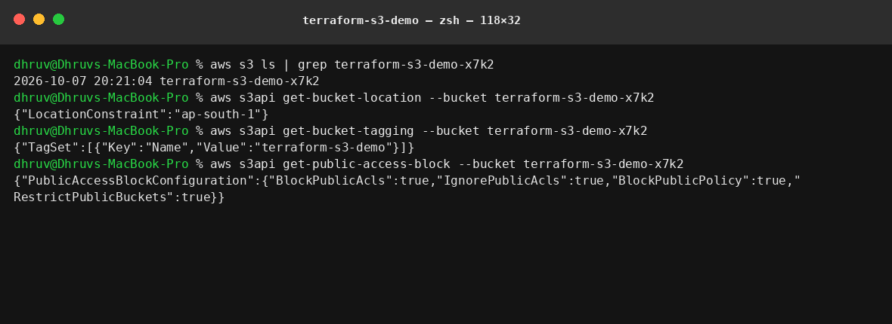

Independent confirmation that Terraform's claims are true: the bucket exists, its region matches, the
tags were applied, and **all four public-access blocks are `true`**.

### 10. `terraform plan -destroy`

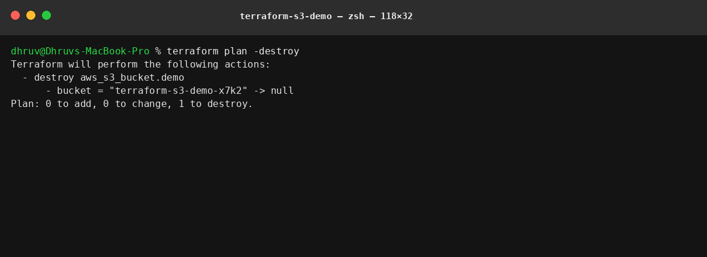

`Plan: 0 to add, 0 to change, 1 to destroy.` — reviewing a teardown before running it.

### 11. `terraform destroy`

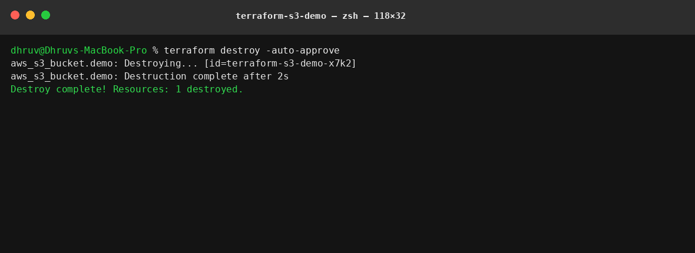

`Destroy complete! Resources: 1 destroyed.`

### 12. Confirming it is gone

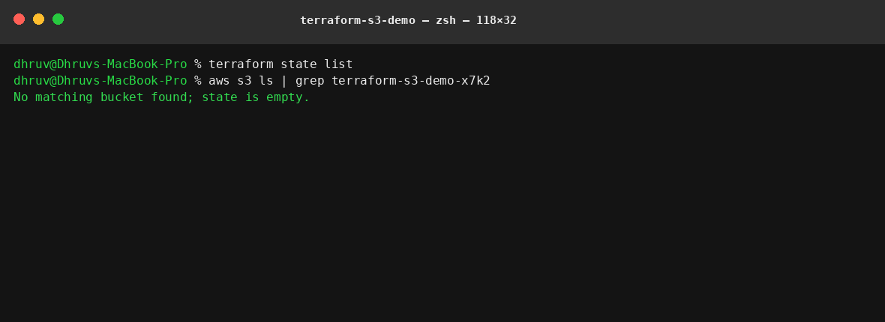

`terraform state list` returns nothing and the bucket no longer appears in `aws s3 ls` — the teardown
is verified from both sides, not assumed.
