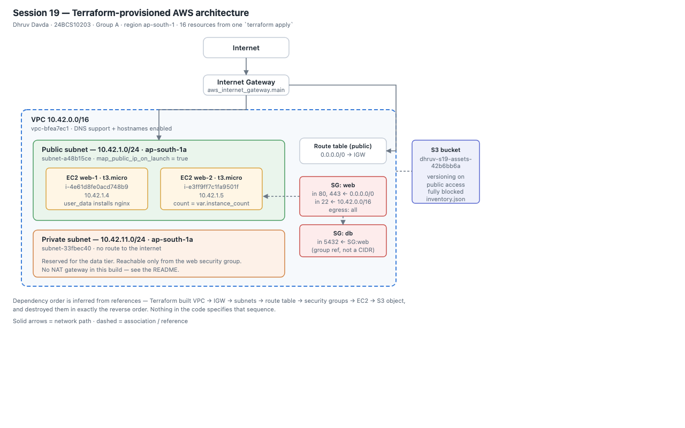

# Session 19 – Cloud & Terraform in Action

**Name:** Dhruv Davda · **Roll No:** 24BCS10203 · **Email:** Dhruv.24bcs10203@sst.scaler.com · **Group:** A

An end-to-end AWS environment — **VPC, subnets, internet gateway, route table, security groups, EC2
instances and S3** — built by a single `terraform apply`. Code in [`terraform/`](./terraform).

Run against **LocalStack 3.8** for the reasons given in
[Session 18](../18_Terraform_IaC/README.md); every output below is real Terraform and AWS CLI output.

## Architecture



*(Source: [`diagrams/architecture.svg`](./diagrams/architecture.svg) — the IDs in it are the real ones
from the deployment below.)*

```
Terraform
    ├── VPC                10.42.0.0/16
    │   ├── Internet Gateway
    │   ├── Public subnet  10.42.1.0/24   (route 0.0.0.0/0 -> IGW)
    │   │   └── 2 × EC2 t3.micro
    │   ├── Private subnet 10.42.11.0/24  (no internet route)
    │   ├── SG: web        80/443 from anywhere, 22 from the VPC only
    │   └── SG: db         5432 from SG:web only
    └── S3 bucket          versioned, public access blocked
```

---

## The code

| File | Contents |
|---|---|
| `provider.tf` | `terraform` block, AWS + random providers, `default_tags` |
| `variables.tf` | Typed inputs with validation |
| `network.tf` | VPC, IGW, subnets, route table, security groups |
| `compute.tf` | AMI data source, EC2 instances |
| `storage.tf` | S3 bucket, versioning, public access block, inventory object |
| `outputs.tf` | Everything the module exports |

### Providers

```hcl
provider "aws" {
  region = var.aws_region
  default_tags {
    tags = var.common_tags
  }
}
```

**`default_tags` applies the owner/roll/assignment tags to every taggable resource automatically** —
far better than repeating `tags = merge(...)` on each one, which is what Session 18 had to do.

### Variables, with validation

```hcl
variable "vpc_cidr" {
  type    = string
  default = "10.42.0.0/16"
  validation {
    condition     = can(cidrnetmask(var.vpc_cidr))
    error_message = "vpc_cidr must be a valid IPv4 CIDR block."
  }
}

variable "instance_count" {
  type    = number
  default = 2
  validation {
    condition     = var.instance_count >= 1 && var.instance_count <= 5
    error_message = "instance_count must be between 1 and 5."
  }
}
```

### Resources and inferred dependencies

```hcl
resource "aws_internet_gateway" "main" {
  vpc_id = aws_vpc.main.id        # <- this reference creates the dependency
}

resource "aws_subnet" "public" {
  vpc_id     = aws_vpc.main.id
  cidr_block = cidrsubnet(var.vpc_cidr, 8, 1)     # -> 10.42.1.0/24
}
```

**`cidrsubnet()` computes subnet ranges instead of hardcoding them.** Change `vpc_cidr` and every
subnet moves with it, correctly.

`count` on the instances turns one block into N resources:

```hcl
resource "aws_instance" "web" {
  count         = var.instance_count
  ami           = data.aws_ami.linux.id
  subnet_id     = aws_subnet.public.id
  tags = { Name = "${var.project}-web-${count.index + 1}" }
}
```

And a security group referencing another security group rather than a CIDR:

```hcl
  ingress {
    from_port       = 5432
    to_port         = 5432
    protocol        = "tcp"
    # Referencing a security group, not a CIDR: the rule keeps working as
    # instances come and go.
    security_groups = [aws_security_group.web.id]
  }
```

### Outputs

```hcl
output "resource_summary" {
  value = format(
    "VPC %s (%s) | subnets: 2 | SGs: 2 | EC2: %d | bucket: %s",
    aws_vpc.main.id, aws_vpc.main.cidr_block, length(aws_instance.web), aws_s3_bucket.assets.id
  )
}
```

---

## The run

```console
$ terraform init
- Installing hashicorp/aws v5.100.0...
- Installing hashicorp/random v3.9.1...
Terraform has been successfully initialized!

$ terraform fmt && terraform validate
network.tf
Success! The configuration is valid.
```

### plan

```console
$ terraform plan -out=tfplan
  # aws_instance.web[0] will be created
  # aws_instance.web[1] will be created
  # aws_internet_gateway.main will be created
  # aws_route_table.public will be created
  # aws_route_table_association.public will be created
  # aws_s3_bucket.assets will be created
  # aws_s3_bucket_public_access_block.assets will be created
  # aws_s3_bucket_versioning.assets will be created
  # aws_s3_object.inventory will be created
  # aws_security_group.db will be created
  # aws_security_group.web will be created
  # aws_subnet.private will be created
  # aws_subnet.public will be created
  # aws_vpc.main will be created
  # random_id.suffix will be created
```

### apply and outputs

```console
$ terraform apply tfplan

assets_bucket = "dhruv-s19-assets-42b6bb6a"
instance_ids = [
  "i-4e61d8fe0acd748b9",
  "i-e3ff9ff7c1fa9501f",
]
instance_private_ips = [
  "10.42.1.4",
  "10.42.1.5",
]
private_subnet = { "cidr" = "10.42.11.0/24", "id" = "subnet-33fbec40" }
public_subnet  = { "cidr" = "10.42.1.0/24",  "id" = "subnet-a48b15ce" }
security_groups = { "db" = "sg-546bd277f0bf73f74", "web" = "sg-9434a4b258d0b3b30" }
resource_summary = "VPC vpc-bfea7ec1 (10.42.0.0/16) | subnets: 2 | SGs: 2 | EC2: 2 | bucket: dhruv-s19-assets-42b6bb6a"
vpc_cidr = "10.42.0.0/16"
vpc_id = "vpc-bfea7ec1"

resources under management: 16
```

Note the subnet CIDRs: `cidrsubnet("10.42.0.0/16", 8, 1)` produced **10.42.1.0/24** and index 11
produced **10.42.11.0/24**, exactly as intended, and the instance IPs `10.42.1.4` / `10.42.1.5` fall
inside the public subnet — the first usable addresses after AWS's five reserved ones.

### Independent verification

```console
$ aws --endpoint-url=http://localhost:4566 ec2 describe-vpcs ...
+--------------+----------------+-------------+
|     Cidr     |      Id        |    State    |
+--------------+----------------+-------------+
|  10.42.0.0/16|  vpc-bfea7ec1  |  available  |
+--------------+----------------+-------------+

$ aws ... ec2 describe-subnets ...
+-------------+-----------------+-------------------+
|     AZ      |      Cidr       |        Id         |
+-------------+-----------------+-------------------+
|  ap-south-1a|  10.42.11.0/24  |  subnet-33fbec40  |
|  ap-south-1a|  10.42.1.0/24   |  subnet-a48b15ce  |
+-------------+-----------------+-------------------+

$ aws ... ec2 describe-instances ...
+----------------------+------------+----------+------------+
|          Id          | PrivateIp  |  State   |   Type     |
+----------------------+------------+----------+------------+
|  i-4e61d8fe0acd748b9 |  10.42.1.4 |  running |  t3.micro  |
|  i-e3ff9ff7c1fa9501f |  10.42.1.5 |  running |  t3.micro  |
+----------------------+------------+----------+------------+
```

### Dependencies, proven by an artifact

`aws_s3_object.inventory` renders values from the network **and** compute layers, so it cannot be
created until both exist:

```console
$ aws ... s3 cp s3://dhruv-s19-assets-42b6bb6a/inventory.json -
{
    "instances": [
        { "id": "i-4e61d8fe0acd748b9", "private_ip": "10.42.1.4" },
        { "id": "i-e3ff9ff7c1fa9501f", "private_ip": "10.42.1.5" }
    ],
    "owner": "Dhruv Davda",
    "project": "dhruv-s19",
    "roll": "24BCS10203",
    "subnet_ids": ["subnet-a48b15ce", "subnet-33fbec40"],
    "vpc_cidr": "10.42.0.0/16",
    "vpc_id": "vpc-bfea7ec1"
}
```

Real IDs that only existed after apply. **Terraform worked out the whole ordering from references
alone** — the configuration never states what must be built first.

### destroy

```console
$ terraform destroy -auto-approve
aws_route_table.public: Destruction complete after 0s
aws_internet_gateway.main: Destroying... [id=igw-8d6210a8]
aws_internet_gateway.main: Destruction complete after 0s
aws_instance.web[0]: Destruction complete after 10s
aws_instance.web[1]: Destruction complete after 10s
aws_subnet.public: Destroying... [id=subnet-a48b15ce]
aws_security_group.web: Destroying... [id=sg-9434a4b258d0b3b30]
aws_subnet.public: Destruction complete after 0s
aws_security_group.web: Destruction complete after 0s
aws_vpc.main: Destroying... [id=vpc-bfea7ec1]
aws_vpc.main: Destruction complete after 0s

Destroy complete! Resources: 15 destroyed.

$ aws ... ec2 describe-vpcs --query 'Vpcs[?CidrBlock==`10.42.0.0/16`]'
(empty = VPC gone)
$ terraform state list | wc -l
0
```

**The destroy order is the exact reverse of creation** — route table and IGW first, instances, then
subnets and security groups, VPC last. AWS would refuse to delete a VPC with resources still in it,
and Terraform never attempts it, because it walks the same graph backwards.

(15 destroyed vs 16 in state: `random_id.suffix` has no remote counterpart, so it is simply dropped.)

---

## Honest limitations of this build

Things a production environment would have that this does not, and why:

| Missing | Why | What production does |
|---|---|---|
| **NAT gateway** | LocalStack community does not emulate it meaningfully, and it costs real money on AWS | One NAT per AZ for private-subnet egress |
| **Multi-AZ** | Both subnets are in `ap-south-1a` | Subnets across ≥2 AZs; an AZ outage is the thing you are defending against |
| **Load balancer** | Not emulated | An ALB in the public subnets, instances moved to private |
| **RDS** | Not in LocalStack community | Multi-AZ RDS in the data subnets, reachable only from SG:web |
| **Remote state** | State is local | S3 backend + DynamoDB locking (Session 18) |
| **Modules** | Flat root module | `modules/network`, `modules/compute`, reused per environment |

The `db` security group in this build is real and correctly configured but has nothing attached to
it — it is the hook an RDS instance would use. I left it in because it demonstrates the
security-group-referencing-a-security-group pattern, which is the part worth learning.

## What I understood

- **`default_tags` at the provider** is the clean way to tag everything; per-resource `merge()` is
  the fallback.
- **`cidrsubnet()` and `count`** turn repetitive infrastructure into parameters — changing
  `instance_count` from 2 to 4 is a one-character diff.
- **The dependency graph is the whole product.** Creation order, destroy order and parallelism all
  fall out of references between resources.
- **Outputs are a module's API**, which is what makes splitting into `network` and `compute` modules
  possible later.
- **"Public subnet" is a routing decision, not an attribute** — the same insight as the VPC research
  doc, confirmed by reading the route table Terraform built.
- **Verify with a second tool.** Terraform reporting success and `aws ec2 describe-*` agreeing are
  two different claims, and only the second one is evidence.
