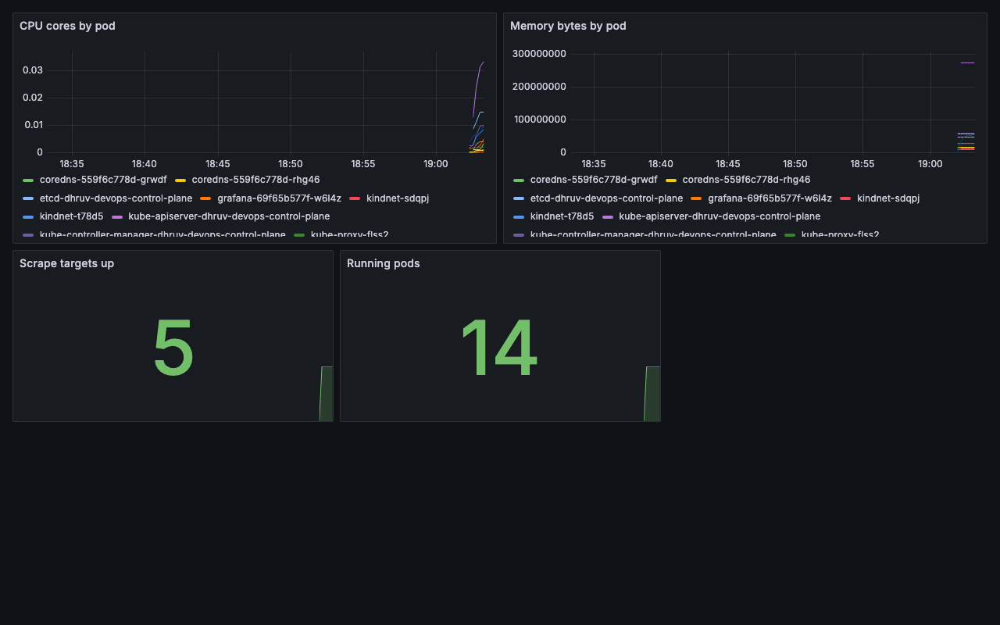
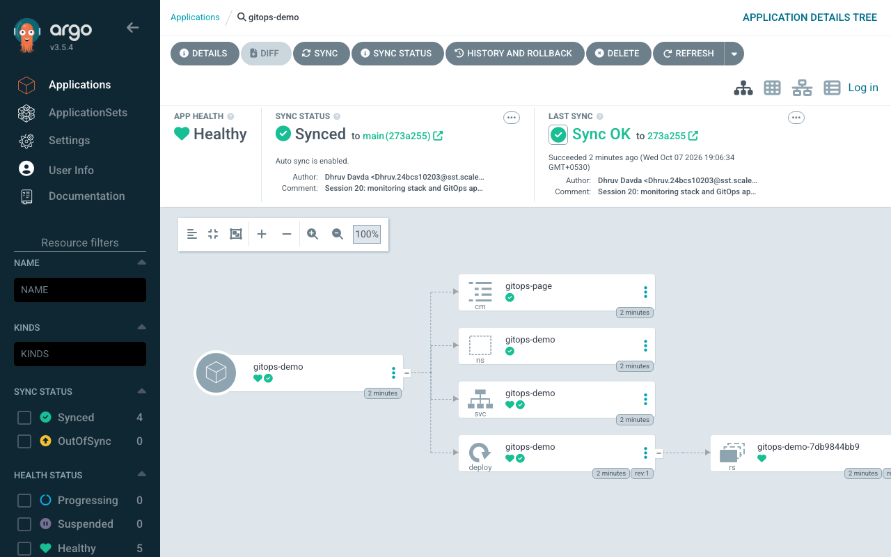

# Session 20 – Monitoring, Observability & GitOps

**Name:** Dhruv Davda · **Roll No:** 24BCS10203 · **Email:** Dhruv.24bcs10203@sst.scaler.com · **Group:** A

Run against my `dhruv-devops` kind cluster. Manifests in [`manifests/`](./manifests) and
[`gitops/`](./gitops).

| Task | Where |
|---|---|
| Task 1 — Monitoring demo | Prometheus + Grafana, below |
| Task 2 — Observability | The three pillars, below |
| Task 3 — GitOps demo | Argo CD syncing this repo, below |

---

## Task 1: Monitoring

### The stack

```
kubelet / cAdvisor ──scrape──> Prometheus ──query──> Grafana
   (metrics source)            (TSDB + rules)        (dashboards)
                                    │
                                    └──> alerts
```

[`manifests/01-prometheus.yaml`](./manifests/01-prometheus.yaml) deploys Prometheus with RBAC and a
scrape config; [`manifests/02-grafana.yaml`](./manifests/02-grafana.yaml) deploys Grafana with its
datasource and dashboard **provisioned from ConfigMaps** rather than clicked in the UI — monitoring
as code.

### Service discovery, not a static target list

```yaml
      - job_name: kubernetes-pods
        kubernetes_sd_configs: [{role: pod}]
        relabel_configs:
          - source_labels: [__meta_kubernetes_pod_annotation_prometheus_io_scrape]
            action: keep
            regex: true
```

Prometheus **queries the Kubernetes API for its own targets**. Any Pod annotated
`prometheus.io/scrape: "true"` is picked up automatically — essential when Pods are created and
destroyed constantly.

```console
$ curl prometheus:9090/api/v1/targets?state=active
  kubernetes-cadvisor      up     x2
  kubernetes-nodes         up     x2
  prometheus               up     x1
  TOTAL active targets: 5
```

Two nodes × two jobs, plus Prometheus scraping itself — all `up`.

### Metrics: CPU and memory

```console
$ promQL: sum(rate(container_cpu_usage_seconds_total{container!="",pod!=""}[2m])) by (pod)
POD                                                 CPU(cores)
  kube-apiserver-dhruv-devops-control-plane         0.0276
  etcd-dhruv-devops-control-plane                   0.0128
  prometheus-74d589f977-9fckh                       0.0066
  kube-scheduler-dhruv-devops-control-plane         0.0065
  kube-controller-manager-dhruv-devops-control-plane 0.0059
  coredns-559f6c778d-grwdf                          0.0036

$ promQL: sum(container_memory_working_set_bytes{container!="",pod!=""}) by (pod)
  kube-apiserver-dhruv-devops-control-plane         262.5 MiB
  kube-controller-manager-dhruv-devops-control-plane 55.9 MiB
  grafana-69f65b577f-w6l4z                          54.0 MiB
  prometheus-74d589f977-9fckh                       48.5 MiB
  etcd-dhruv-devops-control-plane                   44.8 MiB
```

Two PromQL details that matter:

- **`rate(...[2m])` is required for CPU.** `container_cpu_usage_seconds_total` is a *counter* — a
  total that only increases. Graphing it raw gives a meaningless rising line; `rate()` converts it to
  cores-per-second.
- **`container_memory_working_set_bytes`, not `usage_bytes`.** Working set excludes reclaimable page
  cache and is what the OOM killer actually acts on — so it is the number that matches the Session 14
  `OOMKilled` behaviour.

The `kube-apiserver` being the largest consumer on an idle cluster is expected: every controller,
kubelet and Argo CD watch is a long-lived connection to it.

### Dashboard



Provisioned, not hand-built:

```console
$ curl -u admin:*** localhost:3001/api/datasources
  Prometheus (prometheus) -> http://prometheus.monitoring.svc.cluster.local:9090  default=True
$ curl -u admin:*** localhost:3001/api/search
  Cluster Overview - Dhruv Davda 24BCS10203  uid=dhruv-cluster
```

**Scrape targets up: 5 · Running pods: 14**, with live CPU and memory series per pod.

### Alerts

```yaml
          - alert: HighContainerCPU
            expr: sum(rate(container_cpu_usage_seconds_total{container!="",pod!=""}[2m])) by (pod) > 0.4
            for: 1m
            labels: {severity: warning}
            annotations:
              description: "Pod {{ $labels.pod }} is using {{ $value | printf \"%.2f\" }} cores"
```

```console
$ curl prometheus:9090/api/v1/alerts
  1 alert(s) currently firing/pending:
    AlwaysFiring           state=firing   severity=info
      Smoke-test alert - proves the rule pipeline works
```

**`for: 1m` is the part people miss.** A rule whose expression is momentarily true goes to `pending`,
not `firing`; it only fires if it stays true for the duration. That is what stops a one-off CPU spike
paging someone at 3am.

I included `AlwaysFiring` deliberately — a rule that is true by construction — so the alerting
pipeline itself is demonstrably working rather than merely configured. **An alerting system that has
never fired is untested.**

**One rule did not work, honestly:** `PodNotReady` uses `kube_pod_status_ready`, which comes from
**kube-state-metrics** — a separate component I did not deploy. cAdvisor exposes *container resource*
metrics; Kubernetes *object state* (pod phase, deployment replicas, PVC status) comes from
kube-state-metrics. Two different sources, routinely confused, and a rule referencing a metric that
does not exist simply never fires rather than erroring.

### An operational problem I hit

```console
Failed to pull image "prom/prometheus:v2.54.1": rpc error: code = Canceled
  desc = failed to pull and unpack image ...: context canceled
```

Not a bad tag (Session 14's `not found`) and not an auth issue (`insufficient_scope`) — **`context
canceled` means the pull was interrupted**, i.e. it timed out part-way through a large image. The
kubelet's own retry succeeded. Reading the specific error text is what separates "retry" from
"fix the manifest".

---

## Task 2: Observability

### Monitoring vs observability

**Monitoring** answers questions you knew to ask ("is CPU above 80%?"). **Observability** is whether
you can answer questions you did *not* anticipate from the data already being emitted. Monitoring
tells you something is wrong; observability lets you work out why without shipping a new build.

### The three pillars

| | Metrics | Logs | Traces |
|---|---|---|---|
| **What** | Numbers over time | Discrete timestamped events | One request's path across services |
| **Answers** | *Is* something wrong? | *What* happened? | *Where* is the latency? |
| **Cardinality** | Low — labels must be bounded | High | Very high |
| **Cost** | Cheap, fixed | Grows with volume | Expensive, usually sampled |
| **Retention** | Months | Days–weeks | Hours–days |
| **Tools** | Prometheus, Grafana | Loki, ELK, CloudWatch | Jaeger, Tempo, OpenTelemetry |
| **In this course** | **This session** | `kubectl logs`, Topics 05/09/14 | Not deployed — see below |

#### Metrics

Numeric, aggregatable, cheap. The constraint is **cardinality**: every unique label combination is a
separate time series, so a label like `user_id` or `request_id` will destroy a Prometheus server.
That is exactly what logs and traces are for.

Four types: **counter** (only increases — needs `rate()`), **gauge** (up and down, e.g. memory),
**histogram** (bucketed, enables percentiles), **summary** (client-side quantiles).

#### Logs

Shown throughout this course — `kubectl logs --previous` was the only way to find the root cause of
the CrashLoopBackOff in Session 14. In production they are shipped off the node, because:

- A deleted Pod's logs are gone.
- Node disk pressure causes rotation.
- You cannot grep across 50 Pods with `kubectl`.

**Structured (JSON) logs** with a `trace_id` field are what connect this pillar to the next.

#### Traces

A trace follows one request through every service, as nested spans with timings. This is the pillar
that answers "the checkout is slow" in a system where the request touches six services — metrics say
*something* is slow, logs say what each service did, only traces say *which hop* cost the 400ms.

**I did not deploy tracing**, and the honest reason is that it needs application instrumentation
(OpenTelemetry SDK) rather than infrastructure. My demo apps are a few dozen lines with a single HTTP
handler and no downstream calls, so there is no distributed path to trace. Standing up Jaeger with
nothing meaningful to send it would be theatre.

### Why observability is required

In a monolith, a stack trace is enough. In the architectures from this course — Topic 06's three
tiers, Session 10's rolling deployments, Session 19's multiple instances — a single user request
crosses process, container and host boundaries, and no one machine holds the whole story.

### Kubernetes observability specifics

| Layer | Signal | Source |
|---|---|---|
| Cluster | Node CPU/memory/disk | kubelet, node-exporter |
| Kubernetes objects | Pod phase, deployment replicas | **kube-state-metrics** |
| Container | Per-container CPU/memory | **cAdvisor** (used here) |
| Application | Request rate, errors, latency | The app's `/metrics` |
| Events | Scheduling, pulls, probe failures | `kubectl get events` |

The **four golden signals** — latency, traffic, errors, saturation — are what to alert on. Note that
`kubectl top` (Session 13) comes from **metrics-server**, which is a *separate* short-term store for
the HPA, not Prometheus. A cluster commonly runs both.

---

## Task 3: GitOps

### What is GitOps?

An operating model where **a Git repository is the single source of truth for the desired state of a
system**, and an in-cluster agent continuously reconciles reality to match it.

The shift is from **push** to **pull**:

| | Traditional CD (push) | GitOps (pull) |
|---|---|---|
| Who applies | The CI pipeline, from outside | **An agent inside the cluster** |
| Credentials | CI holds cluster admin | **Cluster needs no inbound access** |
| Drift | Undetected until the next deploy | **Continuously corrected** |
| Audit | CI logs | **`git log`** |
| Rollback | Re-run an old pipeline | **`git revert`** |

That second row solves the exact problem I hit in Session 16, where the deploy job could only
*render* manifests because a GitHub-hosted runner cannot reach a local kind cluster. A pull-based
agent needs no inbound path at all.

### Git as the source of truth

[`gitops/apps/demo-app.yaml`](./gitops/apps/demo-app.yaml) declares a Namespace, ConfigMap,
Deployment (2 replicas) and Service. **Nothing in this demo was ever applied by hand.**

### Declarative configuration and continuous reconciliation

```yaml
spec:
  source:
    repoURL: https://github.com/dhruvdavda777/DevOps-Assignment-1.git
    targetRevision: main
    path: 20_Monitoring_Observability_GitOps/gitops/apps
  syncPolicy:
    automated:
      prune: true      # delete resources removed from Git
      selfHeal: true   # revert manual changes made in the cluster
```

```console
$ kubectl apply -f gitops/argocd-application.yaml
application.argoproj.io/gitops-demo created

  t+10s  sync=? health=?
  t+20s  sync=Synced health=Healthy

$ kubectl get all -n gitops-demo
pod/gitops-demo-7db9844bb9-sxcfm   1/1   Running   0   5s
pod/gitops-demo-7db9844bb9-t7kng   1/1   Running   0   5s
service/gitops-demo   ClusterIP   10.96.85.213   80/TCP   5s
deployment.apps/gitops-demo   2/2   2   2   5s
```



The UI shows **Healthy · Synced to `main (273a255)`**, the resource tree Argo CD built, and the Git
author and commit message that produced it — the audit trail is just Git history.

### Self-healing, demonstrated twice

**Scaling by hand, against what Git says:**

```console
$ kubectl scale deploy/gitops-demo -n gitops-demo --replicas=5    # Git says 2
deployment.apps/gitops-demo scaled

  t+5s   replicas=5  argocd_sync=Synced
  t+10s  replicas=2  argocd_sync=Synced
  -> reverted to the value in Git
```

**Deleting a resource Git still declares:**

```console
$ kubectl delete svc gitops-demo -n gitops-demo
service "gitops-demo" deleted from gitops-demo namespace

  t+5s   service present=0
  t+10s  service present=1
  -> Argo CD recreated it from Git
```

Both corrected within ~10 seconds. The controller's own account:

```console
$ kubectl describe application gitops-demo -n argocd | sed -n '/Events:/,$p'
  Normal  OperationStarted    5s  argocd-application-controller  Initiated automated sync to '273a25564ad...'
  Normal  ResourceUpdated     5s  argocd-application-controller  Updated sync status: Synced -> OutOfSync
  Normal  OperationCompleted  4s  argocd-application-controller  Partial sync operation to 273a25564ad... succeeded
  Normal  ResourceUpdated     4s  argocd-application-controller  Updated sync status: OutOfSync -> Synced
```

**`Synced -> OutOfSync -> Synced`** is the reconciliation loop, visible as events. This is the same
controller pattern as Kubernetes itself (Topic 09's ReplicaSet replacing a deleted Pod) and as
Terraform reverting manual drift (Session 18) — one level up, with Git as the desired state.

A real consequence: **`kubectl edit` in production becomes pointless.** Fixing an incident by hand
gets undone in seconds. The fix goes through Git, which is the point — but it changes incident
response, and `selfHeal: false` exists for teams not ready for that.

### The GitOps workflow

```
Developer ──PR──> Git repo ──merge──> main
                                       │
                            Argo CD polls / webhook
                                       │
                                  diff vs cluster
                                       │
                         ┌─────────────┴─────────────┐
                    in sync                      out of sync
                   do nothing                    apply diff
                                                      │
                                              cluster matches Git
```

Rollback is `git revert` — the agent then converges on the previous state. The cluster has no special
"rollback" concept at all.

### An installation problem worth recording

```console
$ kubectl apply -n argocd -f .../install.yaml
The CustomResourceDefinition "applicationsets.argoproj.io" is invalid:
  metadata.annotations: Too long: may not be more than 262144 bytes
```

Client-side `kubectl apply` stores the entire manifest in a
`kubectl.kubernetes.io/last-applied-configuration` annotation, and annotations are capped at 256 KB.
The Argo CD CRD exceeds it. The fix is **server-side apply**, which keeps field ownership on the
server instead:

```console
$ kubectl apply --server-side -n argocd -f .../install.yaml
```

A good illustration that `kubectl apply` is not a thin wrapper over the API — it has its own
client-side state model, with its own limits.

---

## What I understood

- **Counters need `rate()`.** The single most common PromQL mistake.
- **`working_set_bytes` is the memory number that matters**, because it is what the OOM killer uses.
- **cAdvisor and kube-state-metrics are different sources.** Container resources vs Kubernetes object
  state — my `PodNotReady` rule silently never fired for exactly this reason.
- **`for:` is what separates an alert from a spike**, and an alerting pipeline that has never fired
  has not been tested.
- **Provision dashboards and datasources as code**, or monitoring becomes the one part of the system
  nobody can reproduce.
- **GitOps inverts the trust direction.** The cluster pulls; CI never needs cluster credentials.
- **Reconciliation is the same idea at every layer** — ReplicaSets, Terraform, Argo CD. Declare the
  desired state, let a controller close the gap, continuously.

## Clean up

```console
$ kubectl delete -f gitops/argocd-application.yaml
$ kubectl delete ns argocd monitoring gitops-demo
```
