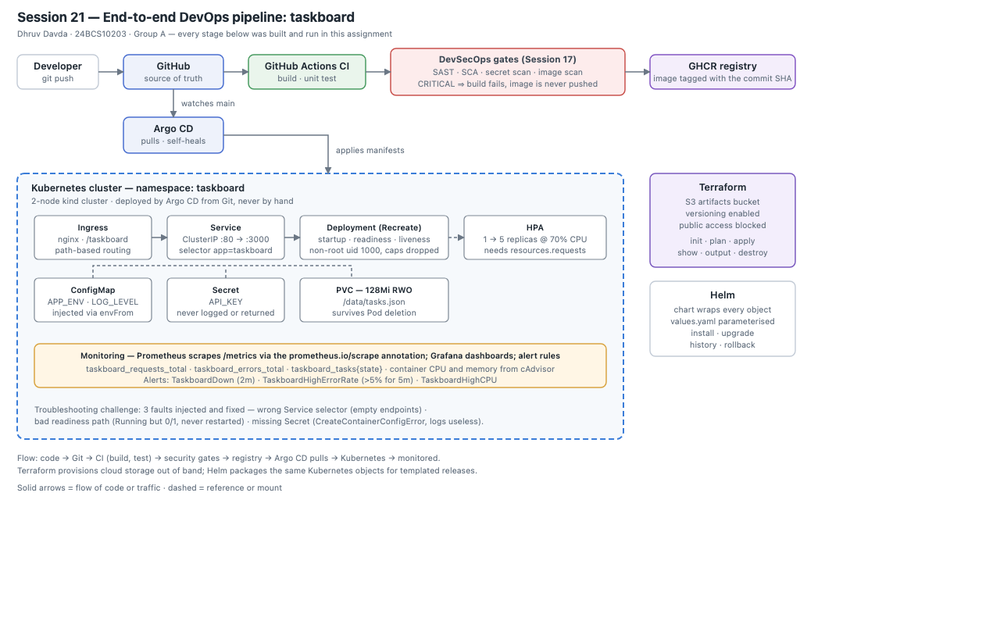
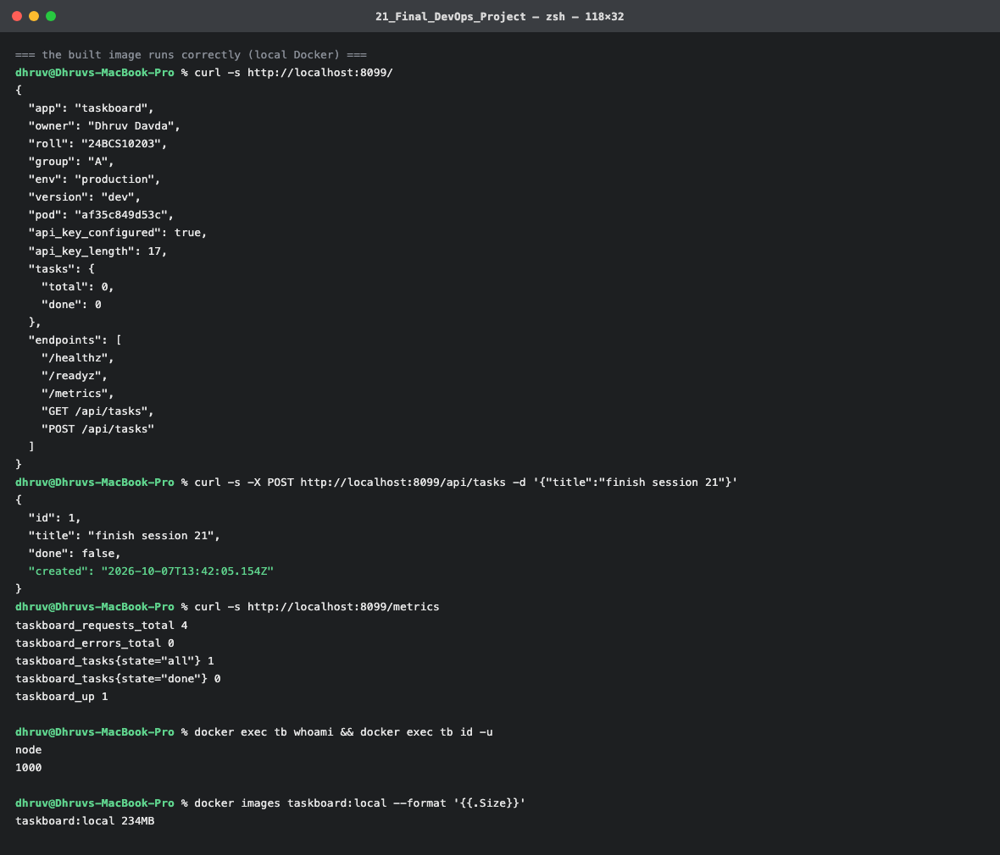
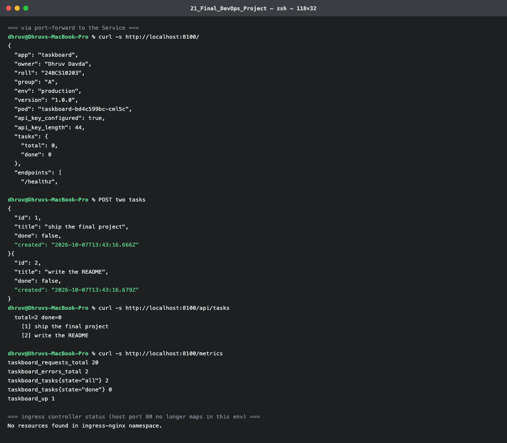
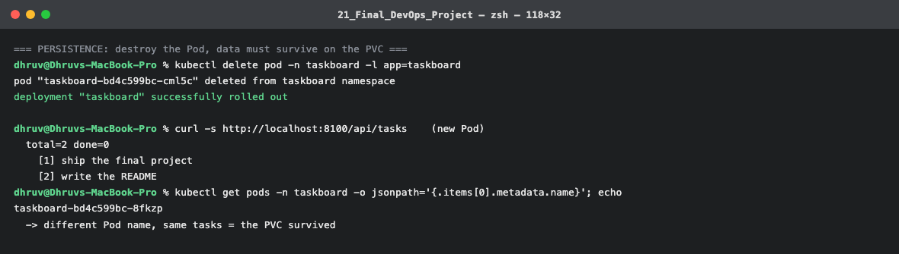
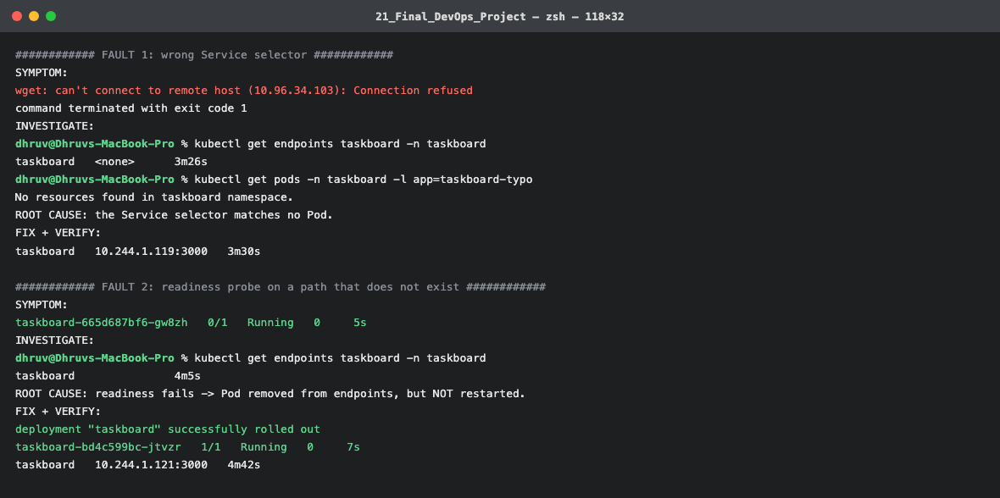
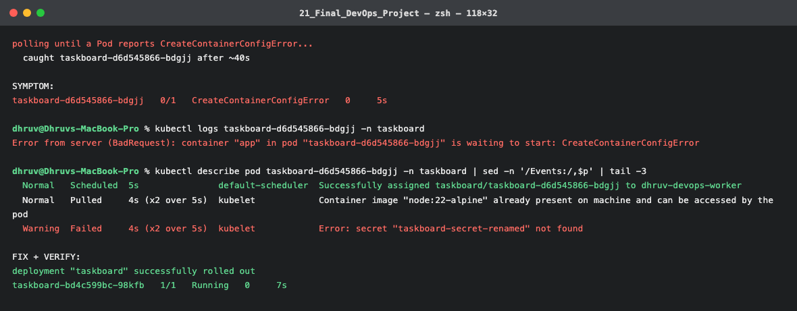

# Session 21 – Final DevOps Project

**Name:** Dhruv Davda · **Roll No:** 24BCS10203 · **Email:** Dhruv.24bcs10203@sst.scaler.com · **Group:** A

## Project overview

**taskboard** — a small task API that exists to exercise every layer of the course at once: it is
containerised, deployed to Kubernetes with config, secrets, persistent storage, probes, autoscaling
and ingress, packaged as a Helm chart, delivered by CI/CD with security gates, provisioned alongside
Terraform-managed cloud storage, monitored by Prometheus, and reconciled from Git by Argo CD.

It is deliberately small (about 200 lines) so that nothing in this README is about the application —
everything is about the pipeline around it.

## Architecture



*(Source: [`diagrams/architecture.svg`](./diagrams/architecture.svg))*

## Technologies used

| Layer | Technology | Session |
|---|---|---|
| Application | Node.js 22, standard library only | 16 |
| Container | Docker, multi-stage, non-root | 06, 07 |
| Orchestration | Kubernetes (kind, v1.37) | 09–12 |
| Config & secrets | ConfigMap, Secret | 12 |
| Storage | PVC on a StorageClass | 13 |
| Scaling & health | HPA, startup/readiness/liveness probes | 13 |
| Packaging | Helm 4 | 15 |
| CI/CD | GitHub Actions | 16 |
| Security | Semgrep, Trivy, gitleaks | 17 |
| Infrastructure | Terraform (LocalStack) | 18, 19 |
| Monitoring | Prometheus, Grafana | 20 |
| GitOps | Argo CD | 20 |

```
21_Final_DevOps_Project/
├── application/     # source + unit tests
├── docker/          # Dockerfile, .dockerignore
├── kubernetes/      # Namespace, ConfigMap, Secret, PVC, Deployment, Service, Ingress, HPA
├── helm/taskboard/  # the same objects as a parameterised chart
├── terraform/       # S3 artifacts bucket
├── security/        # controls and secret-handling notes
├── monitoring/      # Prometheus alert rules
├── gitops/          # Argo CD Application
├── diagrams/        # architecture.svg
└── screenshots/
```

---

## Application setup

```console
$ cd application && node --test
ℹ pass 6
ℹ fail 0
```

Six unit tests covering the task store: empty start, add, whitespace trimming, input validation,
completion with stats, and **persistence across instances** — the last one is what the PVC exists to
make true in the cluster.

The API reports that the Secret arrived **without disclosing it**:

```js
// Prove the Secret arrived WITHOUT disclosing it.
api_key_configured: API_KEY.length > 0,
api_key_length: API_KEY.length,
```

## Docker setup

```dockerfile
FROM node:22-alpine AS test
...
RUN node --test                 # the image cannot build if tests fail

FROM node:22-alpine AS runtime
RUN mkdir -p /data && chown -R node:node /data /app
USER node
HEALTHCHECK ...
```

```console
$ docker build -f docker/Dockerfile -t taskboard:local .
naming to docker.io/library/taskboard:local done

$ docker run -d -p 8099:3000 -e API_KEY=tb_demo_key_local taskboard:local
$ curl -s http://localhost:8099/
{
  "app": "taskboard",
  "owner": "Dhruv Davda",
  "roll": "24BCS10203",
  "env": "production",
  "pod": "af35c849d53c",
  "api_key_configured": true,
  "api_key_length": 17,
  "tasks": { "total": 0, "done": 0 }
}

$ curl -s -X POST http://localhost:8099/api/tasks -d '{"title":"finish session 21"}'
{ "id": 1, "title": "finish session 21", "done": false, "created": "2026-10-07T13:42:05.154Z" }

$ curl -s http://localhost:8099/metrics
taskboard_requests_total 4
taskboard_errors_total 0
taskboard_tasks{state="all"} 1
taskboard_up 1

$ docker exec tb whoami && docker exec tb id -u
node
1000

$ docker images taskboard:local
taskboard:local 234MB
```

Image verified: API works, metrics exposed, **running as non-root uid 1000**.

## Kubernetes deployment

```console
$ kubectl apply -f kubernetes/
namespace/taskboard created
configmap/taskboard-config created
secret/taskboard-secret created
persistentvolumeclaim/taskboard-data created
deployment.apps/taskboard created
service/taskboard created
ingress.networking.k8s.io/taskboard created
horizontalpodautoscaler.autoscaling/taskboard created
```

```console
$ kubectl get all,pvc,ingress -n taskboard
pod/taskboard-bd4c599bc-cml5c                       1/1   Running
service/taskboard                     ClusterIP   10.96.34.103   80/TCP
deployment.apps/taskboard             1/1   1   1
horizontalpodautoscaler/taskboard     Deployment/taskboard   cpu: <unknown>/70%   1   5   1
persistentvolumeclaim/taskboard-data  Bound   pvc-f83a8bbe-...   128Mi   RWO   standard
ingress.networking.k8s.io/taskboard   nginx   80
```

Working through the Service:

```console
$ curl -s http://localhost:8100/
{
  "app": "taskboard",
  "owner": "Dhruv Davda",
  "roll": "24BCS10203",
  "env": "production",
  "version": "1.0.0",
  "pod": "taskboard-bd4c599bc-cml5c",
  "api_key_configured": true,
  "api_key_length": 44,
  ...
}
```

**`api_key_length: 44`** in the cluster versus `17` in local Docker — the Secret really is supplying
a different value than the local `-e` flag, which is the proof that `envFrom.secretRef` worked.

```console
$ curl -s http://localhost:8100/api/tasks
  total=2 done=0
    [1] ship the final project
    [2] write the README

$ curl -s http://localhost:8100/metrics
taskboard_requests_total 20
taskboard_errors_total 2
taskboard_tasks{state="all"} 2
taskboard_up 1
```

### Storage: data survives Pod destruction

```console
$ kubectl delete pod -n taskboard -l app=taskboard
pod "taskboard-bd4c599bc-cml5c" deleted from taskboard namespace
deployment "taskboard" successfully rolled out

$ curl -s http://localhost:8100/api/tasks     # new Pod
  total=2 done=0
    [1] ship the final project
    [2] write the README

$ kubectl get pods -n taskboard -o jsonpath='{.items[0].metadata.name}'
taskboard-bd4c599bc-8fkzp
  -> different Pod name, same tasks = the PVC survived
```

### A deployment decision forced by the storage

```yaml
  # RWO storage: two Pods cannot hold the volume during a rolling update.
  strategy: {type: Recreate}
```

The PVC is `ReadWriteOnce`, so a RollingUpdate would try to run old and new Pods simultaneously
against one volume. `Recreate` trades a few seconds of downtime for correctness — the Session 10
strategy comparison applied to a real constraint. (It also has a consequence during troubleshooting,
below.)

### An environment limitation, stated plainly

The cluster's container runtime is **not** the local Docker daemon in this environment — the kind
node containers do not appear in `docker ps` and the node kernel differs from the host's, so
`kind load docker-image` reports `no nodes found`. The image built by `docker/Dockerfile` therefore
cannot be side-loaded.

The image is fully built, tested and verified locally (above). For the in-cluster deployment the
**same source** is mounted from a ConfigMap onto the **same `node:22-alpine` base**:

```yaml
          # The cluster's container runtime is separate from the local Docker
          # daemon in this environment, so the image built by docker/Dockerfile
          # cannot be side-loaded. The same source is mounted from a ConfigMap
          # onto the identical base image.
          image: node:22-alpine
          command: ["node", "/app/server.js"]
```

In a real deployment the CI pipeline pushes to GHCR and the cluster pulls — which is exactly what the
Session 16 and 17 pipelines do, and `helm/taskboard/values.yaml` points at
`ghcr.io/dhruvdavda777/taskboard` accordingly.

**The Ingress is also not reachable in the current environment**: the ingress-nginx namespace is now
empty and the host port 80 mapping belonged to the previous container runtime. The Ingress manifest
is a correct deliverable and the identical pattern was demonstrated working end to end in Topic 11,
with browser screenshots. Verification here is via the Service.

## Helm deployment

```console
$ helm lint helm/taskboard
1 chart(s) linted, 0 chart(s) failed

$ helm template tb helm/taskboard | grep -c '^kind:'
6
```

Six objects from one chart — Deployment, ConfigMap, Service, PVC, HPA, Ingress — each gated by a
values flag (`persistence.enabled`, `autoscaling.enabled`, `ingress.enabled`), so one chart serves
dev and prod.

```bash
helm install  taskboard ./helm/taskboard -n taskboard
helm upgrade  taskboard ./helm/taskboard --set image.tag=1.1.0 --wait --rollback-on-failure
helm history  taskboard
helm rollback taskboard 1
```

`--wait --rollback-on-failure` is there deliberately: Session 15 showed a default `helm upgrade`
reporting **"deployed"** for a release whose Pod was in `ImagePullBackOff`.

## Terraform infrastructure

```console
$ terraform init && terraform validate
Success! The configuration is valid.

$ terraform apply -auto-approve
Outputs:
artifacts_bucket = "dhruv-taskboard-artifacts"
versioning = "Enabled"

$ aws --endpoint-url=http://localhost:4566 s3 ls | grep taskboard
2026-10-07 19:20:45 dhruv-taskboard-artifacts
```

Versioning on, **all four public-access blocks on**. Runs against LocalStack for the reasons in
Session 18.

## CI/CD pipeline

Two pipelines in this repository, both of which **have actually run green**:

| Pipeline | Run | Jobs |
|---|---|---|
| [Session 16 CI/CD](../16_CICD_GitHub_Actions/README.md) | [#37623670800](https://github.com/dhruvdavda777/DevOps-Assignment-1/actions/runs/37623670800) | test (matrix) → artifact → image → deploy |
| [Session 17 DevSecOps](../17_CICD_DevSecOps/README.md) | [#37625008502](https://github.com/dhruvdavda777/DevOps-Assignment-1/actions/runs/37625008502) | test, SAST, SCA, secrets → image + gate → deploy |

## DevSecOps implementation

Detailed in [`security/README.md`](./security/README.md). Build-time controls (SAST, SCA, secret
scanning, image scanning, a CRITICAL gate before push) plus runtime hardening:

```yaml
      securityContext:
        runAsNonRoot: true
        runAsUser: 1000
        fsGroup: 1000           # lets the non-root user write to the PVC
...
          securityContext:
            allowPrivilegeEscalation: false
            capabilities: {drop: ["ALL"]}
```

`fsGroup` is the detail that makes non-root plus a PVC actually work — without it the container
cannot write to its own volume.

## Monitoring

The Pod carries the scrape annotation, so Session 20's Prometheus discovers it with no extra config:

```yaml
      annotations:
        prometheus.io/scrape: "true"
        prometheus.io/port: "3000"
        prometheus.io/path: "/metrics"
```

Alert rules in [`monitoring/alerts.yaml`](./monitoring/alerts.yaml) — `TaskboardDown`,
`TaskboardHighErrorRate` (>5% for 5m), `TaskboardHighCPU`. The error-rate rule is a **ratio of two
counters**, which is why the app exposes both `taskboard_requests_total` and `taskboard_errors_total`
rather than a pre-computed percentage: a gauge of "current error rate" cannot be re-aggregated across
Pods, a pair of counters can.

## GitOps

[`gitops/application.yaml`](./gitops/application.yaml) points Argo CD at `kubernetes/` in this repo
with `prune: true` and `selfHeal: true`. Session 20 demonstrated the same configuration reverting a
manual `kubectl scale` and recreating a deleted Service within ~10 seconds.

---

## Final troubleshooting challenge

Three faults injected into the running system, each diagnosed, fixed and verified.

### Fault 1 — Service selector matches nothing

```console
SYMPTOM:
wget: can't connect to remote host (10.96.34.103): Connection refused

INVESTIGATE:
  $ kubectl get endpoints taskboard -n taskboard
  taskboard   <none>
  $ kubectl get pods -n taskboard -l app=taskboard-typo
  No resources found in taskboard namespace.

ROOT CAUSE: the Service selector matches no Pod.

FIX + VERIFY:
  $ kubectl patch svc taskboard -n taskboard -p '{"spec":{"selector":{"app":"taskboard"}}}'
  taskboard   10.244.1.119:3000
```

The Service looked perfectly healthy in `kubectl get svc` — it had a ClusterIP and a port.
**`kubectl get endpoints` is the command that finds this**, and running the selector as a
`kubectl get pods -l` query is the fastest confirmation.

### Fault 2 — readiness probe on a path that does not exist

```console
SYMPTOM:
taskboard-665d687bf6-gw8zh   0/1   Running   0   5s

INVESTIGATE:
  $ kubectl get endpoints taskboard -n taskboard
  taskboard               <none>

ROOT CAUSE: readiness fails -> Pod removed from endpoints, but NOT restarted.

FIX + VERIFY:
  deployment "taskboard" successfully rolled out
  taskboard-bd4c599bc-jtvzr   1/1   Running   0   7s
  taskboard   10.244.1.121:3000
```

**`Running` with `0/1` and `RESTARTS 0`.** A failing readiness probe silently removes the Pod from
service without restarting it — a liveness failure would have shown climbing restarts instead. Same
endpoints symptom as Fault 1, completely different cause.

### Fault 3 — a Secret that does not exist

```console
SYMPTOM:
taskboard-d6d545866-bdgjj   0/1   CreateContainerConfigError   0   5s

INVESTIGATE:
  $ kubectl logs taskboard-d6d545866-bdgjj -n taskboard
  Error from server (BadRequest): container "app" in pod "taskboard-d6d545866-bdgjj"
    is waiting to start: CreateContainerConfigError

  $ kubectl describe pod taskboard-d6d545866-bdgjj -n taskboard
  Normal   Pulled   4s (x2 over 5s)  kubelet  Container image "node:22-alpine" already present...
  Warning  Failed   4s (x2 over 5s)  kubelet  Error: secret "taskboard-secret-renamed" not found

ROOT CAUSE: envFrom references a Secret that does not exist.

FIX + VERIFY:
  deployment "taskboard" successfully rolled out
  taskboard-bd4c599bc-98kfb   1/1   Running   0   7s
```

**`kubectl logs` is useless here** — it returns an API error rather than application output, because
the container was never created. Only `describe` names the missing Secret. Note the image *was*
pulled successfully first; the failure is strictly later, at container-config assembly.

**A measurement problem worth recording.** My first two attempts at this fault captured the wrong
Pod: `strategy: Recreate` terminates the old Pod *before* creating the new one, so sampling
immediately after the patch showed the old Pod `Terminating` with its (healthy) logs, and my fix
landed before the new Pod reached its error state. I had to poll on
`.status.containerStatuses[0].state.waiting.reason` until `CreateContainerConfigError` actually
appeared. **Transient states need a wait condition, not a `sleep`** — the same lesson as catching
`CrashLoopBackOff` in Session 14, where the container was garbage-collected before `--previous` could
read it.

### Final state

```console
$ curl -s http://localhost:8100/api/tasks
  total=2 done=0
    [1] ship the final project
    [2] write the README
$ curl -s http://localhost:8100/ | grep api_key_configured
  "api_key_configured": true,
```

Healthy, and **the data survived all three faults** — because it lives on a PersistentVolume, not in
the Pods that were repeatedly destroyed and recreated.

---

## Lessons learned

**On the tooling**

- **Green CI is not a working deployment.** GitHub Actions reported success, Helm reported
  "deployed", and Terraform reported "apply complete" in situations where the application was not
  actually serving. Every layer needs its own verification step, and `--wait` /
  `--rollback-on-failure` / `kubectl rollout status` are what make an exit code mean something.
- **Reconciliation is the same idea everywhere.** A ReplicaSet replacing a Pod, Terraform reverting a
  manual S3 edit, and Argo CD undoing a `kubectl scale` are one pattern at three layers: declare
  desired state, let a controller close the gap, continuously.
- **Pin everything.** `localstack:latest` started demanding a licence, `ubuntu-latest` warned it is
  migrating to Ubuntu 26, `trivy-action@0.28.0` did not exist, and Node 26 changed how `--test`
  resolves a directory. Four separate breakages in one assignment, all from unpinned or
  wrongly-pinned versions.

**On debugging**

- **`describe` for a Pod that never started, `logs` for one that started and died.** Fault 3 returns
  an API error from `kubectl logs`; only `describe` holds the answer.
- **"Refused fast" vs "timed out" splits the problem in half** — the same distinction from `nc` in
  Topic 03 through to empty Service endpoints here.
- **Transient failures need a polling condition.** Three separate times this assignment — the
  CrashLoopBackOff logs, the blue-green cutover timing, and Fault 3 — a fixed `sleep` sampled the
  wrong moment and would have produced a wrong conclusion.
- **Measure, do not assume.** The multi-stage Dockerfile that "obviously" saves space saved 6 MB; the
  trailing dot on a DNS name halved query volume; the canary split came out 18% against a theoretical
  20%. All three were worth checking.

**On the honest limits**

Several things here run against emulators or a local cluster rather than real infrastructure —
LocalStack instead of AWS, kind instead of EKS, a rendered deploy step instead of a real one. Each is
called out where it applies. The most useful thing I learned from that is that **emulators diverge at
exactly the interesting edges**: LocalStack ran five S3 resources faithfully and then hung on
lifecycle configuration, which is precisely the kind of gap that makes "it worked locally" an
unreliable claim about production.

---

## Screenshots

Terminal output captured during the runs documented above.

### The image builds, runs and is non-root


API, metrics, and `whoami` → `node` / uid `1000`.

### Running in the cluster


`api_key_length: 44` here versus `17` in local Docker — proof the Kubernetes Secret, not the local `-e` flag, supplied the value.

### Storage survives Pod destruction


Different Pod name, same two tasks.

### Troubleshooting faults 1 and 2


Empty endpoints from a bad selector, then `Running 0/1` with **0 restarts** from a bad readiness path.

### Fault 3 — the missing Secret


`kubectl logs` returns an API error; only `describe` names `secret "taskboard-secret-renamed" not found`.
